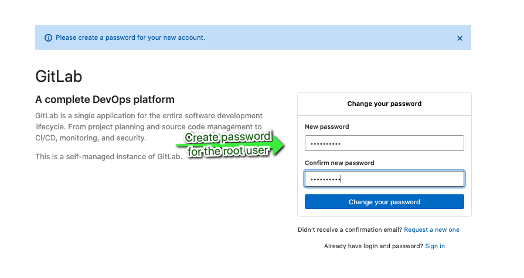
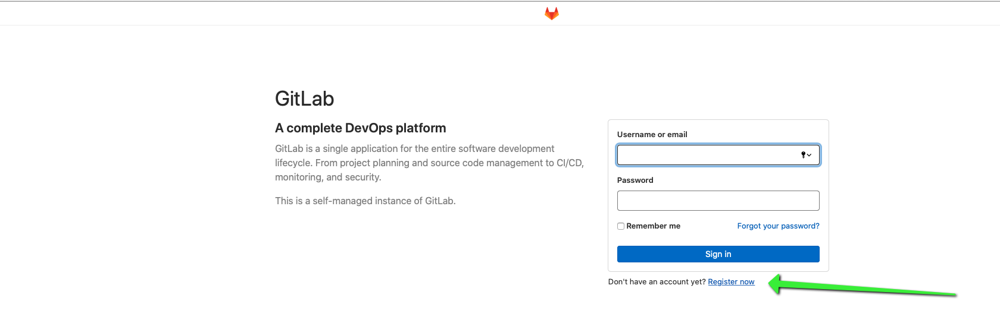
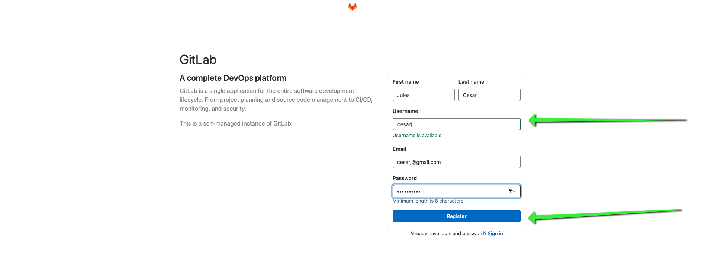
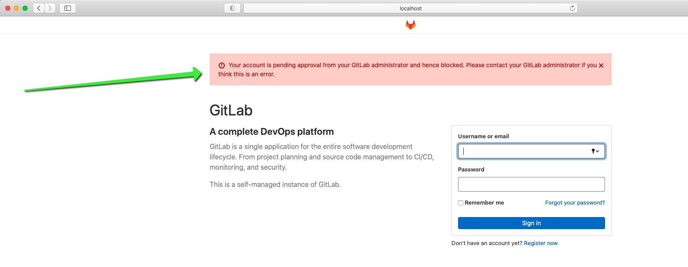
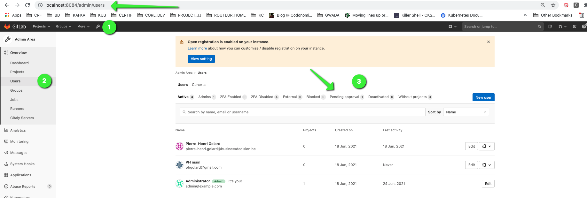
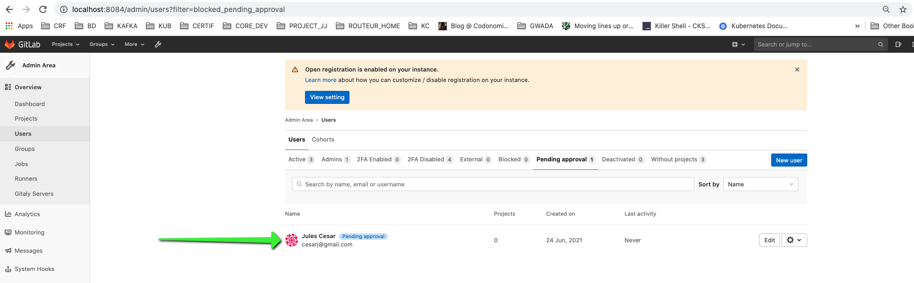
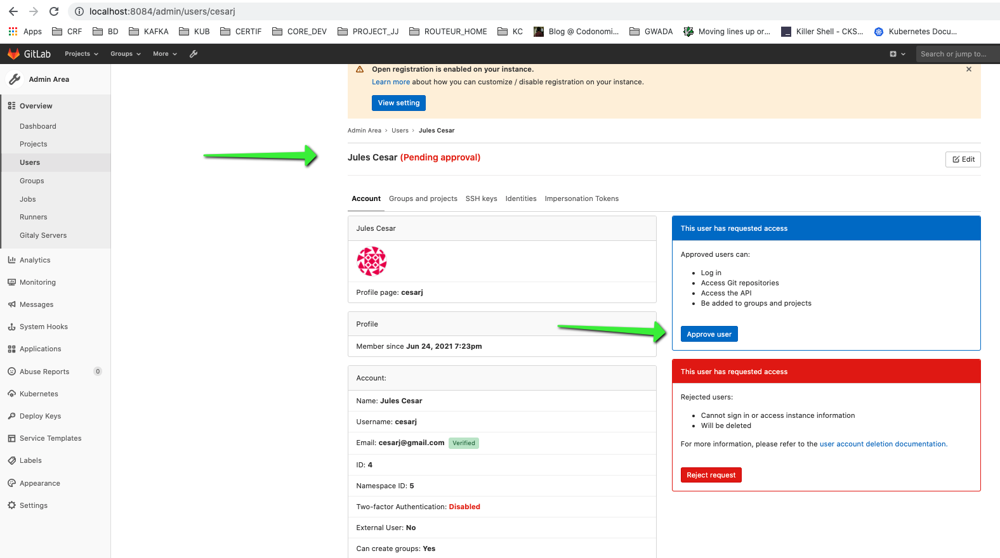
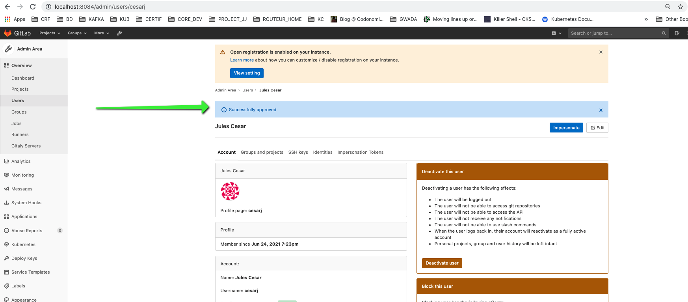
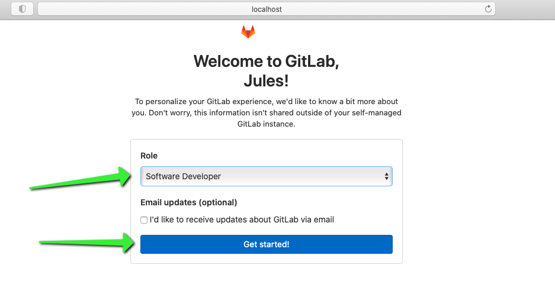
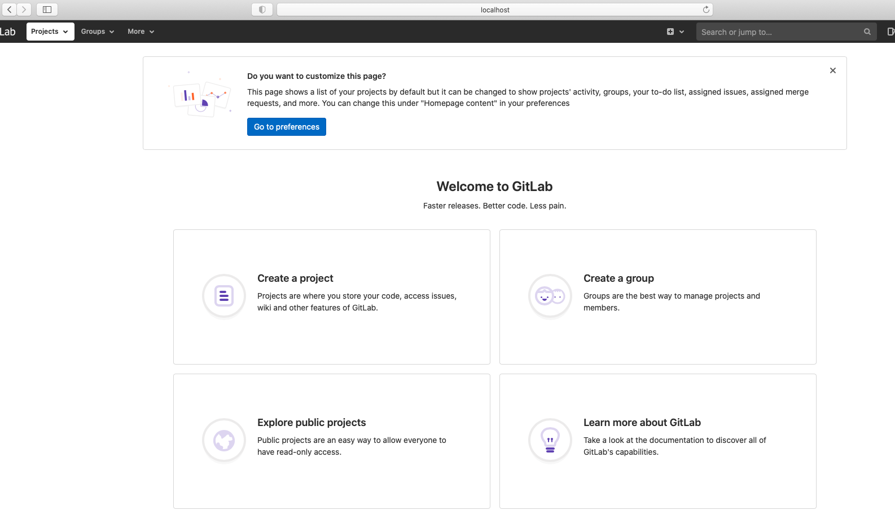

# Installation Guide

## Section Contents

In this chapter we go through the different software needed in the course of this tutorial.
First section indicates the pre-requisite namely the list of tools required to run the exercises and illustrations of the course.
Then we will go through the set up of Gitlab. Gitlab is code collaboration & version controlling tool, as well as a DevOps platform. At first we describe how to set up Gitlab Server using Docker. Then we go further with the installation of Gitlab Runner, a component used to run CICD jobs.

* [Installation Guide](#installation-guide)
  * [Section Contents](#section-contents)
  * [Pre-requisite](#pre-requisite)
    * [Git](#git)
    * [Docker](#docker)
    * [WSL2](#WSL2)
    * [Maven](#maven)
    * [JAVA](#JAVA)
    * [IDE](#ide)
  * [Gitlab Server](#gitlab-server)
    * [1.1 Gitlab Server on Docker](#11-gitlab-server-on-docker)
    * [1.2 Deploying Gitlab server on Docker](#12-deploying-gitlab-server-on-docker)
    * [1.3 Gitlab Server Administration](#13-gitlab-server-administration)
    * [1.4 Gitlab Server User Creation](#14-gitlab-server-user-creation)
    * [1.5 User Authentication with ssh keys](#15-user-authentication-with-ssh-keys)
    * [1.6 Create your First Project](#16-create-your-first-project)

## Pre-requisite

### Git

First we need to set up the version controlling software.

OS  |  Commands
--|--
linux (Ubuntu)  |  `sudo apt-get install git`
MacOs  |  `sudo brew install git`
Windows  |  https://git-scm.com/download/win

### Docker

Docker will be used to deploy Gitlab Server and Gitlab Runner on local machines.
An entire section of this course is dedicated to Docker. As a result we are not going to develop concepts around Docker in current chapter. We stick to the set up of Docker Community Edition.

On **Ubuntu**, these are the steps that should be taken:
```
sudo apt-get update
sudo apt install -y apt-transport-https ca-certificates curl software-properties-common
curl -fsSL https://download.docker.com/linux/ubuntu/gpg | sudo apt-key add -
sudo add-apt-repository -y "deb [arch=amd64] https://download.docker.com/linux/ubuntu $(lsb_release -cs) stable"
sudo apt-get update
sudo apt install docker-ce
  ```

On **MacOs**, we advise to use [Docker Desktop](https://docs.docker.com/docker-for-mac/install/#install-and-run-docker-desktop-on-mac). The Docker Desktop installation includes `Docker Engine`, Docker `CLI` client, `Docker Compose`, Notary, `Kubernetes`, and Credential Helper.

On **Windows**, [Docker Desktop](https://docs.docker.com/docker-for-windows/install/) exists as well. But we will have to install some other things **before**. You can download the installer and use it after you've completed the [Maven](#maven) part.

### WSL2

(Windows only)
You have to install [WSL 2](https://docs.microsoft.com/en-us/windows/wsl/install-win10#step-4---download-the-linux-kernel-update-package). It replace the Hyper-V manager which docker used before to handle Linux containers, WSL 2 is a full Linux kernel built by Microsoft, allowing Linux containers to run natively without emulation.
If you want more information : https://docs.docker.com/docker-for-windows/wsl/

### Maven

Maven is a powerful project management tool that is based on POM (project object model). It is used for projects build, dependency and documentation. Primarily Maven is used to build `Java` and `Scala` projects, even though it's language agnostic.

Maven will be used to illustrate some CI-CD features with Java and Scala projects, this is why it's part of the programs required for this course.

OS  |  Commands
--|--
linux (Ubuntu)  |  `sudo apt-get install maven`
MacOs  |  `sudo brew install maven`
Windows  |  https://www.javatpoint.com/how-to-install-maven

On windows, we would recommend to place the Maven folder in C:\Program Files as it's the same place you'll find your JAVA JDK folder.

### JAVA

(Windows only)
You also have to install a [JAVA JDK](https://www.oracle.com/java/technologies/javase-downloads.html) and add it to the PATH as an environment variable(see [Maven](#maven) on windows installation)

### IDE

IDE stands for Integrated Development Environment. We strongly advise to have at least one IDE set up on your machine in order to be able to execute, test, modify... code base of the illustrations and exercises all along the course.

**Intellij** is pretty useful for Java and Scala projects in particular, especially to run Unit Tests.
**VSCode** or **Atom** are good complement/alternatives.


## Gitlab Server

The actions we are about to take in this sections are specific to this e-learning context.
Let's go back to the global git schema.


In this section I'll explain how to set up a gitlab server on your local machine.
In the very most of your projects, you will never be required to set up a git server.
Anyway, even if you are required to do so, the central repository should never be installed on your local laptop:


In addition to the versioning features, a git server, either installed on premises or hosted in the cloud, must be configured as a central repository which offers security as well as the possibility of collaborative working.
As a result it will never be set up on the same machine as the developer's workstation.

The point here is to avoid polluting the B&D's gitlab instance, so your laptop will be used as a developer workstation along with a git central repository.

### 1.1 Gitlab Server on Docker

The set up of the gitlab server instance is done as a set of docker containers made up of 3 different micro services based on 3 different docker images:

- Gitlab: container running core gitlab instance including the web UI, the git repositories, ssh, administration of users, groups, CI coordinator...
- PostgreSql: RDBMS used to persist configuration of Gitlab
- Redis: Job queuing

Basically, those 3 containers will run through the Docker daemon running on the OS of your local workstation, next to the local codebase project(s) we will use as illustrations.


We could have installed Gitlab server and its components as regular applications directly on the workstation OS.
We chose docker because

- portability: whatever your laptop OS, as long as Docker Engine is installed we can use the same docker-compose.yml file to get it up and running
- isolation: processes are isolated so it's easy to start/stop it only when needed without affecting your other applications
- easy resource allocation

### 1.2 Deploying Gitlab server on Docker

First start by downloading the project


Extract the project and then open a Command prompt/Terminal in the `git-master` folder

Type the following commands:
```yml
cd 0-Gitlab\ server
cd Theory/
docker-compose -f docker-compose_gs.yml up
```

Run the command `docker ps`to list the running containers:
```yml
CONTAINER ID   IMAGE                              COMMAND                  CREATED       STATUS                PORTS                                                                                       NAMES
55c6d4eb3b9d   sameersbn/gitlab:13.11.3           "/sbin/entrypoint.sh…"   2 weeks ago   Up 4 days (healthy)   443/tcp, 0.0.0.0:10022->22/tcp, :::10022->22/tcp, 0.0.0.0:10080->80/tcp, :::10080->80/tcp   gitlab-docker_gitlab_1
f227704b0555   sameersbn/postgresql:12-20200524   "/sbin/entrypoint.sh"    2 weeks ago   Up 4 days             5432/tcp                                                                                    gitlab-docker_postgresql_1
5203e9bca26c   redis:5.0.9                        "docker-entrypoint.s…"   2 weeks ago   Up 4 days             6379/tcp                                                                                    gitlab-docker_redis_1
```

Then If you type the
`docker inspect <containerId>`
command for each of the container:


You clearly notice that docker engine created its own bridge network within which the containers received an IP address and the gateway is the IP of the Engine/host.

### 1.3 Gitlab Server Administration

Once containers are up and runnning, please open up your browser and connect to `http://localhost:8084`.
If this is your first connnection, you will be asked to create a password for the `root`account:



You can now log in as `root`as username and the password you have previously created.

### 1.4 Gitlab Server User Creation

After deploying gitlab server on your local machine through docker, you have in the previous section accessed gitlab as admin with `root`account.
Now let's create a `user`account.

1. Open another browser (or an incognito session on the same browser as you used to access gitlab as admin) and connect to `http://localhost:8084` and Click on `register`

    

2. Insert the contact details. The email address doesn't need to exist.

    

3. Try to connect to gitlab with the **user you have registered with**. You'll see that the account status is **pending for approval** by the admin.

    

4. At this stage, you need to **approve** the request from the new user you **registered**. Therefore You go back to the browser you have used to configure the `root`account to connect to gitlab. Please click on the **adjustable wrench** to go to the `admin area`and Then clik on `users`. You will then see the list of users (for those already approved), but here you need to click on `pending approval`.

   

5. Click on the user you want to approve, in my case ***Jules Cesar***.

   
6. Approve the request.

   
7. You should now see that the request has been successfully approved.

   
8. At this stage please open up the other browser, the one used to register and connect as user. Type your username and password. You should now manage to authenticate and access to the following page where you'll be asked to choose your role (in our case select Developer) and click on ***Get Started***.

   
9.  Now You can create or browse project as ***Jules Cesar***.

    

### 1.5 User Authentication with ssh keys
TODO
### 1.6 Create your First Project
TODO see illu 2.2. Git areas
