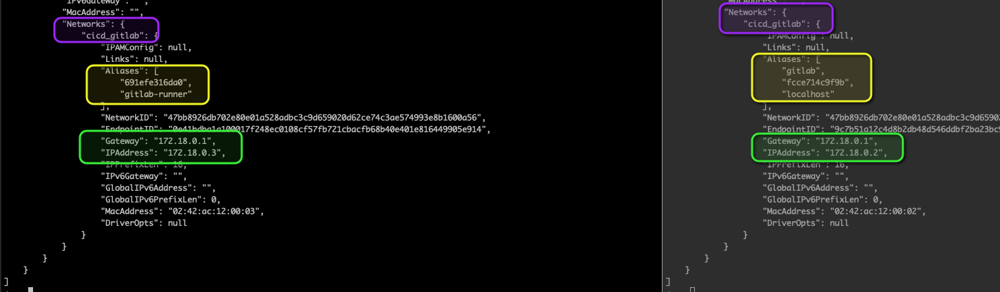
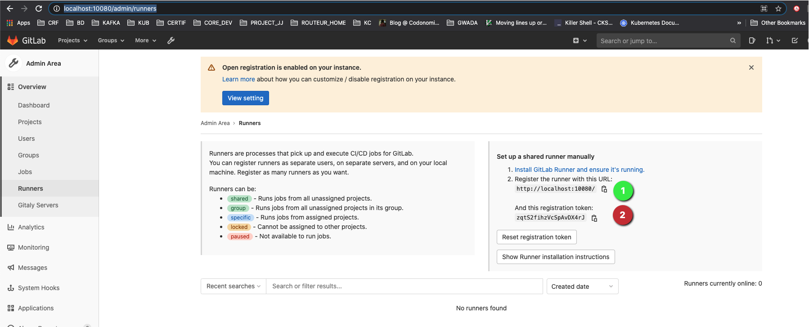
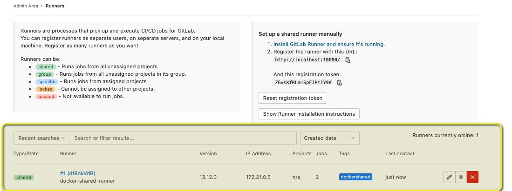
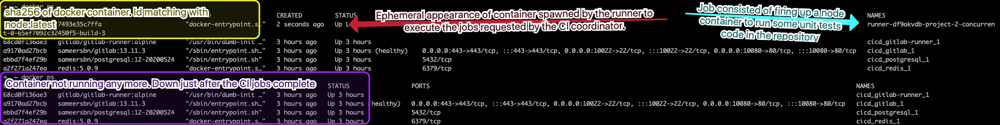
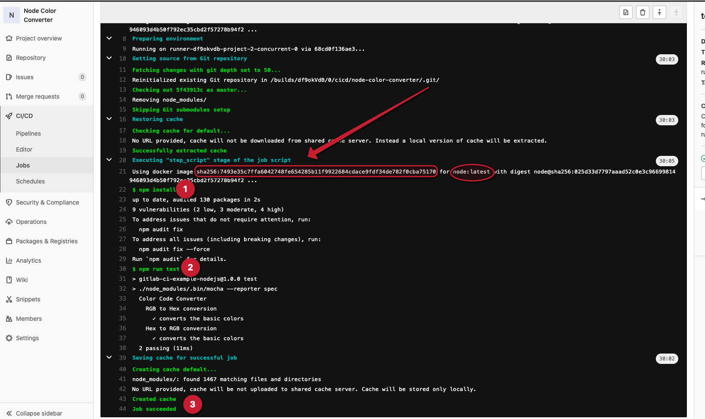

set up alt: everything on docker compose: gitlab CE and runner


## Global description
Before make sur every components from the previous set up is shut down:
* `docker-compose down`for prevoious docker compose elements (gitlab + redis+ postgre as Gitlab server )
* `brew gitlab-runner uninstall`
* check with `docker ps -a`and `gitlab-runner list`

If you have a look at the [docker-compose](docker-compose.yml) file in the current directory, we notice some key pieces of information:
1. There are 4 different docker services
    > redis | postgresql | gitlab | gitlab-runner
2. The first 3 services make up the gitlab server
    > Redis plays caching server role and manages job queues. Postgresql is there to persists informations (likes users). The gitlab container runs various key processes like the webserver (nginx), the git repositories (Gitaly), CI coordinator (Gitlab-CI).The gitlab-runner container consists of a Docker container that creates and register Runners that will execute the CICD jobs defined by the CI coordinator, running on the gitlab container. Usually this doesn't run on the same machine as Gitlab Server. This is due to several reasons: performances, security... but mainly due to the fact that the apps you have developped locally and that are intended to run on your client's server or container are not running on the same machine as the client's git remote repositories manager. 
3. There are in the same docker network
4. The Gitlab runner is set up as docker service and will be used as docker executor. This means the CI jobs running the gitlab-runner container wil fire up other container in order to achieve the CI role like building, running the unit tests, deploying on registries the artifacts.

Frist run docker compose to deploy and create docker services with user-defined bridge network
`docker-compose up -d`

Let's check the outpout:
- `docker ps`

```yaml
CONTAINER ID   IMAGE                              COMMAND                  CREATED          STATUS                      PORTS                                                                                                                     NAMES
68cd0f136ae3   gitlab/gitlab-runner:alpine        "/usr/bin/dumb-init …"   25 minutes ago   Up 21 minutes                                                                                                                                         cicd_gitlab-runner_1
a9170ad27bcb   sameersbn/gitlab:13.11.3           "/sbin/entrypoint.sh…"   25 minutes ago   Up 21 minutes (unhealthy)   0.0.0.0:443->443/tcp, :::443->443/tcp, 0.0.0.0:10022->22/tcp, :::10022->22/tcp, 0.0.0.0:10080->80/tcp, :::10080->80/tcp   cicd_gitlab_1
ebbd7f4ef29b   sameersbn/postgresql:12-20200524   "/sbin/entrypoint.sh"    25 minutes ago   Up 21 minutes               5432/tcp                                                                                                                  cicd_postgresql_1
a2f271a247ea   redis:5.0.9                        "docker-entrypoint.s…"   25 minutes ago   Up 21 minutes               6379/tcp                                                                                                                  cicd_redis_1

```

Let's have a look at 2 of the containers, that will have to communicate to run CI cd pipelines:
```yaml
docker inspect cicd_gitlab_1 
docker inspect cicd_gitlab-runner_1
```


We see they share the same docker newtork, bridge mode, called cicd_gitlab (cicd is picked up from my local directory name, concatenante to the one I specified in the docker-compose file as gitlab. This was done to avoid duplicated container and network name).

## Config of Gitlab Server

We disable the AutoDevops run by default. This is too heavy for the kind of setup we have here locally. This might cause the app to crash.

<http://localhost:10080/admin/application_settings/ci_cd#js-ci-cd-settings>

You create users, add them password and add ssh keys. create different users.

## Register the Gitlab Runner

Go first on gitlab to copy the registration tken. We will use it to register a Runner that we're going to create and start on the dockzer container that acts as runner server.
<http://localhost:10080/admin/runners>

In our situation, we already have a Docker container Running that plays the gitlab runner server.
We need to gesistrate a Runner on this container. Once registered, the Runner process will staty sync with the gitlab-ci coordinator that will send him job requests for the repositories that are linked to this registrated Runner. The tag you specify once registering has to be specified in the .gitlab-ci.yaml file defined at project-level (at epo level).
So let's copy the Token



Then access the docker container running the gitlab runner:
>
>```bash
>docker exec -it cicd_gitlab-runner_1 bash
>```
> onece connected, retype the follwoing command to register the runner which is going to use docker as executor:
>  ```yaml
>  gitlab-runner register \
>  --executor="docker" \
>  --custom_build_dir-enabled="true" \
>  --docker-image="maven:3.6.1-jdk-11" \
>  --url="http://gitlab:80" \
>  --clone-url="http://gitlab:80" \
>  --registration-token="ZGvsKfRLm1SpFJPtiY9K" \
>  --description="docker-shared-runner" \
>  --tag-list="dockershared" \
>  --run-untagged="true" \
>  --locked="false" \
>  --docker-network-mode="cicd_gitlab" \
>  --docker-disable-cache="true" \
>  --docker-privileged="true" \
>  --cache-dir="/cache" \
>  --builds-dir="/builds" \
>  --docker-volumes="gitlab-runner-builds:/builds" \
>  --docker-volumes="gitlab-runner-cache:/cache"
>```

Let's see if we have new registered runner:


Now That we have evrything into place, let's take the users and create some repository.
- [ ] First I'll use phgolard and create the first repo, based on what we discussed in another section the example node-color-convertor TODO [ dadd some links], we create a new repo on this instance og gitlab
- [ ] add .gitlab-cy.yml file at the root of the repository. This files specifies the ci and cd tasks we want to run onthe repo (mailny build and test running).  To liaise your registered runner with a reporsitory mention the same tags as the runner





TODO next step:
ajouter correctement le nouveau repo maven scala. finr ede le unit tests. on bien mis, on avait su runner le jar avec jar cp- ....