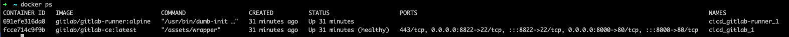

## set up alt: everything on docker compose: gitlab CE and runner
Before make sur every components from the previous set up is shut down:
* `docker-compose down`for prevoious docker compose elements (gitlab + redis+ postgre as Gitlab server )
* `brew gitlab-runner uninstall`
* check with `docker ps -a`and `gitlab-runner list`

Let's srat with the new set up: here, every components is deployed in docker compose:
- gitlab server
- gitlab-runner server (instead of macos)

Frist run docker compose to deploy and create docker services with user-defined bridge network
`docker-compose up -d`

Let's check the outpout:
- `docker ps`

docker inspect cicd_gitlab_1 
&& docker inspect cicd_gitlab-runner_1

gitlab-runner register \
--executor="docker" \
--custom_build_dir-enabled="true" \
--docker-image="maven:3.6.1-jdk-11" \
--url="http://gitlab:80" \
--clone-url="http://gitlab:80" \
--registration-token="ZGvsKfRLm1SpFJPtiY9K" \
--description="docker-shared-runner" \
--tag-list="dockershared" \
--run-untagged="true" \
--locked="false" \
--docker-network-mode="cicd_gitlab" \
--docker-disable-cache="true" \
--docker-privileged="true" \
--cache-dir="/cache" \
--builds-dir="/builds" \
--docker-volumes="gitlab-runner-builds:/builds" \
--docker-volumes="gitlab-runner-cache:/cache"

TODO take other repos and run cicd but with runner as docker instead as macos doceker