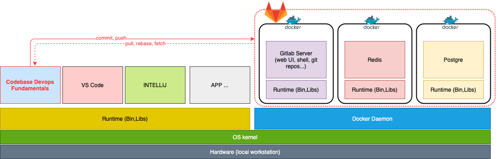
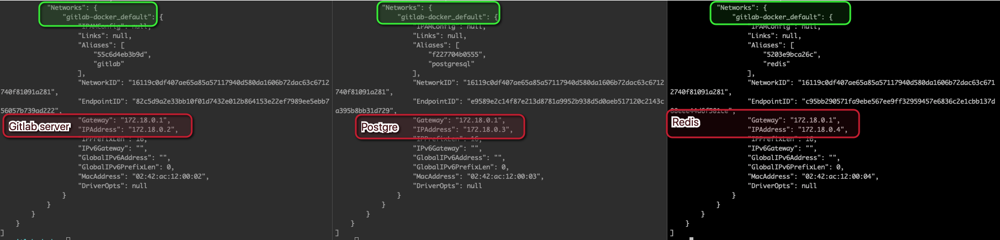
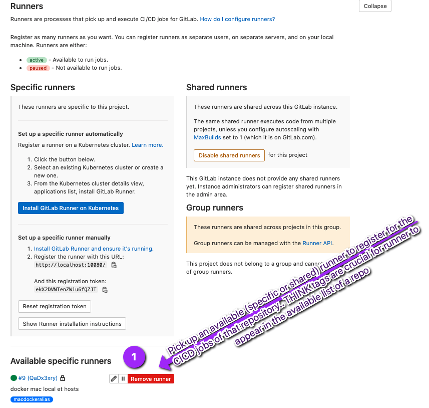
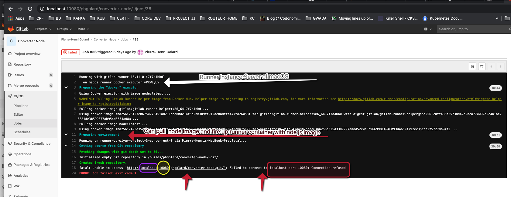
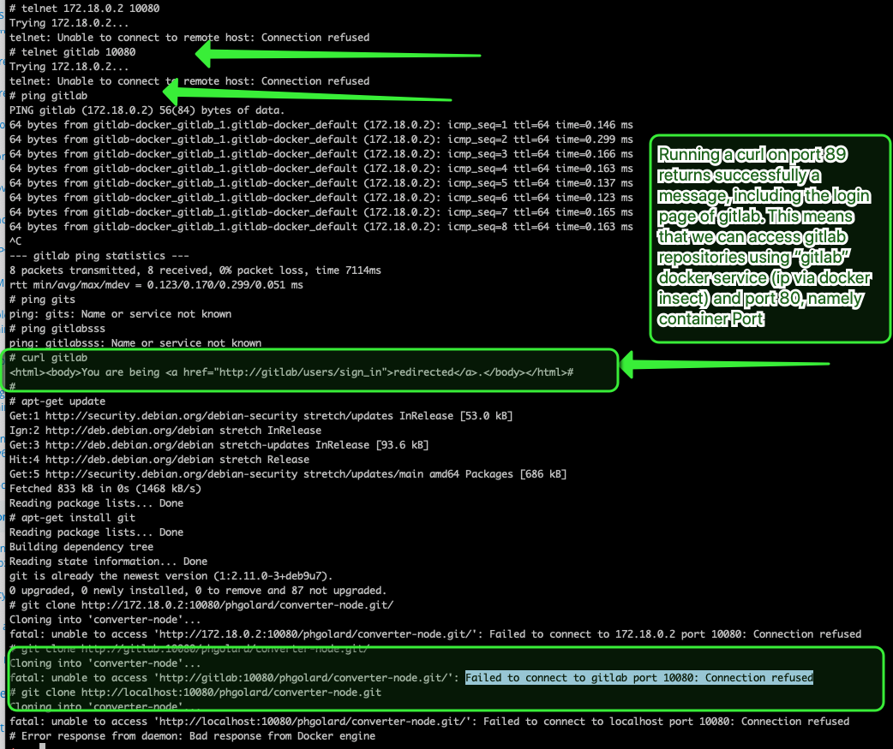
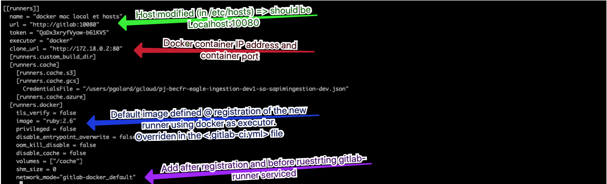
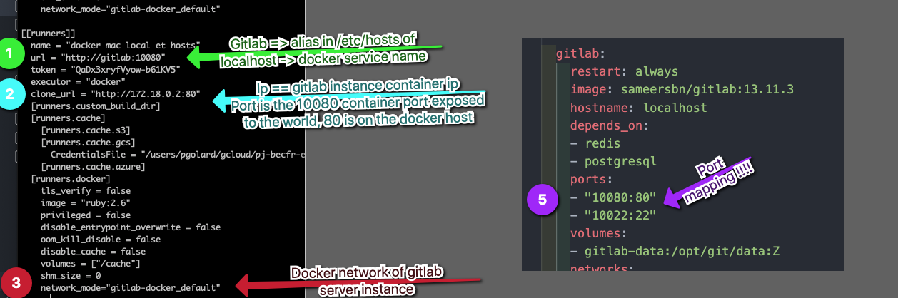

## 1. SetUp Of Gitlab server

The actions we are about to take in this sections are specific to this e-learning context.
Let's go back to the global git schema.


In this section I'll explain how to set up a gitlab server on your local machine.
In the very most of your projects, you will never be required to set up a git server.
Anyway, even if you are required to do so, the central repository should never be installed on your local laptop:


In addition to the versioning features, a git server, either installed on premises or hosted in the cloud, must be configured as a central repository which offers security as well as the possibility of collaborative working.
As a result it will never be set up on the same machine as the developer's workstation.

The point here is to avoid polluting the B&D's gitlab instance, so your laptop will be used as a developer workstation along with a git central repository.

### 1.1 Gitlab Server on Docker

The set up of the gitlab server instance is done as a set of docker containers made up of 3 different micro services based on 3 different docker images:

- Gitlab: container running core gitlab instance including the web UI, the git repositories, ssh, administration of users, groups, CI coordinator...
- PostgreSql: RDBMS used to persist configuration of Gitlab
- Redis: Job queuing

Basically, those 3 containers will run through the Docker daemon running on the OS of your local workstation, next to the local codebase project(s) we will use as illustrations.



We could have installed Gitlab server and its components as regular applications directly on the workstation OS.
We chose docker because

- portability: whatever your laptop OS, as long as Docker Engine is installed we can use the same docker-compose.yml file to get it up and running
- isolation: processes are isolated so it's easy to start/stop it only when needed without affecting your other applications
- easy resource allocation


admin auth

- root
- adminadmin

create user => signup as new user and ask for account creation
admin: validate user request in admin area > overview > users

## 2. CI-CD

### 2.1. Gitlab server

<https://github.com/sameersbn/docker-gitlab#quick-start>

TODO: fill in section on how to deploy gitlab CE with docker-compose.yml

### 2.2. Gitlab Runner

<https://docs.gitlab.com/runner/>

GitLab Runner is an application that works with GitLab CI/CD to run jobs in a pipeline.

You can choose to install the GitLab Runner application on infrastructure that you own or manage.

> If you do, you ***should install GitLab Runner on a machine that’s separate from the one that hosts the GitLab instance for security and performance reasons***. When you use separate machines, you can have different operating systems and tools, like Kubernetes or Docker, on each.

TODO: activity diagram for gitlab runners
https://linuxfr.org/news/boite-a-outils-pour-gitlab-ci
https://www.andrewmunsell.com/blog/ci-cd-with-docker-containers/ - check if it's ok and in line with what we wanna do (it uses tutum and gitlab CI runners, which is not what we wanna do since it does DinD while our future project won't be docker inceptionned lol)


#### 2.2.1. Install Gitlab Runner

GitLab Runner can be installed and used on these OS:

- GNU/Linux
- macOS,
- FreeBSD
- Windows

You can install it:

- In a container.
- By downloading a binary manually.
- By using a repository for rpm/deb packages.

You can also view installation instructions in GitLab by going to your project’s Settings > CI / CD, expanding the Runners section, and clicking Show runner installation instructions.

On Gitlab Server, go to admin area > overview > runners:

<http://localhost:10080/admin/runners>

**Using Brew**
<https://asciinema.org/a/156356>

`brew install gitlab-runner`

Remark:

```bash

To have launchd start gitlab-runner now and restart at login:
  brew services start gitlab-runner
Or, if you don't want/need a background service you can just run:
  gitlab-runner start

```

#### 2.2.2. Configure Gitlab Runner

<https://docs.gitlab.com/runner/executors/README.html#i-am-not-sure>

```bash
➜  ~ sudo gitlab-runner register --url http://localhost:10080/ --registration-token $REGISTRATION_TOKEN
Runtime platform                                    arch=amd64 os=darwin pid=52288 revision=7f7a4bb0 version=13.11.0
Running in system-mode.

Enter the GitLab instance URL (for example, https://gitlab.com/):
[http://localhost:10080/]:
Enter the registration token:
[zqtS2fihzVcSpAvDX4rJ]:
Enter a description for the runner:
[Pierre-Henris-MacBook-Pro.local]:
Enter tags for the runner (comma-separated):
mac,test,shell
Registering runner... succeeded                     runner=zqtS2fih
Enter an executor: shell, virtualbox, parallels, docker, docker-ssh, ssh, docker+machine, docker-ssh+machine, kubernetes, custom:
shell
Runner registered successfully. Feel free to start it, but if it's running already the config should be automatically reloaded!
```

#### 2.2.3. Register Gitlab Runner

```bash
REGISTRATION_TOKEN=zqtS2fihzVcSpAvDX4rJ
sudo gitlab-runner register --url http://localhost:10080/ --registration-token $REGISTRATION_TOKEN
```

:warning: Issues with Runners that can Result in pipeline stuck in ***pending***
status.
See stackoverflow:
<https://devops.stackexchange.com/questions/12866/this-job-is-stuck-because-you-dont-have-any-active-runners-online/13920#13920>

<https://gitlab.com/gitlab-org/gitlab-runner/-/issues/3750>

tout en root ou tout en non root + add tags dans le .gitlab-ci.yml
 et gitlab-runner verify

attention au toml
attention docker vs mac os binaries


probleme mnt si plusieurs runners configured on my macos => pipeline is pointing to the wrong runner


Gros trucs à retenir:

extrait du dcoker-compose.yaml:
```yml
services:
  gitlab:
    restart: always
    image: sameersbn/gitlab:13.11.3
    hostname: localhost
    depends_on:
    - redis
    - postgresql
    ports:
    - "10080:80"
    - "10022:22"
```

docker ps:
```yml
CONTAINER ID   IMAGE                              COMMAND                  CREATED       STATUS                PORTS                                                                                       NAMES
55c6d4eb3b9d   sameersbn/gitlab:13.11.3           "/sbin/entrypoint.sh…"   2 weeks ago   Up 4 days (healthy)   443/tcp, 0.0.0.0:10022->22/tcp, :::10022->22/tcp, 0.0.0.0:10080->80/tcp, :::10080->80/tcp   gitlab-docker_gitlab_1
f227704b0555   sameersbn/postgresql:12-20200524   "/sbin/entrypoint.sh"    2 weeks ago   Up 4 days             5432/tcp                                                                                    gitlab-docker_postgresql_1
5203e9bca26c   redis:5.0.9                        "docker-entrypoint.s…"   2 weeks ago   Up 4 days             6379/tcp                                                                                    gitlab-docker_redis_1
```

The I typed the 
`docker inspect <containerId>`
command for each of the container:


I clearly noticed that docker engine created its own bridge network within which the containers received an IP address and the gateway is the IP of the Engine/host.

Gitlab Runner set up on Macos:

I did brew but this can be done as 👍
```yml
# Download the binary for your system
curl --output /usr/local/bin/gitlab-runner https://gitlab-runner-downloads.s3.amazonaws.com/latest/binaries/gitlab-runner-darwin-amd64

# Give it permissions to execute
chmod +x /usr/local/bin/gitlab-runner

# The rest of commands execute as the user who will run the Runner
# Register the Runner (steps below), then run
cd ~
gitlab-runner install
gitlab-runner start
```
#### Runner registration

Runner Registration on same machine as gitlab-runner
- localhost:10080
- login as root
- access admin are > runners:

you can type the following command onthe terminal on same machine as the one on which gitlab-runner "server" has been installed, namely on my personal macos:

:warning: Modifyed /etc/hosts file to alias localhost with gitlab. This was unuseful and leads to confusion, I'll change it (TODO).

There's a prompt asking serveral questions @ registration. The results are going to be stored in the config.tml filee:

```yml
gitlab-runner register --url http://gitlab:10080/ --registration-token $REGISTRATION_TOKEN
Runtime platform                                    arch=amd64 os=darwin pid=13857 revision=7f7a4bb0 version=13.11.0
```

:warning:💯 the user running the installation as well as running the gitlab-runeer server/process and the one regsitrating a runner to a gitlab server (Gitlab CI) instance have to be identical

```yml
Runtime platform                                    arch=amd64 os=darwin pid=13857 revision=7f7a4bb0 version=13.11.0
WARNING: Running in user-mode.
WARNING: Use sudo for system-mode:
WARNING: $ sudo gitlab-runner...

Enter the GitLab instance URL (for example, https://gitlab.com/):
[http://gitlab:10080/]:
Enter the registration token:
[Jjde2_z4zh8ebr98g3Dc]:
Enter a description for the runner:
[Pierre-Henris-MacBook-Pro.local]: macos runner docker executor with aliased hostname
Enter tags for the runner (comma-separated):
macdocker
Registering runner... succeeded                     runner=Jjde2_z4
Enter an executor: parallels, shell, virtualbox, kubernetes, custom, docker, docker+machine, docker-ssh+machine, docker-ssh, ssh:
docker
Enter the default Docker image (for example, ruby:2.6):
ruby:2.6
Runner registered successfully. Feel free to start it, but if it's running already the config should be automatically reloaded!
```

:warning:🥇 Note that there can be shared or specif runner, but usually you create les runners than repositories for which you run CI pipelines. I think you configure 2 or 3 runner different, that you pivk them up at project-level for registration:

:warning::alarm_clock: we nitce an importance of the tags in order to filter out the available runners for a repo

`gitlab-runner restart`
```yml
Runtime platform                                    arch=amd64 os=darwin pid=13906 revision=7f7a4bb0 version=13.11.0
```

it cleanly restarts the Runners on the runner servers


`gitlab-runner verify`
```yml
Runtime platform                                    arch=amd64 os=darwin pid=13956 revision=7f7a4bb0 version=13.11.0
WARNING: Running in user-mode.
WARNING: Use sudo for system-mode:
WARNING: $ sudo gitlab-runner...

Verifying runner... is alive                        runner=6AP6SvE8
ERROR: Verifying runner... is removed               runner=6DSzD4PZ
ERROR: Verifying runner... is removed               runner=vPRWiyUv
Verifying runner... is alive                        runner=g94o98Vb
FATAL: Failed to verify runners
```

THe job we took as an example was node-converter, a simple node js app running unit test wih hexadecimal convertor.
Normally this is a "normal" node.js app who is run as process/service on a VM.
Here we wont to run a ci job that will run unit tests whenever something happens. As descirbed in the .gitlab-ci.yml file of the repository, the build stage will consists of running thos node.js unit tests. 
The gitlab-runner we registred was using `docker`as executor for its ci jobs.
This means that whenever an event occuer on the repo, it tirggers a CI jobs (triggered by gilab CI coordinator, running on gitlab server) runing on docker and responsibles for executing some tasks of the lifecycle of an application (installation, building, testing, packaging, deploying). 

Here is the content of the .gitlab.ci?yml file at the root of the repository and which defines the CI jobs:

```yml
image: node:latest

cache:
  paths:
    - node_modules/

test:
  tags:
    - macdockeralias
  script:
    - npm install
    - npm run test

```

You notice the `tags` sub-section included in the `test` section. The `tags`indicates a **List of tags that are used to select a ** `runner.`

The 2 commands of the CI script will be run on Docker, on image `node:latest`. The 
> npm install 
download node.js dependencies and store them in the node_modules directory, that will be `cached`. 
> npm run test
will run the unti tests defined in this file:

```javascript
var expect    = require("chai").expect;
var converter = require("../app/converter");

describe("Color Code Converter", function() {
  describe("RGB to Hex conversion", function() {
    it("converts the basic colors", function() {
      var redHex   = converter.rgbToHex(255, 0, 0);
      var greenHex = converter.rgbToHex(0, 255, 0);
      var blueHex  = converter.rgbToHex(0, 0, 255);

      expect(redHex).to.equal("ff0000");
      expect(greenHex).to.equal("00ff00");
      expect(blueHex).to.equal("0000ff");
    });
  });

  describe("Hex to RGB conversion", function() {
    it("converts the basic colors", function() {
      var red   = converter.hexToRgb("ff0000");
      var green = converter.hexToRgb("00ff00");
      var blue  = converter.hexToRgb("0000ff");

      expect(red).to.deep.equal([255, 0, 0]);
      expect(green).to.deep.equal([0, 255, 0]);
      expect(blue).to.deep.equal([0, 0, 255]);
    });
  });
});

```

Here is the failure logs for the first CI job with docker executor runner for node.js project.:

  

Basically some steps complete, like pulling and firing up container frunning the CI jobs defined for the node converter repo, but it fails when it comes to cloning git reposiory hosted on local gitlab-server.
We see that it cannot containe to localhost on port 100800.

In order to clarify the situation, we took several actions.
First we strive to understand the connectivity issues. 
1. First we relize that the cloning of the localhost:10080 hosted repository would never work 
   We connect ssh to each container:
   > docker ps:
   ```yml
   CONTAINER ID   IMAGE                              COMMAND                  CREATED          STATUS                  PORTS                                                                                       NAMES
    054f6a8c1fb1   pgolard/node-utils:v1              "docker-entrypoint.s…"   24 seconds ago   Up 23 seconds                                                                                                       exciting_liskov
    26e813c20c92   busybox                            "/bin/sh -c ' sleep …"   15 minutes ago   Up 15 minutes                                                                                                       magical_nobel
    55c6d4eb3b9d   sameersbn/gitlab:13.11.3           "/sbin/entrypoint.sh…"   9 days ago       Up 20 hours (healthy)   443/tcp, 0.0.0.0:10022->22/tcp, :::10022->22/tcp, 0.0.0.0:10080->80/tcp, :::10080->80/tcp   gitlab-docker_gitlab_1
    f227704b0555   sameersbn/postgresql:12-20200524   "/sbin/entrypoint.sh"    9 days ago       Up 20 hours             5432/tcp                                                                                    gitlab-docker_postgresql_1
    5203e9bca26c   redis:5.0.9                        "docker-entrypoint.s…"   9 days ago       Up 20 hours             6379/tcp                                                                                    gitlab-docker_redis_1

   ```

   and when we immediately understand that localhost is not the appropiate url since all containers have their own localhost diffent from each other. and especially the docker container running the CI job coudn't clone a repo from its localhost since the repo i installed on another dpcker container. When inspecting network on new container:
   `docker inspect 26e813c20c92` we did not see it was part of the network created in the docker-compose. So we decided to welcom this new container in our docker netowrk:
   `docker network connect gitlab-docker_default 26e813c20c92`
   The we ran and connect to the container to run the tests commands about port and url:
   `docker exec -it 26e813c20c92 /bin/sh`

   And I just ran easy command like `ping`or `telnet`:
   ```bash
   # ping gitlab
    PING gitlab (172.18.0.2) 56(84) bytes of data.
    64 bytes from gitlab-docker_gitlab_1.gitlab-docker_default (172.18.0.2): icmp_seq=1 ttl=64 time=0.114 ms
    64 bytes from gitlab-docker_gitlab_1.gitlab-docker_default (172.18.0.2): icmp_seq=2 ttl=64 time=0.159 ms
    64 bytes from gitlab-docker_gitlab_1.gitlab-docker_default (172.18.0.2): icmp_seq=3 ttl=64 time=0.165 ms
    64 bytes from gitlab-docker_gitlab_1.gitlab-docker_default (172.18.0.2): icmp_seq=4 ttl=64 time=0.133 ms
    64 bytes from gitlab-docker_gitlab_1.gitlab-docker_default (172.18.0.2): icmp_seq=5 ttl=64 time=0.165 ms
   ```
   We see we can `ping` "gitlab" the name of the container, docker service, and its IP address given by the docker engine.
   Running a `telnet` on the same IP (accessible: we can send and fetch paquets) but with specif `port` 10080, the port publish to make it accesssible externally, which mappe the HostPort (macos port) to container-port(80), will generate and error, a connection refused while actuall the problm is that we are not pointing to the right port. Since we're now  running commabds ***from with another docker container***, we **can directly used "container" Ports** since we **talk to container directly**
    

   To get this sorted out we had to make some modif when registering the runners. The idea is to be able to initiate the registration of a runner. As this stage (*registering the runners*) is run on MacOsx, the ***git repo needs to be accessible on localhost 100800***. Then `when the CI JOb is actrually run on Docker`, this is a *second stage* where contexts and perspectives completely change and you can refaer to container elements like service, service name, containerId containerPort . This lead to modif of the `config.toml` files (/Users/pgolard/.gitlab-runner/config.toml) in second phase:
   

   
   

   :warning:The config means Port 110080 of the Host is mapped with port 80 of the container

Here a kind of gros summary

- gitlab-runner server 
  - set up as binary/global service on macos
  - runners registered with gitlab CI coordinator (server) as docker executor
  - config.toml modified
    - main url
      - domain specified as gitlab (name of docker service in docker-compose): works since I modified /etc/hosts to include alias of 127.0.0.1 as gitlab. Otherwise I could have left localhost
      - port specified is 10080: attention when testing the registration, this is done by the gitlab-runner process/service directly running on MACOS so you have to specify this port. Actually it will work for the testing but it will fail when trying to clone repo from the docker container during the run of the CI job
    - clone_url: called if main doesn't work. In this case it will be called as the main url will lead to a failure (due to the port)
      - domain specified here is the IP of gitlab container (use `docker inspect <containername>` to retrieve the IP address of the container). we should have left the docker service name (specified in docker-compose) namely gitlab
      - port is 80: this works since 10080 is the port mapped on the host (on my macos). ACtually, when I register I need to specify localhost and 10080 since the registration itself is run on mac os as binary/service, which access gitlab server as well as the git repositories using localhost and the host port 10080 mapped to container port (80). WHen CI jobs is triggered, the job in itself, including the clonde of the git repository, is running in a docker container/ In the container, its own loalhost doesnt' know/run the gitlab server so the runner falls back to clone_url, namely "http://172.18.0.2:80", which the container IP known in docker network. and since we are now in the docker network/layer, we cannot used the "host" port any more but directly the container port (80)

So currently we:

1. Achieve the firtst stage for the registration of a gitlab runner server and gitlab server CI thtrough git respositories that need to be cloned build test and deploy. WE do this by registering runner to Job (repos) using variables with relative adressage that passes the first round of validatio. 
2. Go the `/Users/pgolard/.gitlab-runner/config.toml` and modifies deeper those values. as an example: if your Runner executor is Docker, and if I want to gestiter a new Runner for a repository hosted on the docker container gitlab, I access it through the browser through localhost and port 10080: SO I need to configure the config.toml file to make sur this will be possible.
3. Nevertheless, Once the Runner is registered, this relative adressage won't work when CI job run on Docker: localhost of the container where the CI job runs doesn't contain the git repo. especially in its localhost. THis means the docker nework and the IP's it attributed should now give the appropriate ip address. We modified trhe config.toml to includ the erference to the local docker networke created, and each docker services became part of this docker network.
4. Finally, we quickly picked up that once the CI job is running on a runner instance, the perspective becomes docker container. As a result, if I want to interact with a container 's port, I select the container Port, not the port of the container mapped to the host Port.
5. To enable thos 2 distinct steps completes, the workaround is th specify a "clone_url". This "clone_url" is used onfli if regaler url fails. Or it will fail while run from the container. 

## Future setup (docker gitlab & gitlab runner process on docker using only 2 images)

https://www.ivankrizsan.se/2019/06/17/building-in-docker-containers-on-gitlab-ce/

