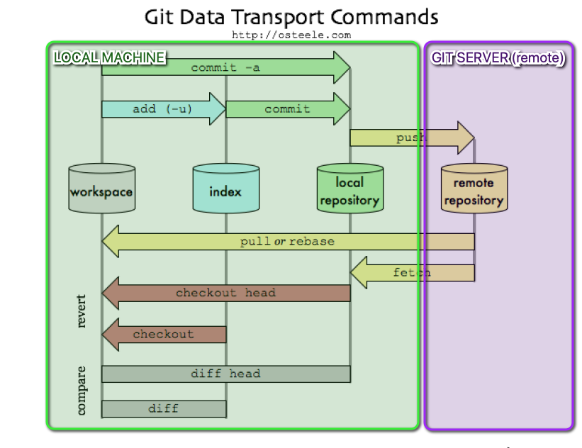

At the heart of Git, introduction illustration.


## 1. Section Contents

Here is an example of content sections with titles, subtitles. Important to integrate fully guide hands-on sections.

* [1. Section Contents](#1-section-contents)
* [2. Types of VCS](#2-types-of-vcs)
  * [2.1. SVN or CVS as centralized VCS](#21-21-svn-or-cvs-as-centralized-vcs)
  * [2.2. Git as distributed VCS](#22-22-git-as-distributed-vcs)
* [3. How Git Stores Revisions](#3-how-git-stores-revisions)
* [4. .git repository structure](#4-git-repository-structure)
  * [4.1. Illustration](#41-illustration)
    * [4.1.1. Pre Requisite](#411-pre-requisite)
    * [4.1.2. Build your first repo](#412-build-your-first-repo)
  * [4.2. Analysis of .git directory](#42-analysis-of-git-directory)
  * [4.3. hooks directory](#43-hooks-directory)
  * [4.4. The Index](#44-the-index)
  * [4.5. .git Config](#45-git-config)
  * [4.6. Git Objects](#46-git-objects)
    * [4.6.1. Git Objet - Commit Object](#461-git-objet---commit-object)
    * [4.6.2. Git Object - Tree Object](#462-git-object---tree-object)
    * [4.6.3. Git Object - Content Object](#463-git-object---content-object)
  * [4.7. .git refs](#47-git-refs)
  * [4.8. Git HEAD](#48-git-head)
  * [4.9. Modif in you working directory](#49-modif-in-you-working-directory)


## 2. Types of VCS

An interesting introductory remark about git would be about its `decentralized` character.
In Version controlling you can have centralized and decentralized VCS.

### 2.1. 2.1 SVN or CVS as centralized VCS

In a `centralized` VCS, the **database** resides on a **central server** and you `checkout` a **copy from the server**. **Most** of the **commands** **require** you to **contact the central database** and hence **require network access**.


### 2.2. 2.2 Git as distributed VCS

In a `decentralized` or `distributed` VCS, **each and every node has a copy of the database** and hence you **clone a copy from a remote server**.


Note that the remote server has no special permissions except for the fact that all the nodes have access to the remote server. As a result of this, **most of the commands** on `git` (**except** `git push` or `git pull`) **can** be performed **without network access**.

## 3. How Git Stores Revisions

As we remember from the introduction, in a `Distributed Version Control` system a `local copy` is saved on `each node` (computer of a person who is part of the project). There is **also** a `centralized` `server` where **all the team members push** their changes. This way `Git` is **resilient** to crashes as each node has its own copy of the source tree.

`Git` stores the changes in files **differently** as compared to other `Version Control Systems` like `SVN` and `CVS`. This is one of the important concept of `Git` that you should internalize as early as possible:

> Centralized Version control systems store the difference (delta) between the two versions.
>
> 

For example, consider **File A** that got changed three times. The First version of the file will be stored as is, in the sense complete file will be stored. As new versions are introduced only the difference from the previous version will be saved. This will become clearer when we look at the image below, this image shows how over multiple revisions changes are stored for three files.
Here we can see that other `CVS` ***store the delta (changes)*** to a given file over time.

`Git`, on the hand, ***stores the Snapshot of the changed file***.
For example, if you made a change to **File A**, a **complete snapshot** of the changed file is stored. ***If a file has not changed between two versions, `Git` will keep a reference of the original file instead of copying it again in the new version***. Below image summarizes how Git internally stores the changes.

> `Git`, on the hand, ***stores the Snapshot of the changed file***.
>
> 

To summarize this section, the three important points that we learned about Git are

* `Git` stores a **Snapshot of a file** as **opposed** to **storing a Difference**, which **other Version Control Systems** do.
* `Git` only takes a `Snapshot` of the `changed` files.
* To optimize memory, `Git` **keeps** a `Reference` of the file that has not changed instead of making a copy of it in the new version.


## 4. .git repository structure

As we have already mentionned, Git is decentralized and therefore every node (laptop, workstation...) has a ful copy of the whole database. There is also a centralized remote server where all team members push their commits.

  

### 4.1. Illustration

To illustrate that, let's do an exercise.

#### 4.1.1. Pre Requisite

At section Zero w saw how to deploy gitlab server locally though Dockr. We  also saw how to create users and authenticate via ssh.
For the sake of this exercise, we will create a project remotely and bind it to our local repository.
Thanks to that we will go over the different zones/areas of git.

For those who have not done it yet, please refer to the following section [Gitlab Server Setup](../../../0-Gitlab%20server/Theory/README.md#11-gitlab-server-on-docker) and

* deploy the containers needed to run gitlab server on your laptop
* configure your admin account to access gitlab as `root`and be able to administrate the platform
* create at least one [User](../../../0-Gitlab%20server/Theory/README.md#14-gitlab-server-user-creation)

#### 4.1.2. Build your first repo

1. First we go on our local machine and we create a folder `gitillu`in which we add a README.md file

  ```yml
  mkdir gitillu
  cd gitillu
  touch README.md
  echo "I love git but I prefer beers" >> README.md
  ```

2. We initialize git in this repository via `git init`and we also configure the user and the email of the developer.

  ```yml
  git init
  git config user.name "Jules Cesar"
  git config user.email "cesarj@gmail.com"
  ```

3. Notice now that we have git project with a default branch called `master`and if you run a git status you see

  

4. We also see that a ***hidden*** folder `.git`has been created. This folder contains several files and directories, notably a config file:

  

5. Now we create a blank project on a remote server - gitlab (here it's local on Docker but we consider it as if was remote on gitlab.com for instance)

  

6. Then we indicate the `remote` repo on our local machine. We specify this remote will be represented by the alias `origin`.

  

  ```yml
  git remote add origin ssh://git@localhost:10022/git-tuto/gitillu.git
  ```

7. Finally we `add`, `commit` the files to our `local repository` on the `master` `branch` and we `push` our work to the `remote repo` on gitlab server docker. We'll speak about those actions later on in this section

  


Now we basically have all the components in place to illustrate the different areas of the Figure 1.

- workspace
- index
- local repo
- remote repo

### 4.2. Analysis of .git directory

Basically, when you run `git init` you trigger a command that will initialize the set up of git in the scope of your directory and `create a new repository`. It means that the `version controlling` of your `working directory` is now managed by Git which deployed a few components in your working directory within a `hidden directory` named `.git`:
> ls -lart
```yml
total 8
-rw-r--r--    1 pgolard  staff    30 Jun 27 18:52 README.md
drwxr-xr-x    4 pgolard  staff   128 Jun 27 18:52 .
drwxr-xr-x   13 pgolard  staff   416 Jun 27 19:22 .git
drwxr-xr-x+ 190 pgolard  staff  6080 Jun 27 19:22 ..
```

Let's have a closer look at the content of the hidden folder `.git` :

  


### 4.3. hooks directory

The `hooks` directory contains your client- or server-side hook scripts. Hooks are programs you can place in a hooks directory to trigger actions at certain points in git's execution

### 4.4. The Index

The `index` file is where `Git` stores your ***staging*** area information. we will develop this concept later on in this section

### 4.5. .git Config

The `config` file contains your **project-specific configuration options**

> cat .git/config
```yml
[core]
	repositoryformatversion = 0
	filemode = true
	bare = false
	logallrefupdates = true
	ignorecase = true
	precomposeunicode = true
[user]
	email = cesarj@gmail.com
	name = Jules Cesar
[remote "origin"]
	url = ssh://git@localhost:10022/git-tuto/gitillu.git
	fetch = +refs/heads/*:refs/remotes/origin/*
[branch "master"]
	remote = origin
	merge = refs/heads/master
```

### 4.6. Git Objects

At the core, `git` is nothing but a `key-value data store`. Git uses `SHA-1`
- hash of the **content** (content could either refer a file or commit or directory structure — we’ll get to it soon) as the `key` and
- the **content** itself (compressed) acts as the `value`.

In order to understand more about git objects, let’s walk-through an example.
Remember the content of the workplace of the new project we have just create `gitillu`:

  

Basically we
* created a file called `README.md`
* and inserted the text `I love git but I prefer beers`,
* we have added to `git index` and
* `committed` with a message.


If we know take a look at the different objects created in this example, I see it has created 3 directories (`35`, `a1` and `91`) **besides** the `info` and the `pack`:

  

We are now going to use a command call `git cat-file` which is used to provide the **content or the type** of an **object** in the **repository**.
This is how Git stores the content initially — as a single file per piece of content, named with the SHA-1 checksum of the content and its header. The `subdirectory` is named with the ***first 2 characters of the SHA-1***, and the `filename` is the ***remaining 38 characters***.

  

#### 4.6.1. Git Objet - Commit Object

In order words, if we want to see what the first object, under the **subdirectory** `35`, represents, we should **concatenate** the `subdirectory` name with the `filename` included in the subdirectory:
> git cat-file -p ***35***4d0d9032f67b801bea5f0acc95ea2c64feac13

  


We end up here with a ***`commit object`***. The folder/subdirectory `35` is the `commit`, with a header containing author, committer details and time-stamp, followed by the `commit message` itself. If you type `git log` you will recognize that the commit number is just the hash of this commit object.

  

#### 4.6.2. Git Object - Tree Object

The second folder (here `a1`) is a ***`tree object`***. Git **stores** the `file system structure` in these `tree objects`

* The first column shows the `unix permissions`
* the second column is either `blob or tree` depending on whether it is a pointer to a file or another directory
* the third is the `hash` of the `object` `pointed` to
* the fourth is the `filename`.

In this case there is ***only one file tracked*** by `git`, `README.md`. As a reminder here the file permission:

> ls -lart
```yml
total 8
-rw-r--r--    1 pgolard  staff    30 Jun 27 18:52 README.md
drwxr-xr-x    4 pgolard  staff   128 Jun 27 18:52 .
drwxr-xr-x   13 pgolard  staff   416 Jun 27 19:22 .git
drwxr-xr-x+ 190 pgolard  staff  6080 Jun 27 19:22 ..
```

and you can see that this tree node reflects that by listing one file, and pointing to the blob holding its contents. We see that the `access rights` of `README.md` is `644`. This matches what we saw above ***(U:rw-, G:r--, O:r--)***.

  


#### 4.6.3. Git Object - Content Object

The last `folder 91` is the ***content of the file itself*** and represent a ***`Content Object`***. You can view the contents of by running the git `cat-file -p ` command **concatenating** its subfolder `91` whith the `filename`. FYI the content of the `README.md` file was `I love git but I prefer beers`.

  

### 4.7. .git refs

The .git/refs directory basically consists of `pointers to commit objects`.

```yml
➜  gitillu git:(master) ls -lart .git/refs
total 0
drwxr-xr-x   2 pgolard  staff   64 Jun 27 18:52 tags
drwxr-xr-x   3 pgolard  staff   96 Jun 27 19:20 heads
drwxr-xr-x   5 pgolard  staff  160 Jun 27 19:20 .
drwxr-xr-x   3 pgolard  staff   96 Jun 27 19:20 remotes
drwxr-xr-x  13 pgolard  staff  416 Jun 28 00:06 ..
```

If you add a ***remote and push to it***, `Git` stores the `SHA-1` value you last **pushed** to that **remote branch** for `each branch in the refs/remotes directory`. So You'll see as many paths as remotes branch you've pushed on your remote server. What is finally included in those files is a reference to last Git Object (last push to this remote branch). Here have a look at what is in the file `.git/refs/remotes/origin/master` which matches the name of the last branch (3) we have pushed to on the remote repo. In this file, we find an hashkey (4) is equal to the hashkey of the commit object (5) we found earlier on. HAving a look again at the commit object (6,7), we see the reference made to the tree object(7)

  


The **heads** directory has a `file for every branch in your repository` containing the `SHA-1 hash` of the `latest commit in that repository`.It's exactly the sames as the refs section but refs/remote only contains remote branches on which we have pushed while heads contain all branches local and remote.

  

<!-- TODO check tag folder
 The tag folder has references to a tag object. A tag object is very much like a commit object — it contains a tagger, a date, a message, and a pointer. The main difference is that a tag object generally points to a commit rather than a tree. It’s like a branch reference, but it never moves — it always points to the same commit but gives it a friendlier name.
We see THe Conect Object represents the content of the
-->


### 4.8. Git HEAD

The `HEAD` file points to the `branch` you ***currently*** have `checked out`. This is also detailed later on.
The HEAD file is a symbolic reference to the branch you’re currently on. By symbolic reference, we mean that unlike a normal reference, it doesn’t generally contain a SHA-1 value but rather a pointer to another reference. If you look at the file, you’ll normally see something like this:
>cat .git/HEAD
```yml
ref: refs/heads/master
```


### 4.9. Modif in you working directory

Imagine we modify the README.md file by adding thousands of records. Then we add and commit this change.
Now let's have a look at your .git/objects directory:
When you make a change to `README.md` and commit it, this will create **3** more folders. the first one, `16` in our case, will be a `snapshot` of the latest file, and represents a `Content Object`


The second one, `2e`, will be a `tree object` for the `folder structure` pointing to the `latest commit`
The third one,`ad`, is for the `commit`.


## 5. Git areas and file state management


We have already seen that a git operates the version controlling of the files with a local set of components, notably the objects that stores all pieces of info need to securely build/rebuild the files last state.:

* tree objects that keep the fs structure of file (size, rights...)
* commit objects that points to the last commit msg
* content objects

But in order to figure out how git takes care of the version controlling, you have to see it as workflow between 3 steps, 3 areas through which files have various states and are moved from one stage to another depending on the states.

### 5.1. Git WorkFloW

There are three main components of a Git project:

* The `repository`, or repo, is the “container” that `tracks the changes` to your ***project files***. It ***holds all of the commits*** — a `snapshot of all your files at a point in time` — that have been made. You can ***access the commit history*** with the `Git log`.

* The `working tree`, or working directory, ***consists of files that you are currently working on***. You can think of a working tree as a file system where you can modify the state of our workspace: create, edit or delete an existing file. O

* The `index`, or `staging area`, is where commits are prepared. The index compares the files in the working tree to the files in the repo. When you make a change in the working tree, the index marks the file as modified before it is committed. ne role of Git is therefore to **take track of the modifications between your workplace** (your local directory) and **what has been versioned**, the local as well as the remote repository.

This can be presented as a workflow:


* `Modify` your files in the `working tree`.
* `Stage` the ***changes you want to include in the next commit*** - `git add`. `Staging` ***puts changes in the*** `index` ***until commit***..
* `Commit` your **changes**. (Committing will **take the files from the index and store them as a snapshot in the repository.**)

### 5.2. States of Files in GIT

As you can probably guess from the Git workflow, files can be in one of three states:

* `Tracked`: file exists `locally` in your `working` tree and is ***part of the Git Repository***. Git tracks any changes on that file
* `Untracked`: This file exists locally, but isn’t a part of the Git repository. ONCe it has BeeN `Git add`, it becomes `staged` and part of the `index`
* `Modified`: tracked file on which some modification have been made since last commit. Only Tracked file can have modified as state
* `Staged`: tracked file whose last changes have been staged, namely added to the `index` (via git add), but not committed yet
* `Committed`: staged changes on tracked  files that have been committed. As a result, the file is ***moved from the index to the local repository where stored as a `snapshot`*** and becomes `unmodified`

When you modify a file, the change will only be found in the working tree. You must then stage the changes if you want to include them in your next commit. Once you finish staging all files, you can commit them and add a message describing what you changed. The modified files will then be safely stored in the repo.


### 5.3. Hands on illustration

Let's restart from our current example gitillu:

> ls -lart

```yml
total 256
drwxr-xr-x    4 pgolard  staff     128 Jun 27 18:52 .
-rw-r--r--    1 pgolard  staff  125985 Jun 28 02:12 README.md
drwxr-xr-x   13 pgolard  staff     416 Jun 28 02:50 .git
drwxr-xr-x+ 190 pgolard  staff    6080 Jun 28 04:37 ..
```

We are going to illustrate the functionning of git with some actions we're going to take on our gitillu project.

1. Create a new file "toto.py" and insert "print ("hello")"

  > touch toto.py
  > echo "print('hello')" >> toto.py

2. Check the status of your git repo


  > git status

  ```yml
  On branch master
  Your branch is up to date with 'origin/master'.

  Untracked files:
    (use "git add <file>..." to include in what will be committed)
    toto.py

  nothing added to commit but untracked files present (use "git add" to track)
  ```
3. Make sure your new file and its content are tracked and ready to be committed (staged)
  > git add toto.py
  > git status
  ```yml
  On branch master
  Your branch is up to date with 'origin/master'.

  Changes to be committed:
    (use "git restore --staged <file>..." to unstage)
    new file:   toto.py
  ```
4. Commit
  > git commit -m "Add toto"
  > git status
  ```yml
  On branch master
  Your branch is ahead of 'origin/master' by 1 commit.
    (use "git push" to publish your local commits)

  nothing to commit, working tree clean
  ```  
5. Make some modif on "toto.py" by adding new line "print ("new line in toto")"
  > echo "print('second line')" >> toto.py

6. check the status
  > git status
  ```yml
  On branch master
  Your branch is ahead of 'origin/master' by 1 commit.
    (use "git push" to publish your local commits)

  Changes not staged for commit:
    (use "git add <file>..." to update what will be committed)
    (use "git restore <file>..." to discard changes in working directory)
    modified:   toto.py

  no changes added to commit (use "git add" and/or "git commit -a")
  ```
7. We see now that "toto.py" is tracked and is mentionned as "modified". Please now add the modifications to the index (staging) but do not commmit them. ANd before commit, compare what is in the repository with what is currently staged with `git diff --staged`

> git diff --staged

  


If you want to remove a tracked file and make it become untracked you can
> git rm --cached toto.py
> git restore --staged toto.py

Please note that your file will be removed from the index but still present in your working directory.
> git status

```yml
On branch master
Your branch is ahead of 'origin/master' by 5 commits.
  (use "git push" to publish your local commits)

Changes to be committed:
  (use "git restore --staged <file>..." to unstage)
	deleted:    toto.py

Untracked files:
  (use "git add <file>..." to include in what will be committed)
	toto.py
```

If you want to `unstage` your changes you can  can
> git restore --staged toto.py
> git rm --cached toto.py
> git reset toto.py
> git reset -p

Find below a small analogy between **packing boxing for moving out and Git**.


| Moving boxes      |      Git    |   commands|
- |:-: | -:
| You’re moving and you have **a box to pack** your things in.      |        You're doing some **changes in the files** of your directory (create, modify, delete, ...)        |      nano, touch, rm, ... |
| You can **put stuff** into the box, but you can also **take stuff out** of the box.        |        You can **add file** to your staging area or **remove** some        |      git add, git checkout, ... |
| You wouldn’t want to ***mix items*** from the bathroom, kitchen and living room into ***the same box***.      |        You only add changes that correspond to a same development feature        |      git add -p, ... |
| You **seal the box** and **stick a label** on it in order to easily find it back.      |        You **commit** your changes **with a message**        |      git commit -m ".."|
| You wouldn’t want to label your box with “stuff”, but rather **give a more descriptive label**.        |        **Always use a meaningful message** to find back your changes later        |       |
| You **send the boxes** to the **new flat**       |        You **push the codes** to the **remote repository**       |   git push    |

## 6. SUMMARY

### Key assets of Git

* `Performance`: Git provides the best performance when it comes to version control systems. Committing, branching, merging all are optimized for a better performance than other systems.
* `Security`: Git handles your security with cryptographic method SHA-1. The algorithm manages your `versions, files, and directory` securely so that your work is not corrupted.
* `Branching Model`: Git has a different branching model than the other VCS. Git branching model lets you have multiple local branches which are independent of each other. Having this also enables you to have ***friction-less context switching*** (switch back and forth to new commit, code and back), `role-based code` (a branch that always goes to production, another to testing etc) and disposable experimentation (try something out, if does not work, delete it without any loss of code).
* `Staging Area`: Git has an intermediate stage called “index” or “staging area” where commits can be formatted and modified before completing the commit.
* `Distributed`: Git is distributed in nature. Distributed means that the repository or the complete code base is mirrored onto the developer’s system so that he can work on it only.

###  Key commands

```
git checkout <file_name>     => undo all file changes in your working dir
git checkout -p              => undo changes by blocks in your working dir
git add <file_name>          => add this files to the index (tracked) and all changes related to it
git reset <file_name>        => undo all file changes staged
git reset -p                 => undo staged changes by blocks
git revert <commit_id>       => undo a commit
git commit --amend           => modify the previous commit
git reset --hard <commit_id> => go back to an old commit
```


TODO add a reference to git ignore file
TOOOOOPPPP TODO https://www.atlassian.com/git/tutorials/refs-and-the-reflog
git reflog and head top https://www.atlassian.com/git/tutorials/refs-and-the-reflog

### Next sections

You can now go to the next sections: [3-Recovery](3-Recovery)
