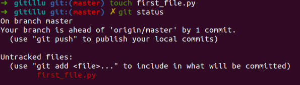

# Introduction

## Section Contents

Here is an example of content sections with titles, subtitles. Important to integrate fully guide hands-on sections.

* [Version control tool](#Version-control-tool)
  * [What is version control](#What-is-version-control)
  * [The well known, Git](#The-well-known,-Git)
* [Repositories](#Repositories)
* [Git Basics by example](#Git-Basics-by-example)
  * [Branches in Git](#Branches)
  * [Environment](#Environment)
  * [Hands on](#Starting-hands-on)

## Version control tool

#### What is version control

Version control, also known as source control, is the practice of tracking and managing changes to software code.
Version control systems are software tools that help software teams manage changes to source code over time.

Some of the key benefices of source control - that we will highlight further - can be summarize below:
- Prevent code loss
- Allowing several developpers/teams to work on the same project by keeping track of all changes
- Ensuring that no developers change the same part of codes without validated them
- Helping Devops team to automatically test and deploy codes
- ... many more.

#### The well known, Git

In the Dev community, Git is the version controller that you will encounter in any project.
Git is a mature, actively maintained open source project originally developed in 2005 by Linus Torvalds, the famous creator of the Linux operating system kernel.

Basically, Git consists of **saving / backing up / versioning a directory**, originally stored on a local machine (your machine), on a **remote server**. The server can be any machine on which git "server" is running, even though most of the time you use a cloud provider such as **Github, Gitlab, Bitbucket**,...

The content of this "directory" can consist of many different type of things.
Most of the time though it consists of source code that can be built (interpreted or compiled) and usually the content of the code is handled through an IDE (Intellij, Visual Studio, Atom, ...) which offers various facilities to manage, run and test code.

## Repositories

Before diving more into Git, we thought important to go back to the understanding of what is a repository and how is generally organize a source code.

@PH to add information here, I propose to not introduce .gitignore here but come back to it at the end of this introduction section :)

## Git Basics by example

Before diving into the Git way of working, let's create our first project tracked by git and set-up the gitlab server.

**Go to the [Gitlab server session](0-Gitlab server) and follow the set_up.md.**

- On your local machine, on the home of your user, create a folder we will use along that training for example purposes and let's initiate Git.
Note that the path/command could change depending on your OS. (on Windows, do it with Git Bash)

```
 mkdir /home/username/testGit
 cd /home/username/testGit
 git init
 git remote add origin http://localhost:8080/user1/test.git
 touch first_file.py
 ls -alrt
```

By doing the previous commands, you should see that a .git folder has been created. You can navigate on it if you want. We will comeback to it later.
(Note that ls -a allows to visualize the hidden directories which start with a .)

> git status



Probably the git command you will run the most with Git. If at any point you don't know if you did something wrong or if something seems weird in the project. Simply run a ***git status*** command and try to figure it out.
We can see that git has discovered that we created a new file in red but that this file is untracted, meaning that we didn't tell Git that we would like to "save it in Git".
let's tell Git that we would like to keep track of that file.

> git add first_file.py


Then, go to your gitlab server (localhost:8080) and see that no file exists.

Let's create a second file but we will not add it to the files we want to keep track with Git.
> touch second_file.txt

> git status


Let's do our first commit of the first_file.py that we created before.

> git commit -m "Generate the first file to commit"

> git status


> git push

Then, go to your gitlab server (localhost:8080) and see that first_file.py has been pushed to Gitlab.


We can now add the second file and also commit it.

> git add second_file.txt

> git commit -m "Add the second file"

> git status

> git push

Then, go to your gitlab server (localhost:8080) and see that both files have been pushed to Git with a reference to the commit message we provided.


#### Commits


By doing a **git add -> git commit**. You tell git to take a snapshot of your directory that is store in the **.git** directory.


    Photography analogy: We first focus (git add, we “stage” the change), then shoot (git commit):


By doing a git push, you tell git to send those snapshots to your remote git server (bitbucket, gitlab, gitblit, github, ...).


## SUMMARY

-    Initializing a Git repository is simple: git init
-    Commits should be used to tell a story.
-    Git uses the .git folder to store the snapshots.

## Key commands

```
git init                               => initiate git in your folder
git remote add origin <remote_git_url> => link your git folder with a remote git repository
git diff                               => see the difference you've made
git add                                => stage your file
git commit                             => commit your changes
git log                                => See your previous commit (id of the commit + messages)
git push                               => Push to the remote git repository
```

#### Next sections

You can now go to the next sections: [2-Git areas](2-Git-areas)
