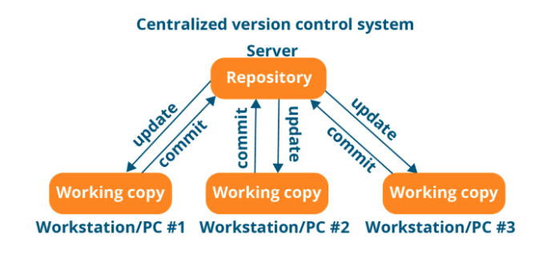
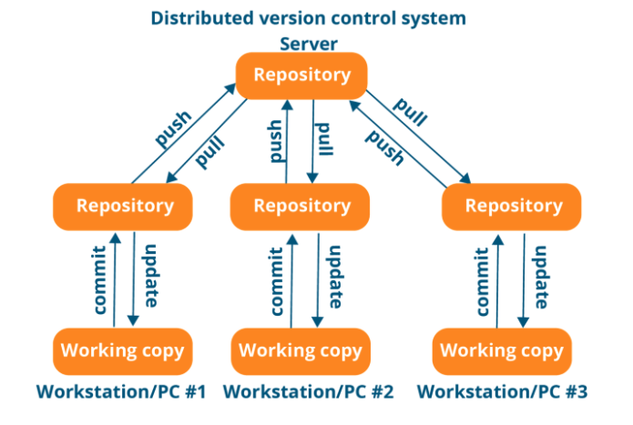
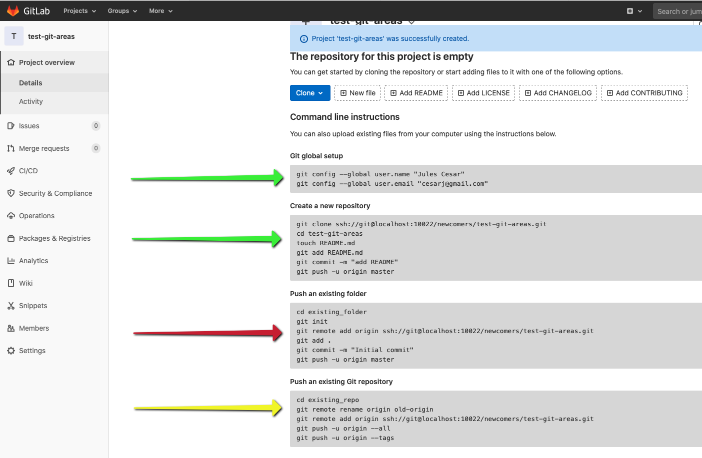
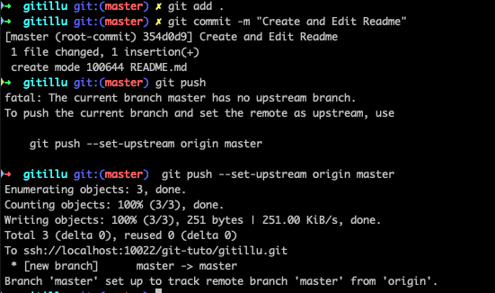
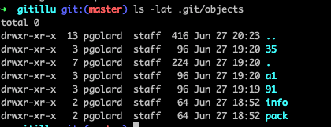
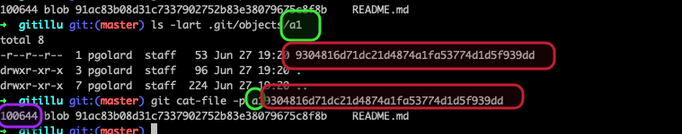
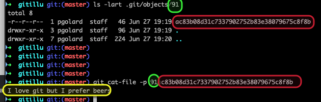
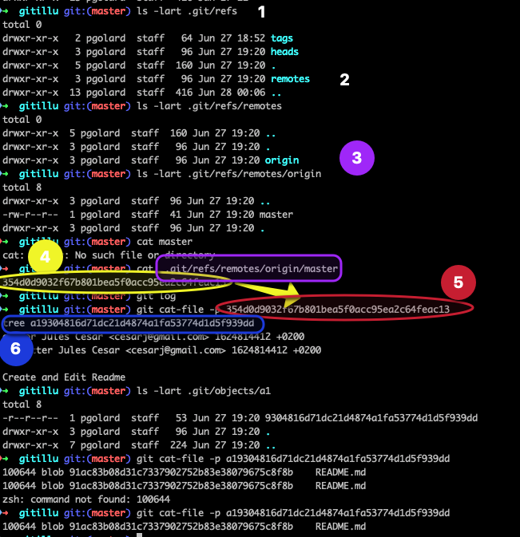
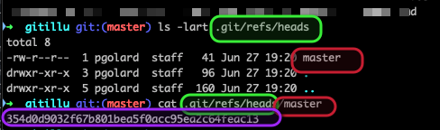
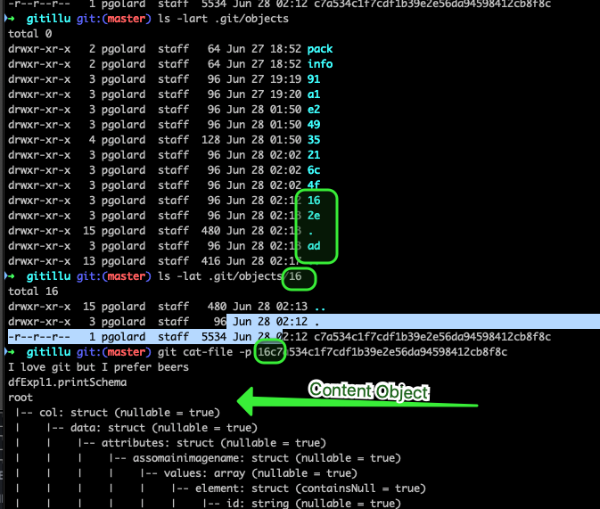

# Introduction

## Section Contents

Here is an example of content sections with titles, subtitles. Important to integrate fully guide hands-on sections.

* [Introduction](#introduction)
  * [Section Contents](#section-contents)
  * [1. Version control tool](#1-version-control-tool)
      * [1.1 What is version control](#11what-is-version-control)
      * [1.2 The well known, Git](#the-well-known-git)
  * [2. Types of VCS](#2-types-of-vcs)
    * [2.1. SVN or CVS as centralized VCS](#21-21-svn-or-cvs-as-centralized-vcs)
    * [2.2. Git as distributed VCS](#22-22-git-as-distributed-vcs)
  * [3. How Git Stores Revisions](#3-how-git-stores-revisions)
  * [4. .git repository structure](#4-git-repository-structure)
    * [4.1. Illustration](#41-illustration)
      * [4.1.1. Pre Requisite](#411-pre-requisite)
      * [4.1.2. Build your first repo](#412-build-your-first-repo)
    * [4.2. Analysis of .git directory](#42-analysis-of-git-directory)
    * [4.3. hooks directory](#43-hooks-directory)
    * [4.4. The Index](#44-the-index)
    * [4.5. .git Config](#45-git-config)
    * [4.6. Git Objects](#46-git-objects)
      * [4.6.1. Git Objet - Commit Object](#461-git-objet---commit-object)
      * [4.6.2. Git Object - Tree Object](#462-git-object---tree-object)
      * [4.6.3. Git Object - Content Object](#463-git-object---content-object)
    * [4.7. .git refs](#47-git-refs)
    * [4.8. Git HEAD](#48-git-head)
    * [4.9. Modif in you working directory](#49-modif-in-you-working-directory)
  * [5. Git Basics by example](#git-basics-by-example)
      * [Commits](#commits)
  * [SUMMARY](#summary)
    * [Key commands](#key-commands)
  * [Next sections](#next-sections)

## 1 Version control tool

#### 1.1 What is version control

Version control, also known as source control, is the practice of tracking and managing changes to software code.
Version control systems are software tools that help software teams manage changes to source code over time.

Some of the key benefices of source control - that we will highlight further - can be summarize below:
- Prevent code loss
- Allowing several developpers/teams to work on the same project by keeping track of all changes
- Ensuring that no developers change the same part of codes without validated them
- Helping Devops team to automatically test and deploy codes
- ... many more.

#### 1.2 The well known, Git

In the Dev community, Git is the version controller that you will encounter in any project.
Git is a mature, actively maintained open source project originally developed in 2005 by Linus Torvalds, the famous creator of the Linux operating system kernel.

Basically, Git consists of **saving / backing up / versioning a directory**, originally stored on a local machine (your machine), on a **remote server**. The server can be any machine on which git "server" is running, even though most of the time you use a cloud provider such as **Github, Gitlab, Bitbucket**,...

The content of this "directory" can consist of many different type of things.
Most of the time though it consists of source code that can be built (interpreted or compiled) and usually the content of the code is handled through an IDE (Intellij, Visual Studio, Atom, ...) which offers various facilities to manage, run and test code.

## 2. Types of VCS

An interesting introductory remark about git would be about its `decentralized` character.
In Version controlling you can have centralized and decentralized VCS.

### 2.1. SVN or CVS as centralized VCS

In a `centralized` VCS, the **database** resides on a **central server** and you `checkout` a **copy from the server**. **Most** of the **commands** **require** you to **contact the central database** and hence **require network access**.




### 2.2. Git as distributed VCS

In a `decentralized` or `distributed` VCS, **each and every node has a copy of the database** and hence you **clone a copy from a remote server**.




Note that the remote server has no special permissions except for the fact that all the nodes have access to the remote server. As a result of this, **most of the commands** on `git` (**except** `git push` or `git pull`) **can** be performed **without network access**.

## 3. How Git Stores Revisions

As we remember from the introduction, in a `Distributed Version Control` system a `local copy` is saved on `each node` (computer of a person who is part of the project). There is **also** a `centralized` `server` where **all the team members push** their changes. This way `Git` is **resilient** to crashes as each node has its own copy of the source tree.

`Git` stores the changes in files **differently** as compared to other `Version Control Systems` like `SVN` and `CVS`. This is one of the important concept of `Git` that you should internalize as early as possible:

> Centralized Version control systems store the difference (delta) between the two versions.
>
> 

For example, consider **File A** that got changed three times. The First version of the file will be stored as is, in the sense complete file will be stored. As new versions are introduced only the difference from the previous version will be saved. This will become clearer when we look at the image below, this image shows how over multiple revisions changes are stored for three files.
Here we can see that other `CVS` ***store the delta (changes)*** to a given file over time.

`Git`, on the hand, ***stores the Snapshot of the changed file***.
For example, if you made a change to **File A**, a **complete snapshot** of the changed file is stored. ***If a file has not changed between two versions, `Git` will keep a reference of the original file instead of copying it again in the new version***. Below image summarizes how Git internally stores the changes.

> `Git`, on the hand, ***stores the Snapshot of the changed file***.
>
> 

To summarize this section, the three important points that we learned about Git are

* `Git` stores a **Snapshot of a file** as **opposed** to **storing a Difference**, which **other Version Control Systems** do.
* `Git` only takes a `Snapshot` of the `changed` files.
* To optimize memory, `Git` **keeps** a `Reference` of the file that has not changed instead of making a copy of it in the new version.


## 4. Initiate a GIT repo

#### 4.1. Pre Requisites

At section Zero we saw how to deploy gitlab server locally though Docker. We also saw how to create users and authenticate via ssh.
For the sake of this exercise, we will create a project remotely and bind it to our local repository.

For those who have not done it yet, please refer to the following section [Gitlab Server Setup](../../../0-Gitlab%20server/Theory/README.md#11-gitlab-server-on-docker) and

* deploy the containers needed to run gitlab server on your laptop
* configure your admin account to access gitlab as `root`and be able to administrate the platform
* create at least one [User](../../../0-Gitlab%20server/Theory/README.md#14-gitlab-server-user-creation)

#### 4.1.2. Build your first repo

1. First we go on our local machine and we create a folder `gitillu`in which we add a README.md file
*(On windows, use the GitBash commandline)*

  ```yml
  mkdir gitillu
  cd gitillu
  touch README.md
  echo "I love git but I prefer beers" >> README.md
  ```

2. We initialize git in this repository via `git init`and we also configure the user and the email of the developer.

  ```yml
  git init
  git config user.name "Jules Cesar"
  git config user.email "cesarj@gmail.com"
  ```
  Note that this configuration is only for that project, you can add the `--global` parameter after `git config` to make it your default profile for all projects. If you create other projects you can again define a "local" config as we do here.

3. Notice now that we have git project with a default branch called `master`and if you run a git status you see

  

4. We also see that a ***hidden*** folder `.git`has been created. This folder contains several files and directories, notably a config file:

  

5. Now we create a blank project on a remote server - gitlab (here it's local on Docker but we consider it as if was remote on gitlab.com for instance)
In order to change the project URL as in the picture below, you'll have to click on `create a group` but you can only do so with an admin account. In this case, it's the root account or you can upgrade the regular user account to an admin account.

  

6. Then we indicate the `remote` repo on our local machine. We specify this remote will be represented by the alias `origin`.

  

  ```yml
  git remote add origin http://localhost:8084/newcomers/test-git-areas.git
  ```

7. Finally we `add`, `commit` the files to our `local repository` on the `master` `branch` and we `push` our work to the `remote repo` on gitlab server docker. We'll speak about those actions later on in this section

  


## 5. .git repository structure

As we have already mentionned, Git is decentralized and therefore every node (laptop, workstation...) has a ful copy of the whole database. There is also a centralized remote server where all team members push their commits.

  

### 5.1. Analysis of .git directory

Basically, when you run `git init` you trigger a command that will initialize the set up of git in the scope of your directory and `create a new repository`. It means that the `version controlling` of your `working directory` is now managed by Git which deployed a few components in your working directory within a `hidden directory` named `.git`:
> ls -lart
```yml
total 8
-rw-r--r--    1 pgolard  staff    30 Jun 27 18:52 README.md
drwxr-xr-x    4 pgolard  staff   128 Jun 27 18:52 .
drwxr-xr-x   13 pgolard  staff   416 Jun 27 19:22 .git
drwxr-xr-x+ 190 pgolard  staff  6080 Jun 27 19:22 ..
```

Let's have a closer look at the content of the hidden folder `.git` :

  


### 5.2. hooks directory

The `hooks` directory contains your client- or server-side hook scripts. Hooks are programs you can place in a hooks directory to trigger actions at certain points in git's execution

### 5.3. The Index

The `index` file is where `Git` stores your ***staging*** area information. we will develop this concept later on in this section

### 5.4. .git Config

The `config` file contains your **project-specific configuration options**

> cat .git/config
```yml
[core]
	repositoryformatversion = 0
	filemode = true
	bare = false
	logallrefupdates = true
	ignorecase = true
	precomposeunicode = true
[user]
	email = cesarj@gmail.com
	name = Jules Cesar
[remote "origin"]
	url = http://localhost:8084/newcomers/test-git-areas.git
	fetch = +refs/heads/*:refs/remotes/origin/*
[branch "master"]
	remote = origin
	merge = refs/heads/master
```

### 5.5. Git Objects

At the core, `git` is nothing but a `key-value data store`. Git uses `SHA-1`
- hash of the **content** (content could either refer a file or commit or directory structure — we’ll get to it soon) as the `key` and
- the **content** itself (compressed) acts as the `value`.

In order to understand more about git objects, let’s walk-through an example.
Remember the content of the workplace of the new project we have just create `gitillu`:

  

Basically we
* created a file called `README.md`
* and inserted the text `I love git but I prefer beers`,
* we have added to `git index` and
* `committed` with a message.


If we now take a look at the different objects created in this example, it has created 3 directories (`35`, `a1` and `91`) **besides** the `info` and the `pack`:

  

We are now going to use a command call `git cat-file` which is used to provide the **content or the type** of an **object** in the **repository**.
This is how Git stores the content initially — as a single file per piece of content, named with the SHA-1 checksum of the content and its header. The `subdirectory` is named with the ***first 2 characters of the SHA-1***, and the `filename` is the ***remaining 38 characters***.

  

#### 5.5.1. Git Objet - Commit Object

In order words, if we want to see what the first object, under the **subdirectory** `35`, represents, we should **concatenate** the `subdirectory` name with the `filename` included in the subdirectory:
> git cat-file -p ***35***4d0d9032f67b801bea5f0acc95ea2c64feac13

  


We end up here with a ***`commit object`***. The folder/subdirectory `35` is the `commit`, with a header containing author, committer details and time-stamp, followed by the `commit message` itself. If you type `git log` you will recognize that the commit number is just the hash of this commit object.

  

#### 5.5.2. Git Object - Tree Object

The second folder (here `a1`) is a ***`tree object`***. Git **stores** the `file system structure` in these `tree objects`

* The first column shows the `unix permissions`
* the second column is either `blob or tree` depending on whether it is a pointer to a file or another directory
* the third is the `hash` of the `object` `pointed` to
* the fourth is the `filename`.

In this case there is ***only one file tracked*** by `git`, `README.md`. As a reminder here the file permission:

> ls -lart
```yml
total 8
-rw-r--r--    1 pgolard  staff    30 Jun 27 18:52 README.md
drwxr-xr-x    4 pgolard  staff   128 Jun 27 18:52 .
drwxr-xr-x   13 pgolard  staff   416 Jun 27 19:22 .git
drwxr-xr-x+ 190 pgolard  staff  6080 Jun 27 19:22 ..
```

and you can see that this tree node reflects that by listing one file, and pointing to the blob holding its contents. We see that the `access rights` of `README.md` is `644`. This matches what we saw above ***(U:rw-, G:r--, O:r--)***.

  


#### 5.5.3. Git Object - Content Object

The last `folder 91` is the ***content of the file itself*** and represent a ***`Content Object`***. You can view the contents of by running the git `cat-file -p ` command **concatenating** its subfolder `91` whith the `filename`. FYI the content of the `README.md` file was `I love git but I prefer beers`.

  

### 5.6. .git refs

The .git/refs directory basically consists of `pointers to commit objects`.

```yml
➜  gitillu git:(master) ls -lart .git/refs
total 0
drwxr-xr-x   2 pgolard  staff   64 Jun 27 18:52 tags
drwxr-xr-x   3 pgolard  staff   96 Jun 27 19:20 heads
drwxr-xr-x   5 pgolard  staff  160 Jun 27 19:20 .
drwxr-xr-x   3 pgolard  staff   96 Jun 27 19:20 remotes
drwxr-xr-x  13 pgolard  staff  416 Jun 28 00:06 ..
```

If you add a ***remote and push to it***, `Git` stores the `SHA-1` value you last **pushed** to that **remote branch** for `each branch in the refs/remotes directory`. So You'll see as many paths as remotes branch you've pushed on your remote server. What is finally included in those files is a reference to last Git Object (last push to this remote branch). Here have a look at what is in the file `.git/refs/remotes/origin/master` which matches the name of the last branch (3) we have pushed to on the remote repo. In this file, we find an hashkey (4) is equal to the hashkey of the commit object (5) we found earlier on. HAving a look again at the commit object (6,7), we see the reference made to the tree object(7)

  


The **heads** directory has a `file for every branch in your repository` containing the `SHA-1 hash` of the `latest commit in that repository`.It's exactly the sames as the refs section but refs/remote only contains remote branches on which we have pushed while heads contain all branches local and remote.

  

<!-- TODO check tag folder
 The tag folder has references to a tag object. A tag object is very much like a commit object — it contains a tagger, a date, a message, and a pointer. The main difference is that a tag object generally points to a commit rather than a tree. It’s like a branch reference, but it never moves — it always points to the same commit but gives it a friendlier name.
We see THe Conect Object represents the content of the
-->


### 5.7. Git HEAD

The `HEAD` file points to the `branch` you ***currently*** have `checked out`. This is also detailed later on.
The HEAD file is a symbolic reference to the branch you’re currently on. By symbolic reference, we mean that unlike a normal reference, it doesn’t generally contain a SHA-1 value but rather a pointer to another reference. If you look at the file, you’ll normally see something like this:
>cat .git/HEAD
```yml
ref: refs/heads/master
```

### 5.8. Modif in you working directory

Imagine we modify the README.md file by adding thousands of records (we only add a line in the following example). Then we add and commit this change.

```
echo "make some changes to the README file for .git check" >> README.md
git add .
git commit -m "README changes for .git explanations"
```

Now let's have a look at your .git/objects directory:
When you make a change to `README.md` and commit it, this will create **3** more folders. the first one, `16` in our case, will be a `snapshot` of the latest file, and represents a `Content Object`



The second one, `2e`, will be a `tree object` for the `folder structure` pointing to the `latest commit`
The third one,`ad`, is for the `commit`.


## 5. Git Basics by example

You should have created the first git project `gitillu` and linked it with the gitlab server's repository using :

> git remote add origin http://localhost:8084/newcomers/test-git-areas.git

Let's create a new file and try to version it in the gitlab server


```
 touch first_file.py
```


> git status


Probably the git command you will run the most with Git. If at any point you don't know if you did something wrong or if something seems weird in the project. Simply run a ***git status*** command and try to figure it out.
We can see that git has discovered that we created a new file in red but that this file is **untracked**, meaning that we didn't tell Git that we would like to "save it in Git".
let's tell Git that we would like to keep track of that file.

> git add first_file.py


Then, go to your gitlab server (localhost:8084) and see that no file exists.

Let's create a second file but we will not add it to the files we want to keep track with Git.
> touch second_file.txt

> git status


Let's do our first commit of the first_file.py that we created before.

```
git commit -m "Generate the first file for basics section"
git status
git push
```


Then, go to your gitlab server (localhost:8084) and see that first_file.py has been pushed to Gitlab.


We can now add the second file and also commit it.

> git add second_file.txt

> git commit -m "Add the second file for basics section"

> git status

> git push

Then, go to your gitlab server (localhost:8084) and see that both files have been pushed to Git with a reference to the commit message we provided.


By doing a **git add -> git commit**. You tell git to take a snapshot of your directory that is store in the **.git** directory.


    Photography analogy: We first focus (git add, we “stage” the change), then shoot (git commit):


By doing a git push, you tell git to send those snapshots to your remote git server (bitbucket, gitlab, gitblit, github, ...).


## SUMMARY

-    Initializing a Git repository is simple: git init
-    Commits should be used to tell a story.
-    Git uses the .git folder to store the snapshots.

### Key commands

```
git init                               => initiate git in your folder
git remote add origin <remote_git_url> => link your git folder with a remote git repository
git diff                               => see the difference you've made
git add                                => stage your file
git commit                             => commit your changes
git log                                => See your previous commit (id of the commit + messages)
git push                               => Push to the remote git repository
```

#### Next sections

You can now go to the next sections: [2-Git areas](../../2-Git%20areas/Theory/README.md))
