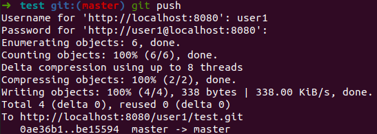

# Introduction

## Section Contents

Here is an example of content sections with titles, subtitles. Important to integrate fully guide hands-on sections.

* [Workspace](#Workspace)
* [Stage area](#Stage area)
* [Remote area](#Remote area)
* [Summary](#Summary)


in itself the workspace is not a zone proper to git, it just represents the content of your project (code, files, docs...). 
## Stage area

The staging area is a git area that will help you prepare the files modifications that you would like to save on the remote git. It can happen that you make changes different changes to several files but you would like to only save one part cause the second one is not finished or does not correspond to the feature you develop.

Only modifications that you added on your staging area can be then commit and push to your remote repository.

Find below a small analogy between **packing boxing for moving out and Git**.

You can add a specific file that you create, modify or delete locally one by one.
> git add <name_of_your_file>

You can add all the files at One
> git add .

Add all the files to your stage area:


| Moving boxes      |      Git    |   commands|
- |:-: | -:
| You’re moving and you have **a box to pack** your things in.      |        You're doing some **changes in the files** of your directory (create, modify, delete, ...)        |      nano, touch, rm, ... |
| You can **put stuff** into the box, but you can also **take stuff out** of the box.        |        You can **add file** to your staging area or **remove** some        |      git add, git checkout, ... |
| You wouldn’t want to ***mix items*** from the bathroom, kitchen and living room into ***the same box***.      |        You only add changes that correspond to a same development feature        |      git add -p, ... |
| You **seal the box** and **stick a label** on it in order to easily find it back.      |        You **commit** your changes **with a message**        |      git commit -m ".."|
| You wouldn’t want to label your box with “stuff”, but rather **give a more descriptive label**.        |        **Always use a meaningful message** to find back your changes later        |       |
| You **send the boxes** to the **new flat**       |        You **push the codes** to the **remote repository**       |   git push    |

## Remote area

Your remote area is the remote repository that is shared with everyone (that has access to that repo).

Let's create a commit for the files we added on our staging area earlier:


You can see on the illustration above that "Our branch is ahead of 'origin/master' by 1 commit".

If you go to gitlab server, you'll see that nothing happen on the remote repository.


You still need to publish it by doing a git push.
> git push




Do not hesitate to open the first_file.py to see that he contains content now on gitlab server.

TODO: Explain HEAD and git diff


## SUMMARY

TODO write summary

#### Key commands

```
git checkout <file_name>     => undo all file changes in your working dir
git checkout -p              => undo changes by blocks in your working dir
git reset <file_name>        => undo all file changes staged
git reset -p                 => undo staged changes by blocks
git revert <commit_id>       => undo a commit
git commit --amend           => modify the previous commit
git reset --hard <commit_id> => go back to an old commit
```

#### Next sections

You can now go to the next sections: [3-Recovery](3-Recovery)
