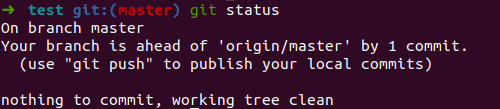

# Introduction

## Section Contents

Here is an example of content sections with titles, subtitles. Important to integrate fully guide hands-on sections.

* [Workspace](#Workspace)
* [Stage area](#Stage area)
* [Remote area](#Remote area)
* [Summary](#Summary)

## Workspace

The workspace is the place where we store our different files and Git gives us a state of the modification made within our directory. We have different way of modifying the state of our workspace: create, edit or delete an existing file.

One role of Git is therefore to take track of the modifications between your workplace (your local repository) and what has been versioned, the remote repository.
On the previous introduction section, we created a repository and we committed two files (first_file.py and second_file.txt).
By doing a commit for those two files, we tell Git that the versionned repo should contain those two files with the content that was on it at that time.

Right now, if we edit/delete those two files or create a new file, we don't have the same version between our local repository and what has been committed to Git (the status of the file Git saved).
Let's do some modification and see for each of them the **git status**

```
  cd /home/username/testGit
  git status
  echo "first edit" > first_file.py
  rm second_file.txt
  echo "test" > third_file.js
  git status

```


Git is pointing out the difference between our local folders and the versioned folder. It is divided into two areas, the changes that need to be staged and the untracked file.


As seen in the above illustration, there are different status for a file in a directory compared to the remote git repo.

- Unmodified: This file is identical in the workspace and in currently checked-out commit in the repository.

- Modified: This file is present in both workspace and repository, but is different.

- Staged: This file is in the workspace, current commit, and stage. Note that the file can be different in all three locations. Indeed, you could have made two changes on a file comparatively to the remote repo. Then, it is possible to only stage one of the change and not the second one.  

- Untracked: This file is in the workspace, but not in the current commit. (the file has never been versioned)

Let's check the differences between our local changes and the remote repository. All the changes, we made are not reflected to the remote repository yet.


Change previous section about workplace to insist about the fact it consists of our code/files in a dir accessed often through an IDE.
Go from my preferred pic with zones also


## Git structure

This is thanks to the different areas as well as the different states of the files that git can provide its core functionnalities.


```
  cd /home/username/gitillu
  touch README.md
  echo "first edit" > toto.py
  git init
  git status

```


in itself the workspace is not a zone proper to git, it just represents the content of your project (code, files, docs...). Basically, when you run `git init` you trigger a command that will initialize the set up of git in the scope of your directory. It means that your project is now managed by git, and this covers so many things.
As we said git offers

- collaborative code management tool: 
    * easy to collaborate together on same code (feture branchs, conflicts)
    * backup code remotely
- versionning tool:
    * easy to roll out/revert to a version or previous state of a file

In order to do so, when you init the repo, a few components are deployed in your directory. If you want to have a look at them, please  run
> ls -lart
```yml
total 0
drwxrwxrwx 1 root root 512 Jun 26 04:20 ..
-rwxrwxrwx 1 root root   0 Jun 26 04:20 REAME.md
-rwxrwxrwx 1 root root   0 Jun 26 04:20 toto.py
drwxrwxrwx 1 root root 512 Jun 26 04:21 .
drwxrwxrwx 1 root root 512 Jun 26 04:21 .git
```

Now Let's create a remote repo TOOODOOOO and add the remote repo to your git project:

> git remote add origin http://localhost:8084/phgol/gitillu.git


Let's have a closer look at what has changed in your directory once you ran git init:

- hidden repo .git got created
- within this hidden repo you can find several insteresting elements

The branches directory isn’t used by newer Git versions.
The description file is used to provide a name to the repository with the description and is only used by the Web UI.
The config file contains your project-specific configuration options
The info directory keeps a global exclude file for ignored patterns that you don’t want to track in a .gitignore file.
The hooks directory contains your client- or server-side hook scripts.
The index file is where Git stores your staging area information.
This blog post would go in detail about the 3 main components in this .git folder — 

Objects directory — The objects directory stores all the content of the git database.
Refs directory — The refs directory stores pointers into commit objects in that data.
Head file — The HEAD file points to the branch you currently have checked out.
Git Objects
At the core, git is nothing but a key-value data store. Git uses SHA-1 hash of the content (content could either refer a file or commit or directory structure — we’ll get to it soon) as the key and the content itself (compressed) acts as the value. In order to understand more about git objects, let’s walk-through an example.

Consider a simple repository with just 1 commit with the contents of a file called first.txt — “This is the first line.”

.git is initialized by git init.

.git contains all information required for version control. If you want to clone your repo, copy .git is enough.

4 sub-directories:

hooks/ : example scripts
info/ : exclude file for ignored patterns
objects/ : all "objects"
refs/ : pointers to commit objects
4 files:

HEAD : current branch
config : configuration options
description
index : staging area
Here "object" includes:

blobs(files)
trees(directories)
commits(reference to a tree, parent commit, etc)


Git Objects

As you can see, it has created 3 directories (59, c5 and dd) besides the info and the pack (which we’ll cover later in this blog post).

Content Objects — The first folder is the content of the file itself. You can view the contents of by running the git cat-file command.


Content Object

Tree Objects — The second folder is a tree object. Git stores the file system structure in these tree objects. The first column shows the unix permissions, the second column is either blob or tree depending on whether it is a pointer to a file or another directory, the third is the hash of the object pointed to, and the fourth is the filename. In this case there is only one file tracked by git, first.txt, and you can see that this tree node reflects that by listing one file, and pointing to the blob holding its contents.


Tree Object

Commit Objects  — The third folder is the commit, with a header containing author, committer details and time-stamp, followed by the commit message itself. If you type git log you will recognize that the commit number is just the hash of this commit object.


use
https://backlog.com/git-tutorial/git-workflow/
https://www.linkedin.com/pulse/git-internals-how-works-kaushik-rangadurai
https://openclassrooms.com/en/courses/5671626-manage-your-code-project-with-git-github/6152251-explore-gits-file-structure


## Stage area

The staging area is a git area that will help you prepare the files modifications that you would like to save on the remote git. It can happen that you make changes different changes to several files but you would like to only save one part cause the second one is not finished or does not correspond to the feature you develop.

Only modifications that you added on your staging area can be then commit and push to your remote repository.

Find below a small analogy between **packing boxing for moving out and Git**.

You can add a specific file that you create, modify or delete locally one by one.
> git add <name_of_your_file>

You can add all the files at One
> git add .

Add all the files to your stage area:


| Moving boxes      |      Git    |   commands|
- |:-: | -:
| You’re moving and you have **a box to pack** your things in.      |        You're doing some **changes in the files** of your directory (create, modify, delete, ...)        |      nano, touch, rm, ... |
| You can **put stuff** into the box, but you can also **take stuff out** of the box.        |        You can **add file** to your staging area or **remove** some        |      git add, git checkout, ... |
| You wouldn’t want to ***mix items*** from the bathroom, kitchen and living room into ***the same box***.      |        You only add changes that correspond to a same development feature        |      git add -p, ... |
| You **seal the box** and **stick a label** on it in order to easily find it back.      |        You **commit** your changes **with a message**        |      git commit -m ".."|
| You wouldn’t want to label your box with “stuff”, but rather **give a more descriptive label**.        |        **Always use a meaningful message** to find back your changes later        |       |
| You **send the boxes** to the **new flat**       |        You **push the codes** to the **remote repository**       |   git push    |

## Remote area

Your remote area is the remote repository that is shared with everyone (that has access to that repo).

Let's create a commit for the files we added on our staging area earlier:



You can see on the illustration above that "Our branch is ahead of 'origin/master' by 1 commit".

If you go to gitlab server, you'll see that nothing happen on the remote repository.


You still need to publish it by doing a git push.
> git push


Do not hesitate to open the first_file.py to see that he contains content now on gitlab server.

TODO: Explain HEAD and git diff


## SUMMARY

TODO write summary

#### Key commands

```
git checkout <file_name>     => undo all file changes in your working dir
git checkout -p              => undo changes by blocks in your working dir
git reset <file_name>        => undo all file changes staged
git reset -p                 => undo staged changes by blocks
git revert <commit_id>       => undo a commit
git commit --amend           => modify the previous commit
git reset --hard <commit_id> => go back to an old commit
```

#### Next sections

You can now go to the next sections: [3-Recovery](3-Recovery)
