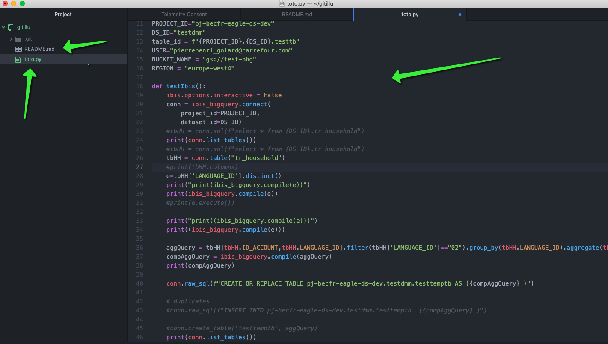
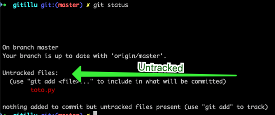
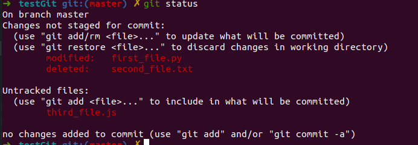
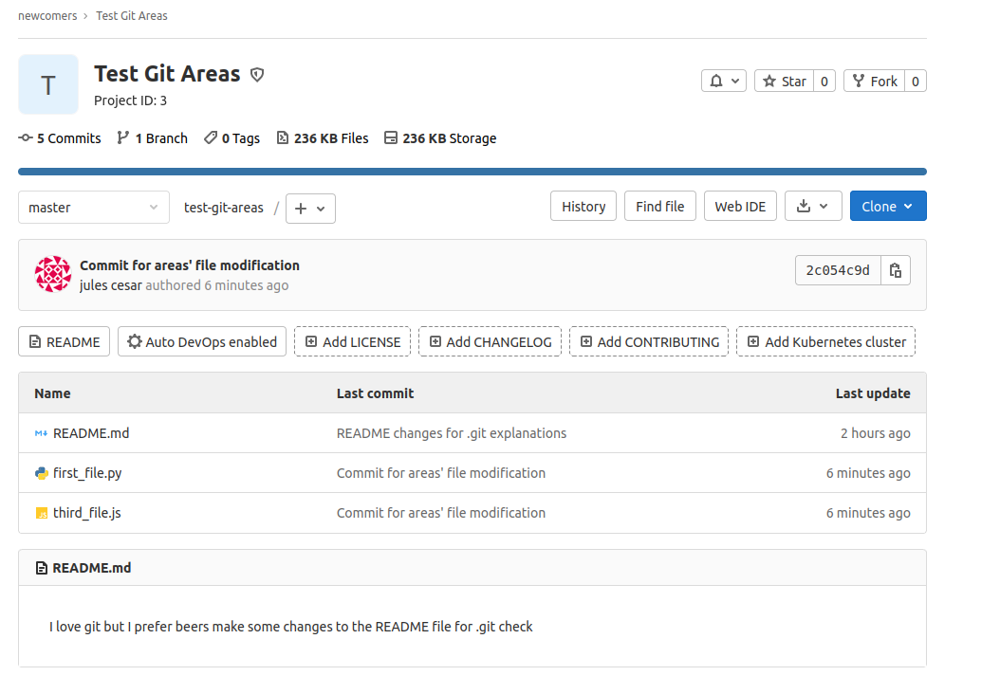

# Introduction


## Section Contents

Here is an example of content sections with titles, subtitles. Important to integrate fully guide hands-on sections.

* [Pre Requisite](#PreRequisite)]
* [Workspace](#Workspace)
* [Stage area](#Stage area)
* [Remote area](#Remote area)
* [Summary](#Summary)

## Pre Requisite

At section Zero w saw how to deploy gitlab server locally though Dockr. We  also saw how to create users and authenticate via ssh.
For the sake of this exercise, we will create a project remotely and bind it to our local repository.
Thanks to that we will go over the different zones/areas of git.

For those who have not done it yet, please refer to the following section [Gitlab Server Setup](../../../0-Gitlab%20server/Theory/README.md#11-gitlab-server-on-docker) and

* deploy the containers needed to run gitlab server on your laptop
* configure your admin account to access gitlab as `root`and be able to administrate the platform
* create at least one [User](../../../0-Gitlab%20server/Theory/README.md#14-gitlab-server-user-creation) 

## Create a new project  


Namely the gitlab server instance we have deployed locally.
So connect with your new user on a different browser you used for gitlab admin on `http://localhost:8084`and type the authentication components of your user.

TODO remove restrictions to enable people to push on master
TODO play with 2 users

git clone ssh://git@localhost:10022/phgolard/firstgitproj.git
cd firstgitproj
git config --global user.name "phgolard"
git config --global user.email "phgolard@gmail.com"
touch README.md
git add README.md
git commit -m "add README"
git push -u origin master

## Git areas - Focus on git repository structure

Now we have basically we have all we need to illustrate the different zones or areas in git.

To provide its core functions, namely collaborative code version control, Git uses different components and divides its directories in different areas. The files that contains the code you want to version, 

Basically the main features that GIT provides consists:

* collaborative code managemnt: developers can work together on the same project but working together on different features at the same time without conflicts (or at least conflicts can be solved smoothly)
* code is backed up on centralized remote repos
* code is version controlled: easy to track the evolution of the files and rollback easily to a previous state

To achieve this functionnalities, git is working with 
* different zones and
* your files go through various states that can be easily restored.


[Figure 1 - Git Areas] 


To illustrate that, let's do an exercise.


* First we go on our local machine and we create a folder `gitillu`in which we add a README.md file
  ```yml
  mkdir gitillu
  cd gitillu
  touch README.md
  ```
* We initialize git in this repository via `git init`and we also configure the user and the email of the developer.
  
  ```yml
  git init
  git config --global user.name "phgolard"
  git config --global user.email "phgolard@gmail.com"
  ```
* Notice now that we have git project with a default branch called `master`and if you run a git status you see 

  

* We also see that a hidden folder `.git`has been created. This folder contains several files and directories, notably a config file:

  

* Now we create a blank project on a remote server - gitlab (here it's local on Docker but we consider it as if was remote on gitlab.com for instance)
  
  

* Then we indicate the remote repo on our local machine. We specify this remote will be represented by the alias `origin`. 
  
  

  ```bash
  git remote add origin ssh://git@localhost:10022/git-tuto/gitillu.git
  ```


Now we basically have all the components in place to illustrate the different areas of the Figure 1.

- workspace
- index
- local repo
- remote repo

## Workspace

The ***workspace*** is the place where we store our different files and ***Git*** gives us a state of the modification made within our `local directory`. We have different way of modifying the state of our workspace: create, edit or delete an existing file.

One role of Git is therefore to take track of the modifications between your workplace (your local directory) and what has been versioned, the local as well as the remote repository.

Let's go back to the example we started building in previous section. The workplace is what is under directory gitillu:


If we see in an IDE, we notice that our gitillu project is currently made up of a README.md file as well as an hidden folder .git.



Let's add a new file in our workplace, toto.py:


Let's now do a git status to see what it says:



We see that the 2 files we created are untracked, namely they are not tracked by Git.

Basically we are now going to make Git track those 2 files.

> git add .
> git status
```yml
On branch master
Changes to be committed:
  (use "git restore --staged <file>..." to unstage)
	new file:   README.md
	new file:   toto.py
```
Now we see that those 2 files are tracked, but now we are going to stage them, namely version them. We do so by committing a message.


On the previous introduction section, we created a repository and we committed two files (first_file.py and second_file.txt).


By doing a commit for those two files, we tell Git that the versionned repo should contain those two files with the content that was on it at that time.

Right now, if we edit/delete those two files or create a new file, we don't have the same version between our local repository and what has been committed to Git (the status of the file Git saved).
Let's do some modification and see for each of them the **git status**

```
  cd /home/username/testGit
  git status
  echo "first edit" > first_file.py
  rm second_file.txt
  echo "test" > third_file.js
  git status

```


Git is pointing out the difference between our local folders and the versioned folder. It is divided into two areas, the changes that need to be staged and the untracked file.


As seen in the above illustration, there are different status for a file in a directory compared to the remote git repo.

- Unmodified: This file is identical in the workspace and in currently checked-out commit in the repository.

- Modified: This file is present in both workspace and repository, but is different.

- Staged: This file is in the workspace, current commit, and stage. Note that the file can be different in all three locations. Indeed, you could have made two changes on a file comparatively to the remote repo. Then, it is possible to only stage one of the change and not the second one.  

- Untracked: This file is in the workspace, but not in the current commit. (the file has never been versioned)

Let's check the differences between our local changes and the remote repository. All the changes, we made are not reflected to the remote repository yet.


## Stage area

The staging area is a git area that will help you prepare the files modifications that you would like to save on the remote git. It can happen that you make changes different changes to several files but you would like to only save one part cause the second one is not finished or does not correspond to the feature you develop.

Only modifications that you added on your staging area can be then commit and push to your remote repository.

Find below a small analogy between **packing boxing for moving out and Git**.

You can add a specific file that you create, modify or delete locally one by one.
> git add <name_of_your_file>

You can add all the files at One
> git add .

Add all the files to your stage area:


| Moving boxes      |      Git    |   commands|
- |:-: | -:
| You’re moving and you have **a box to pack** your things in.      |        You're doing some **changes in the files** of your directory (create, modify, delete, ...)        |      nano, touch, rm, ... |
| You can **put stuff** into the box, but you can also **take stuff out** of the box.        |        You can **add file** to your staging area or **remove** some        |      git add, git checkout, ... |
| You wouldn’t want to ***mix items*** from the bathroom, kitchen and living room into ***the same box***.      |        You only add changes that correspond to a same development feature        |      git add -p, ... |
| You **seal the box** and **stick a label** on it in order to easily find it back.      |        You **commit** your changes **with a message**        |      git commit -m ".."|
| You wouldn’t want to label your box with “stuff”, but rather **give a more descriptive label**.        |        **Always use a meaningful message** to find back your changes later        |       |
| You **send the boxes** to the **new flat**       |        You **push the codes** to the **remote repository**       |   git push    |

## Remote area

Your remote area is the remote repository that is shared with everyone (that has access to that repo).

Let's create a commit for the files we added on our staging area earlier:


You can see on the illustration above that "Our branch is ahead of 'origin/master' by 1 commit".

If you go to gitlab server, you'll see that nothing happen on the remote repository.


You still need to publish it by doing a git push.
> git push




Do not hesitate to open the first_file.py to see that he contains content now on gitlab server.

TODO: Explain HEAD and git diff


## SUMMARY

TODO write summary

#### Key commands

```
git checkout <file_name>     => undo all file changes in your working dir
git checkout -p              => undo changes by blocks in your working dir
git reset <file_name>        => undo all file changes staged
git reset -p                 => undo staged changes by blocks
git revert <commit_id>       => undo a commit
git commit --amend           => modify the previous commit
git reset --hard <commit_id> => go back to an old commit
```

#### Next sections

You can now go to the next sections: [3-Recovery](3-Recovery)
