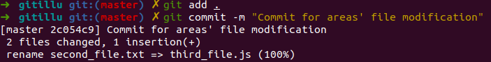
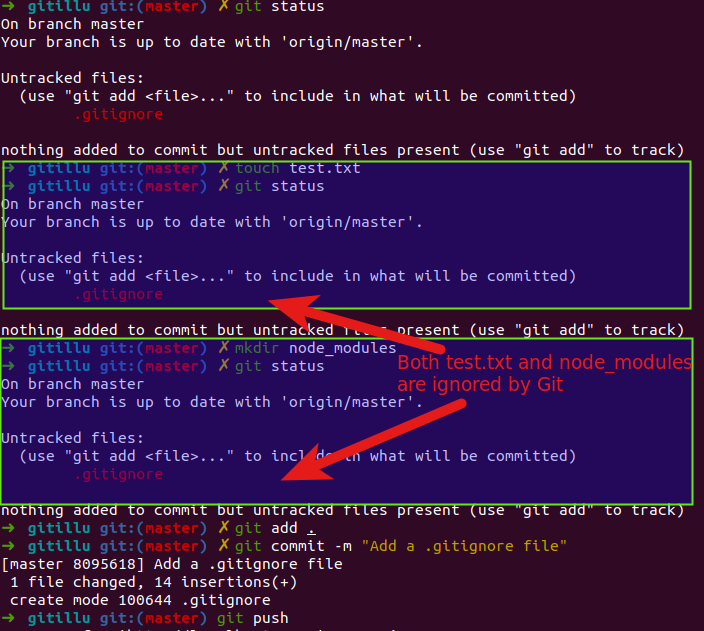
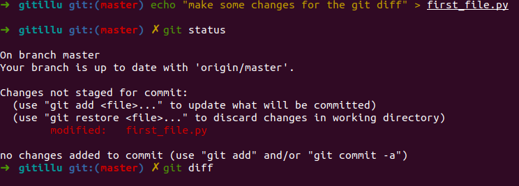
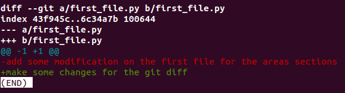
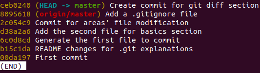
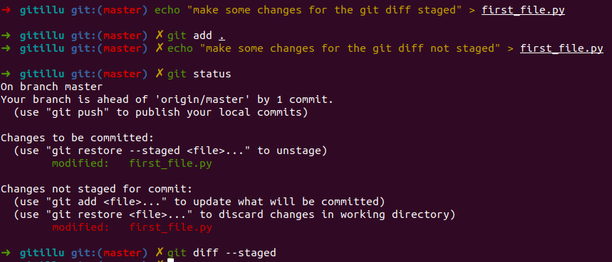

# Introduction

## Section Contents

Here is an example of content sections with titles, subtitles. Important to integrate fully guide hands-on sections.

* [1. Git areas and file state management](#Git-areas-and-file-state-management)
  * [1.1 Git WorkFlow](#Git-WorkFlow)
  * [1.2 States of Files in GIT](#States-of-Files-in-GIT)
    * [1.2.1 Workspace](#Workspace)
    * [1.2.2 Stage-area](#Stage-area)
    * [1.2.3 Remote-area](#Remote-area)
* [2. More advanced concepts](#More-advanced-concepts)
  * [2.1 Git ignore](#Git-ignore)
  * [2.2 Git diff](#Git-diff)
* [3. Summary](#Summary)
  * [3.1 Key assets of Git](#Key-assets-of-Git)
  * [3.2 Key-commands](#Key-commands)

## 1. Git areas and file state management

We have already seen that a git operates the version controlling of the files with a local set of components, notably the objects that stores all pieces of info need to securely build/rebuild the files last state.:

* tree objects that keep the fs structure of file (size, rights...)
* commit objects that points to the last commit msg
* content objects

But in order to figure out how git takes care of the version controlling, you have to see it as workflow between 3 steps, 3 areas through which files have various states and are moved from one stage to another depending on the states.

### 1.1. Git WorkFlow

There are three main components of a Git project:

* The `repository`, or repo, is the “container” that `tracks the changes` to your ***project files***. It ***holds all of the commits*** — a `snapshot of all your files at a point in time` — that have been made. You can ***access the commit history*** with the `Git log`.

* The `working tree`, or working directory, ***consists of files that you are currently working on***. You can think of a working tree as a file system where you can modify the state of our workspace: create, edit or delete an existing file. O

* The `index`, or `staging area`, is where commits are prepared. The index compares the files in the working tree to the files in the repo. When you make a change in the working tree, the index marks the file as modified before it is committed. ne role of Git is therefore to **take track of the modifications between your workplace** (your local directory) and **what has been versioned**, the local as well as the remote repository.

This can be presented as a workflow:


* `Modify` your files in the `working tree`.
* `Stage` the ***changes you want to include in the next commit*** - `git add`. `Staging` ***puts changes in the*** `index` ***until commit***..
* `Commit` your **changes**. (Committing will **take the files from the index and store them as a snapshot in the repository.**)

### 1.2. States of Files in GIT

As you can probably guess from the Git workflow, files can be in one of three states:

* `Tracked`: file exists `locally` in your `working` tree and is ***part of the Git Repository***. Git tracks any changes on that file
* `Untracked`: This file exists locally, but isn’t a part of the Git repository. ONCe it has BeeN `Git add`, it becomes `staged` and part of the `index`
* `Modified`: tracked file on which some modification have been made since last commit. Only Tracked file can have modified as state
* `Staged`: tracked file whose last changes have been staged, namely added to the `index` (via git add), but not committed yet
* `Committed`: staged changes on tracked  files that have been committed. As a result, the file is ***moved from the index to the local repository where stored as a `snapshot`*** and becomes `unmodified`

When you modify a file, the change will only be found in the working tree. You must then stage the changes if you want to include them in your next commit. Once you finish staging all files, you can commit them and add a message describing what you changed. The modified files will then be safely stored in the repo.


#### 1.2.1. Workspace

The workspace is the place where we store our different files and Git gives us a state of the modification made within our directory. We have different way of modifying the state of our workspace: create, edit or delete an existing file.

One role of Git is therefore to take track of the modifications between your workplace (your local repository) and what has been versioned, the remote repository.
On the previous introduction section, we created a repository and we committed two files (first_file.py and second_file.txt).
By doing a commit for those two files, we tell Git that the versionned repo should contain those two files with the content that was on it at that time.

Right now, if we edit/delete those two files or create a new file, we don't have the same version between our local repository and what has been committed to Git (the status of the file Git saved).
Let's do some modification and see for each of them the **git status**

```
  echo "add some modification on the first file for the areas sections" >> first_file.py
  rm second_file.txt
  touch third_file.js
```


Git is pointing out the difference between our local folders and the versioned folder. It is divided into two areas, the changes that need to be staged and the untracked file.


As seen in the introduction section or in the above illustration, there are different status for a file in a directory compared to the remote git repo.

- Unmodified: This file is identical in the workspace and in currently checked-out commit in the repository.

- Modified: This file is present in both workspace and repository, but is different.

- Staged: This file is in the workspace, current commit, and stage. Note that the file can be different in all three locations. Indeed, you could have made two changes on a file comparatively to the remote repo. Then, it is possible to only stage one of the change and not the second one.  

- Untracked: This file is in the workspace, but not in the current commit. (the file has never been versioned)

Let's check the differences between our local changes and the remote repository. All the changes, we made are not reflected to the remote repository yet.


#### 1.2.2 Stage area

The staging area is a git area that will help you prepare the files modifications that you would like to save on the remote git. It can happen that you make changes different changes to several files but you would like to only save one part cause the second one is not finished or does not correspond to the feature you develop.

Only modifications that you added on your staging area can be then commit and push to your remote repository.

Find below a small analogy between **packing boxing for moving out and Git**.

You can add a specific file that you create, modify or delete locally one by one.
> git add \<name_of_your_file>

You can add all the files at One
> git add .

Add all the files to your stage area:


| Moving boxes      |      Git    |   commands|
- |:-: | -:
| You’re moving and you have **a box to pack** your things in.      |        You're doing some **changes in the files** of your directory (create, modify, delete, ...)        |      nano, touch, rm, ... |
| You can **put stuff** into the box, but you can also **take stuff out** of the box.        |        You can **add file** to your staging area or **remove** some        |      git add, git checkout, ... |
| You wouldn’t want to ***mix items*** from the bathroom, kitchen and living room into ***the same box***.      |        You only add changes that correspond to a same development feature        |      git add -p, ... |
| You **seal the box** and **stick a label** on it in order to easily find it back.      |        You **commit** your changes **with a message**        |      git commit -m ".."|
| You wouldn’t want to label your box with “stuff”, but rather **give a more descriptive label**.        |        **Always use a meaningful message** to find back your changes later        |       |
| You **send the boxes** to the **new flat**       |        You **push the codes** to the **remote repository**       |   git push    |

#### 1.2.3 Remote area

Your remote area is the remote repository that is shared with everyone (that has access to that repo).

Let's create a commit for the files we added on our staging area earlier:



You can see on the illustration above that "Our branch is ahead of 'origin/master' by 1 commit".

If you go to gitlab server, you'll see that nothing happen on the remote repository.

You still need to publish it by doing a git push.
> git push


Do not hesitate to open the first_file.py to see that it contains content now on gitlab server.

TODO: Explain HEAD and git diff


## 2. More advanced concepts

### 2.1 Git ignore

Sometimes you don't want to version some files/directories of your project. It can be some env files with passwords or IPs on it, some libraries directories like node_modules in a node.js project or your MAC system files.

For that, git uses a textfile named `.gitignore`.
Each line on it should reference a file or folder that you want Git to ignore.

You can also use pattern matching on the files:
- \* for a wildcard match
- / for ignoring pathnames relative to .gitignore file
- \# is used for comments

Let's create a `.gitignore` file with the following exclusion:
```
# Ignore Mac system files
.DS_store

# Ignore node_modules folder
node_modules

# Ignore all text files
*.txt

# Ignore files related to API keys
.env

# Ignore SASS config files
.sass-cache
```

and see the GIT behavior.

```
touch test.txt
git status
mkdir node_modules
git status
git add .
git commit -m"Add a .gitignore file"
git push
```



We've seen on the above example that Git is not tracking the file/folder we put inside our `.gitignore`.  

### 2.1 Git diff

#### 2.1.1 Default

Diffing is a function that takes two input data sets and **outputs the changes** between them. git diff is a multi-use Git command that when executed runs a diff function on Git data sources. These **data sources** can be **commits, branches, files and more**.

The git diff command is often used along with git status and git log to analyze the current state of a Git repo.

Let's dive into it through some examples:

As we commited our work on the previous section, we should not have any file modified or untracked while doing a git status.

> git status

Let's run `git diff` and see that the ouput is empty. Indeed, we didn't do any changes.

```
echo "make some changes for the git diff" > first_file.py
git status
git diff
```


***Note: The `git diff` command opens a new window, ``:q` for leaving it.***



By default, the git diff command displays any uncommitted changes to your repository.

The **comparison inputs**, we did a diff between a/first_file.py and b/first_file.py.
The **a and b** below represents change **before and after**, followed by a path relative to the repo root.
> diff --git a/first_file.py b/first_file.py


**Metadata** :
> index 43f945c..6c34a7b 100644

**Markers for changes:**, These lines are a legend that assigns symbols to each diff input source. In this case, changes from a/first_file.py are marked with a --- and the changes from b/first_file.py are marked with the +++ symbol.
> --- a/first_file.py     
+++ b/first_file.py

**Diff chunks**, The remaining diff output is a list of diff 'chunks'. A diff only displays the sections of the file that have changes. In our current example, we only have one chunk as we are working with a simple scenario. Chunks have their own granular output semantics.
> @@ -1 +1 @@   
> -add some modification on the first file for the areas sections        
+make some changes for the git diff

in a more realistic chunk header instead of `@@ -1 +1 @@`, we'll have:

`@@ -34,6 +34,8 @@`

In this header example, 6 lines have been extracted starting from line number 34. Additionally, 8 lines have been added starting at line number 34.

The remaining content of the diff chunk displays the recent changes. Each changed line is prepended with a + or - symbol indicating which version of the diff input the changes come from.

#### Specific git diff

You can also check changes in file between different commits or branches (we'll see the notion of branch in the section 4) or even with your staging area.

- between commits:

Let's commit the changes we've made previously and see the diff for first_file.py between the last commit and the commit where we created it.

```
git add .
git commit -m "Create commit for git diff section"
git log --oneline
```



We can see the importance of **meaningful commit** to quickly find the ones we are interested in.

In my case, I will check the changes of `first_file.py` between `ceb0240` and `6c0d8cd`

> git diff ceb0240 6c0d8cd first_file.py

output:
```
diff --git a/first_file.py b/first_file.py
index 6c34a7b..e69de29 100644
--- a/first_file.py
+++ b/first_file.py
@@ -1 +0,0 @@
-make some changes for the git diff
```

As we created it empty (*touch first_file.py*), we only see the changes associated added after.

- between branches:

> git diff <branch_1> <branch_2>

- with the staging area:

> git diff --staged

Let's make the following modifications:

    Adding some content to first_file.py, add it to the staging area,
    then make another change to first_file.py.
    We can see with a git_status that the same file as changes not staged and some staged.

By doing a `git diff`, we'll see the changes not staged as it is the latest uncommitted changes that happened to the file.



output **git diff**
```
diff --git a/first_file.py b/first_file.py
index 5b4b7b0..d4aadc8 100644
--- a/first_file.py
+++ b/first_file.py
@@ -1 +1 @@
-make some changes for the git diff staged
+make some changes for the git diff not staged
```
In the case of a `git diff --staged`, we looked at the changes on the staging area.

output **git diff staged**
```
diff --git a/first_file.py b/first_file.py
index 6c34a7b..5b4b7b0 100644
--- a/first_file.py
+++ b/first_file.py
@@ -1 +1 @@
-make some changes for the git diff
+make some changes for the git diff staged
```


## 3. SUMMARY

### 3.1 Key assets of Git

* `Performance`: Git provides the best performance when it comes to version control systems. Committing, branching, merging all are optimized for a better performance than other systems.
* `Security`: Git handles your security with cryptographic method SHA-1. The algorithm manages your `versions, files, and directory` securely so that your work is not corrupted.
* `Branching Model`: Git has a different branching model than the other VCS. Git branching model lets you have multiple local branches which are independent of each other. Having this also enables you to have ***friction-less context switching*** (switch back and forth to new commit, code and back), `role-based code` (a branch that always goes to production, another to testing etc) and disposable experimentation (try something out, if does not work, delete it without any loss of code).
* `Staging Area`: Git has an intermediate stage called “index” or “staging area” where commits can be formatted and modified before completing the commit.
* `Distributed`: Git is distributed in nature. Distributed means that the repository or the complete code base is mirrored onto the developer’s system so that he can work on it only.


#### 3.2 Key commands

```
git checkout <file_name>     => undo all file changes in your working dir
git checkout -p              => undo changes by blocks in your working dir
git reset <file_name>        => undo all file changes staged
git reset -p                 => undo staged changes by blocks
git revert <commit_id>       => undo a commit
git commit --amend           => modify the previous commit
git reset --hard <commit_id> => go back to an old commit
```

#### Next sections

You can now go to the next sections: [3-Recovery](3-Recovery)
