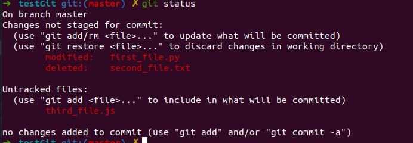
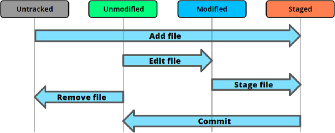
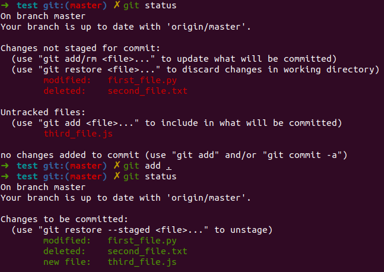
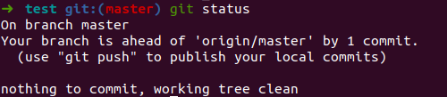
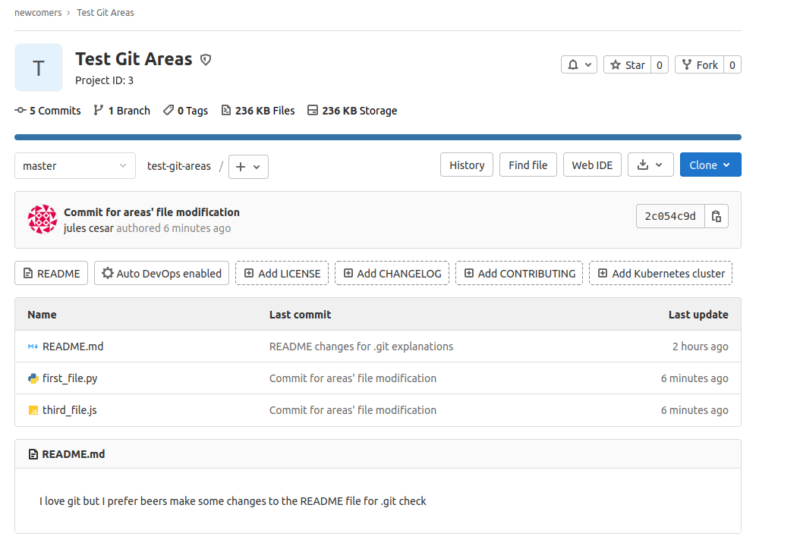

# Introduction

## Section Contents

Here is an example of content sections with titles, subtitles. Important to integrate fully guide hands-on sections.

* [Workspace](#Workspace)

## Workspace

The workspace is the place where we store our different files and Git gives us a state of the modification made within our directory. We have different way of modifying the state of our workspace: create, edit or delete an existing file.

One role of Git is therefore to take track of the modifications between your workplace (your local repository) and what has been versioned, the remote repository.
On the previous introduction section, we created a repository and we committed two files (first_file.py and second_file.txt).
By doing a commit for those two files, we tell Git that the versionned repo should contain those two files with the content that was on it at that time.

Right now, if we edit/delete those two files or create a new file, we don't have the same version between our local repository and what has been committed to Git (the status of the file Git saved).
Let's do some modification and see for each of them the **git status**

```
  cd /home/username/testGit
  git status
  echo "first edit" > first_file.py
  rm second_file.txt
  echo "test" > third_file.js
  git status

```


Git is pointing out the difference between our local folders and the versioned folder. It is divided into two areas, the changes that need to be staged and the untracked file.



As seen in the above illustration, there are different status for a file in a directory compared to the remote git repo.

- Unmodified: This file is identical in the workspace and in currently checked-out commit in the repository.

- Modified: This file is present in both workspace and repository, but is different.

- Staged: This file is in the workspace, current commit, and stage. Note that the file can be different in all three locations. Indeed, you could have made two changes on a file comparatively to the remote repo. Then, it is possible to only stage one of the change and not the second one.  

- Untracked: This file is in the workspace, but not in the current commit. (the file has never been versioned)

Let's check the differences between our local changes and the remote repository. All the changes, we made are not reflected to the remote repository yet.


## Stage area

The staging area is a git area that will help you prepare the files modifications that you would like to save on the remote git. It can happen that you make changes different changes to several files but you would like to only save one part cause the second one is not finished or does not correspond to the feature you develop.

Only modifications that you added on your staging area can be then commit and push to your remote repository.

Find below a small analogy between **packing boxing for moving out and Git**.

You can add a specific file that you create, modify or delete locally one by one.
> git add <name_of_your_file>

You can add all the files at One
> git add .

Add all the files to your stage area:



| Moving boxes      |      Git    |   commands|
- |:-: | -:
| You’re moving and you have **a box to pack** your things in.      |        You're doing some **changes in the files** of your directory (create, modify, delete, ...)        |      nano, touch, rm, ... |
| You can **put stuff** into the box, but you can also **take stuff out** of the box.        |        You can **add file** to your staging area or **remove** some        |      git add, git checkout, ... |
| You wouldn’t want to ***mix items*** from the bathroom, kitchen and living room into ***the same box***.      |        You only add changes that correspond to a same development feature        |      git add -p, ... |
| You **seal the box** and **stick a label** on it in order to easily find it back.      |        You **commit** your changes **with a message**        |      git commit -m ".."|
| You wouldn’t want to label your box with “stuff”, but rather **give a more descriptive label**.        |        **Always use a meaningful message** to find back your changes later        |       |
| You **send the boxes** to the **new flat**       |        You **push the codes** to the **remote repository**       |   git push    |

## Remote area

Your remote area is the remote repository that is shared with everyone (that has access to that repo).

Let's create a commit for the files we added on our staging area earlier:



You can see on the illustration above that "Our branch is ahead of 'origin/master' by 1 commit".

If you go to gitlab server, you'll see that nothing happen on the remote repository.


You still need to publish it by doing a git push.
> git push




Do not hesitate to open the first_file.py to see that he contains content now on gitlab server.


## SUMMARY
https://coderefinery.github.io/git-intro/04-staging-area/
