# Recovery (and undoing)

## Section Contents

Here is an example of content sections with titles, subtitles. Important to integrate fully guide hands-on sections.

* [Introduction](#Introduction)
* [Uncommitted changes](#Uncommitted changes)
* [Revert commit](#Revert commit)
* [Modify commit](#Modify commit)
* [Rollback to past commit](#Rollback to past commit)
* [Key commands](#Key commands)

## Introduction

One of the key interest of Git is to allow you to come back to a previous version/snapshot/commit you did.
Basically you will ***go back in time to recover.***


## Uncommitted changes

Let's make some changes in our files and see how we could undo them.

Right now you should have two files in your testGit local repository

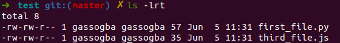

make some changes in those two files (edit them with some additional texts), see the changes you made, stage the 'first_file.py' and then visualize the git status

```
 <some file editions in first_file.py and third_file.js>
 git diff
 git add first_file.py
 git status
```

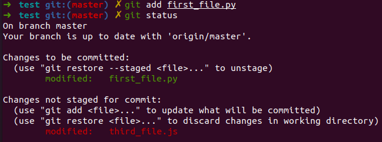

Now, obviously you could decide to manually revert your changes by editing the files again; first it's really fastidious and you don't want to do that but also it's an important source of errors.

Git allows you to undo it via command-line:
-    changes in your working dir: **git checkout -p** or **git checkout $file** (working dir)
-    changes in your staging area: **git reset -p** or **git reset $file**

the -p command allows you to revert blocks by blocks the changes made inside wyour files.

> git checkout -p

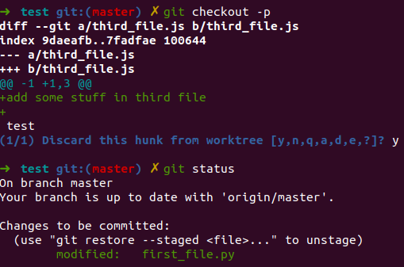

> git reset first_file.py

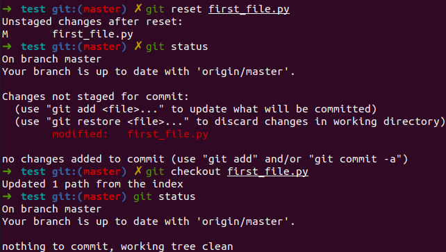

A reset will only remove your file from the staging area to put back the changes in your working dir. If you want to completely revert it, you'll need to then checkout it too.

## Revert commit

When trying to revert a commit, it is really important to pay attention on if you already pushed it or not to the remote repository. if you did, be careful as it could be a real mess.. Use it with cautious.

Let's delete the first_file.py and commit our changes.

```
 rm first_file.py
 git add first_file.py
 git commit -m "Delete unused first_file.py"
 git log --oneline
```

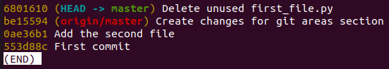

We see the history of the commits we did. Note that origin/master corresponds to the commit that is currently on our remote repository while the HEAD -> master in the last commit on our local working directory.

Now, we saw that it was a mistake and didn't want to delete that file, we need to revert that commit.

> git revert <Hash of the commit: 6801610 in my case>

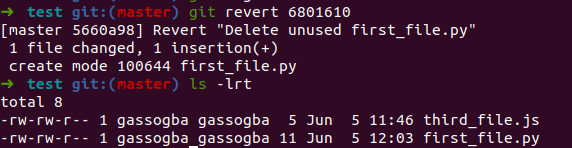

When you did the revert, like a commit, you're asked to provide a revert message.

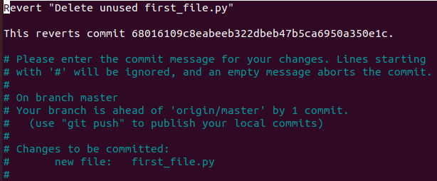

You can now see the commit history again and see that a new commit has been added.
> git log

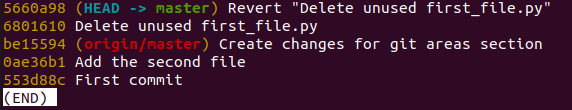

## Modify commit

it happens that you forgot to put some files or changes in a commit. It is possible to amend a commit. (in project, be careful if you pushed your branch already)

```
make some changes in first_file.py
git add first_file.py
git commit --amend
git log
git status
cat first_file.py
```

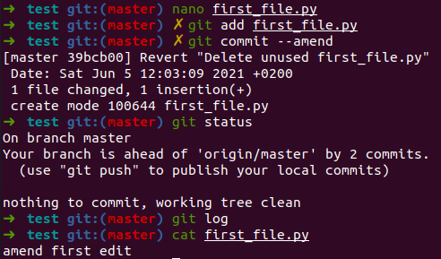

## Rollback to past commit

In some situation, you'd like to come back to a specific commit.

 > git log --oneline

 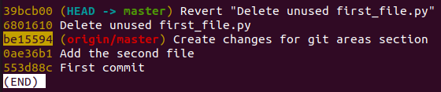

 Find a specific commit you would like to come back to and reset your branch, for example the commit that is currently in Gitlab server (origin/master), you can find the id in gitlab server if it's not obvious:

 > git reset --hard be15594

 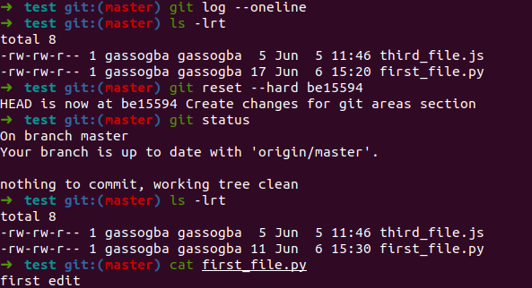

***Note:*** Like the modification of a commit, pay attention in a project if you already pushed your branch and you want to reset it.

## Key commands

```
git checkout <file_name>     => undo all file changes in your working dir
git checkout -p              => undo changes by blocks in your working dir
git reset <file_name>        => undo all file changes staged
git reset -p                 => undo staged changes by blocks
git revert <commit_id>       => undo a commit
git commit --amend           => modify the previous commit
git reset --hard <commit_id> => go back to an old commit
```

#### Next sections

You can now go to the next sections: [4-Branching](4-Branching)
