# Recovery (and undoing)

## Section Contents

Here is an example of content sections with titles, subtitles. Important to integrate fully guide hands-on sections.

* [Introduction](#Introduction)
* [Uncommitted changes](#Uncommitted-changes)
* [Revert commit](#Revert-commit)
* [Modify commit](#Modify-commit)
* [HEAD](#HEAD)
  * [Detached HEAD](#Detached-HEAD)
* [Rollback to past commit](#Rollback-to-past-commit)
* [SUMMARY](#SUMMARY)
  * [Key commands](#Key-commands)
  * [Next sections](#Next-sections)

## Introduction

One of the key interest of Git is to allow you to come back to a previous version/snapshot/commit you did.
Basically you will ***go back in time to recover.***


## Uncommitted changes

Let's make some changes in our files and see how we could undo them.

Right now you should have several files (first_file.py, third_file.js, test.txt) and a folder (node_modules) in your `gitillu` local repository.
Remember that as `test.txt` and `node_modules` are not tracked by Git due to the `.gitignore` file.

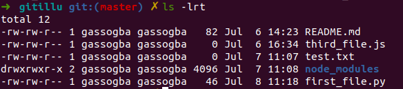

make some changes in the two tracked files (edit them with some additional texts), see the changes you made, stage the 'first_file.py' and then visualize the git status

```
 echo "first changes for the recovery section in first_file" >> first_file.py
 echo "second changes for the recovery section in third_file" >> third_file.js
 git diff
 git add first_file.py
 git status
```

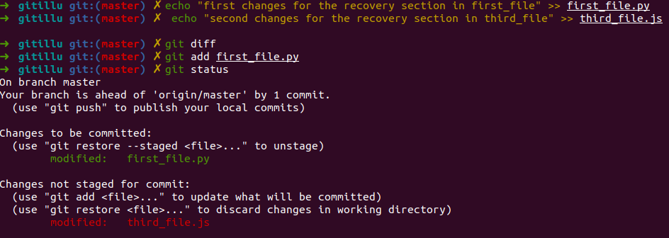

**How could you revert your changes?**

Obviously you could decide to manually revert your changes by editing the files again; first it's really fastidious (and you don't want to do that on a thousands lines file) but also it's an important source of errors.

Git allows you to undo it via command-line:
-    changes in your working dir: **git checkout -p** or **git checkout $file** (working dir)
-    changes in your staging area: **git reset -p** or **git reset $file**

the `-p` command allows you to revert blocks by blocks the changes made inside your files.

> git checkout -p

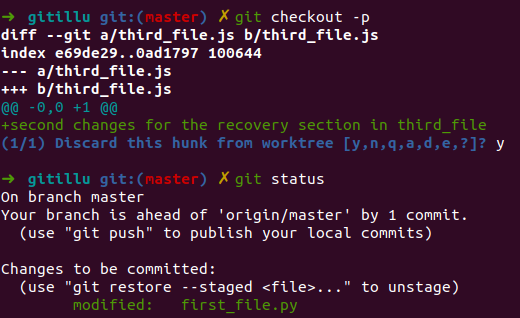

> git reset first_file.py

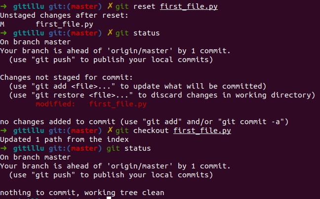

A reset will only remove your file from the staging area to put back the changes in your working dir. If you want to completely revert it, you'll need to then checkout it too.

## Revert commit

When trying to revert a commit, it is really important to pay attention on if you already pushed it or not to the remote repository. if you did, be careful as it could be a real mess.. Use it with cautious.

Let's delete the first_file.py and commit our changes.

```
 rm first_file.py
 git add first_file.py
 git commit -m "Delete unused first_file.py"
 git log --oneline
```

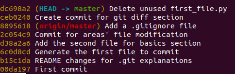

We see the history of the commits we did. Note that origin/master corresponds to the commit that is currently on our remote repository while the HEAD -> master in the last commit on our local working directory.

Now, we saw that it was a mistake and didn't want to delete that file, we need to revert that commit.

> git revert \<Hash of the commit: dc698a2 in my case>

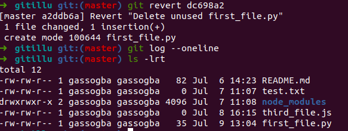

When you did the revert, like a commit, you're asked to provide a revert message.

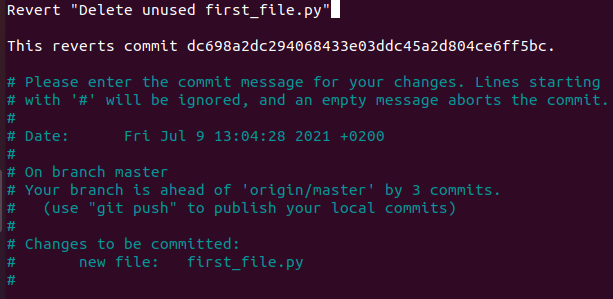

You can now see the commit history again and see that a new commit has been added.
> git log

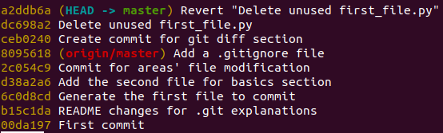

## Modify commit

it happens that you forgot to put some files or changes in a commit. It is possible to amend a commit. (in project, be careful if you pushed your branch already)

```
echo "Make some changes in first_file.py to modify the commit" >> first_file.py
git add first_file.py
git commit --amend
git log
git status
cat first_file.py
```

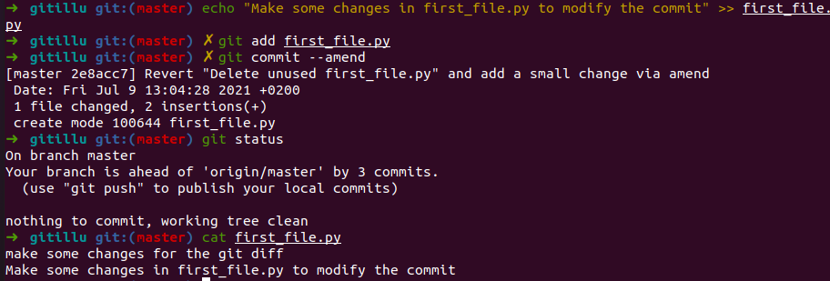

## HEAD

When working with Git, only one branch can be checked out at a time - and this is what's called the "HEAD" branch. Often, this is also referred to as the "active" or "current" branch.

Git makes note of this current branch in a file located inside the Git repository, in .git/HEAD. (This is an internal file, so it should not be manually manipulated!)
If you wonder what exactly this file contains, you can simply have its contents printed on the command line:
> cat .git/HEAD

#### Detached HEAD

Let's see the logs of our branch with a new command:
> git reflog

Let's checkout to a previous commit *(in the example ***a396fbb*** *)*

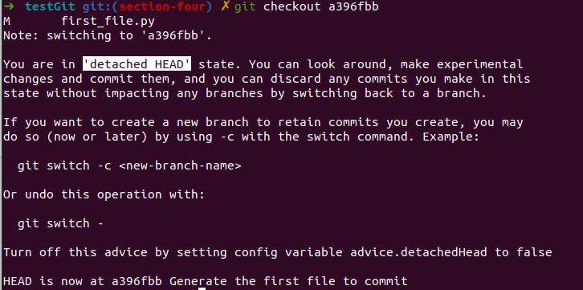

We are told by git that we **are in 'detached HEAD' state**

This places Git into a state called detached HEAD, which means that HEAD is not currently pointing to a branch latest commit.

There are two ways to return HEAD to a normal state:

- If you want to delete any changes associated with the detached HEAD, you can simply checkout an existing branch (e.g. git checkout master). This will fully revert your repository to that branch's state and set HEAD to point to that branch's head.

- If you want to keep your changes, you can simply create a new branch (e.g. git branch tmp). This will store your changes in the tmp branch and move HEAD to the tip of that branch. After doing that, you can checkout the original branch and merge your new branch into it (e.g. git checkout master followed by git merge tmp).


#### Rollback

In some situation, you'd like to come back to a specific commit.

Once you find the commit you want to rollback to, you can revert the full branch state to it using `git checkout <commit ID>`.

This detaches HEAD back to that commit so that you can view that file's old version in context (e.g. to run and test your application).

Alternatively, if you only want to revert that specific file, you can run `git checkout <commit ID> <file>` to restore it.


 > git log --oneline

 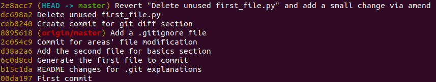

 Find a specific commit you would like to come back to and reset your branch, for example the commit that is currently in Gitlab server (origin/master), you can find the id in gitlab server if it's not obvious:

 > git reset --hard 8095618

 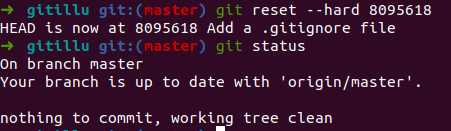

***Note:*** Like the modification of a commit, pay attention in a project if you already pushed your branch and you want to reset it.

TODO: Add section about Squash


#### TODO: Integrate PeacH section on git rm/restore  
If you want to remove a tracked file and make it become untracked you can
> git rm --cached toto.py
> git restore --staged toto.py

Please note that your file will be removed from the index but still present in your working directory.
> git status

```yml
On branch master
Your branch is ahead of 'origin/master' by 5 commits.
  (use "git push" to publish your local commits)

Changes to be committed:
  (use "git restore --staged <file>..." to unstage)
	deleted:    toto.py

Untracked files:
  (use "git add <file>..." to include in what will be committed)
	toto.py
```

If you want to `unstage` your changes you can  can
> git restore --staged toto.py
> git rm --cached toto.py
> git reset toto.py
> git reset -p


## SUMMARY

#### Key commands

```
git checkout <file_name>     => undo all file changes in your working dir
git checkout -p              => undo changes by blocks in your working dir
git reset <file_name>        => undo all file changes staged
git reset -p                 => undo staged changes by blocks
git revert <commit_id>       => undo a commit
git commit --amend           => modify the previous commit
git reset --hard <commit_id> => go back to an old commit
```

#### Next sections

You can now go to the next sections: [4-Branching](4-Branching)
