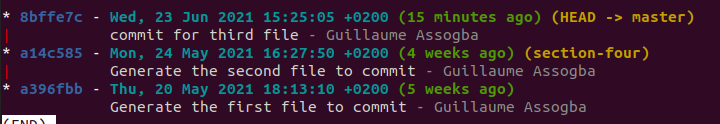
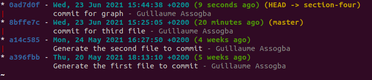
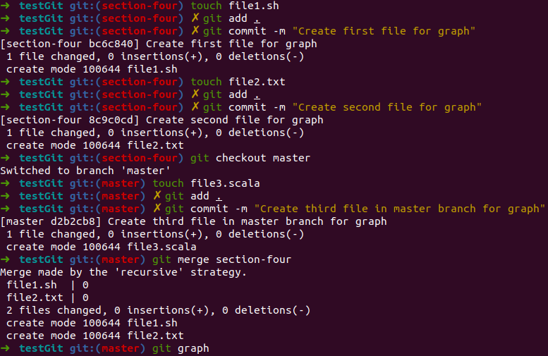
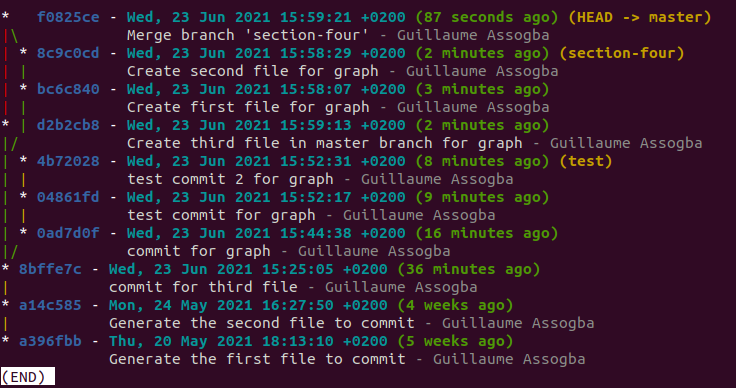

# Branching

## Section Contents

Here is an example of content sections with titles, subtitles. Important to integrate fully guide hands-on sections.

* [BRANCH](#Branches)
* [HEAD](#HEAD)
* [Uncommitted changes](#Uncommitted changes)
* [Revert commit](#Revert commit)
* [Modify commit](#Modify commit)
* [Rollback to past commit](#Rollback to past commit)
* [Key commands](#Key commands)

## Branches

#### Introduction

Software development is often not linear:

    We typically need at least one version of the code to “work” (to compile, to give expected results, …).
    At the same time we work on new features, often several features concurrently. Often they are unfinished.
    We need to be able to separate different lines of work really well.

The strength of version control is that it permits the researcher to isolate different tracks of work, which can later be merged to create a composite version that contains all changes.

In the following example, we can see the development of two new features that are finally merged in the master branch. Note that the two merges below can happened at a different time.


- Main line development is often called master.
- Other than this convention there is nothing special about master, it is just a branch.
- Commits form a directed acyclic graph.

**A group of commits that create a single narrative are called a branch.** There are different branching strategies, but it is useful to think that a branch tells **the story of a feature**, e.g. “fast sequence extraction” or “Python interface” or “fixing bug in matrix inversion algorithm”.

In practice, you will try to only develop one feature per branch for better versioning.

#### Practical

Let's check our current branch:
> git branch


- This command shows where we are, it does not create a branch.
- There is only master and we are on master (star represents the HEAD).

Creation of a new branch called *section-four* and setting it at your current branch

```
git branch section-four
git checkout section-four
```
*it is also possible to directly create and checkout to it with:*
> git checkout **-b** section-four

By re-doing `git branch` we can observe that we now have two branches and that the `HEAD` is on the newly branch


## Checkout

We saw that `git checkout` can be used in quite some occasions with git:

- Switch to a branch (-b for creating it):
`git checkout <branch_name>`

- Bring the working tree to a specific commit:
`git checkout <commit_hash>`

- Set a path/file to a specific state (to throw away all unstaged/uncommitted changes):
`git checkout <path/file>`

Picture git checkout as an operation that brings the working tree to a specific state. The state can be a commit or a branch (pointing to a commit).

## Merging and graph

Merging a branch into another one is the action of **adding all the commits** (and their changes) into **another branch**.

What happens internally when you merge two branches is that Git **creates a new commit**, attempts to **incorporate changes from both branches** and records the state of all files in the new commit. While a regular commit has one parent, a merge commit has two (or more) parents.

You can create alias in Git, let's create one for visualizing the logs with some specific params.
> git config --global alias.graph "log --graph --abbrev-commit --decorate --format=format:'%C(bold blue)%h%C(reset) - %C(bold cyan)%aD%C(reset) %C(bold green)(%ar)%C(reset)%C(bold yellow)%d%C(reset)%n''          %C(white)%s%C(reset) %C(dim white)- %an%C(reset)' --all"

> git graph



> git checkout section-four && git graph




Now let's checkout to the previous branch we created `section-four` and do two successive commits. Then, we will checkout back to `master` and do one commit to finally merge `section-four` into `master`. Let's look at the graph generated afterwards.



```
touch file1.sh
git add .
git commit -m <Your commit message>

touch file2.txt
git add .
git commit -m <Your commit message>

git checkout master
touch file3.js
git add .
git commit -m <Your commit message>

git merge section-four
git graph
```



We see in the Graph example that we can visualize the different commits we made and when the merge.


You can see all the branch merged into your current branch with:
`git branch --merged`


## Conflicts


TODO:

- create new branch
- git graph
=> exo several branches (master, feature_branch)
- switch branch with uncommited changes (git stash => https://www.atlassian.com/git/tutorials/saving-changes/git-stash)

- merge request (USER1 DEV 1, user2 REVIEWER)
- merge request with conflicts

- delete branch after merge request
