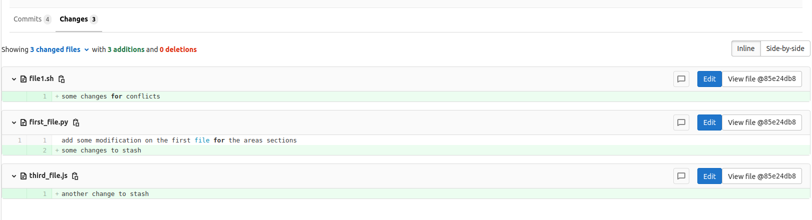
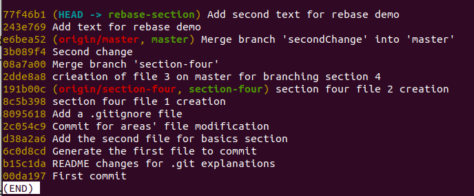

# Branching

## Section Contents

Here is an example of content sections with titles, subtitles. Important to integrate fully guide hands-on sections.

* [Branches](#Branches)
  * [Introduction](#Introduction)
  * [Practical](#Practical)
* [Checkout](#Checkout)
* [Merging and graph](#Merging-And-Graph)
* [Push](#Push-a-branch)
* [Conflicts](#Rollback to past commit)
* [More advanced notions](#More-advanced-notions)
  * [stash](#Stash)
  * [Merge requests](#merge-requests)
  * [fetch and pull](#Fetch-and-pull)
  * [rebase](#Rebase)
  * [Fast forward merge](#Fast-forward-merge)  (Optional not done yet)
* [SUMMARY](#SUMMARY)
  * [Key commands](#Key-commands)
  * [Next sections](#Next-sections)


## Branches

#### Introduction

Software development is often not linear:

    We typically need at least one version of the code to “work” (to compile, to give expected results, …).
    At the same time we work on new features, often several features concurrently. Often they are unfinished.
    We need to be able to separate different lines of work really well.

The strength of version control is that it permits the researcher to isolate different tracks of work, which can later be merged to create a composite version that contains all changes.

In the following example, we can see the development of two new features that are finally merged in the master branch. Note that the two merges below can happened at a different time.


- Main line development is often called master.
- Other than this convention there is nothing special about master, it is just a branch.
- Commits form a directed acyclic graph.

**A group of commits that create a single narrative are called a branch.** There are different branching strategies, but it is useful to think that a branch tells **the story of a feature**, e.g. “fast sequence extraction” or “Python interface” or “fixing bug in matrix inversion algorithm”.

In practice, you will try to only develop one feature per branch for better versioning.

#### Practical

Let's check our current branch:
> git branch


- This command shows where we are, it does not create a branch.
- There is only master and we are on master (star represents the HEAD).

Creation of a new branch called *section-four* and setting it at your current branch

```
git branch section-four
git checkout section-four
```
*it is also possible to directly create and checkout to it with:*
> git checkout **-b** section-four

By re-doing `git branch` we can observe that we now have two branches and that the `HEAD` is on the newly branch


## Checkout

We saw that `git checkout` can be used in quite some occasions with git:

- Switch to a branch (-b for creating it):
`git checkout <branch_name>`

- Bring the working tree to a specific commit:
`git checkout <commit_hash>`

- Set a path/file to a specific state (to throw away all unstaged/uncommitted changes):
`git checkout <path/file>`

Picture git checkout as an operation that brings the working tree to a specific state. The state can be a commit or a branch (pointing to a commit).

TODO add illustrations

## Merging and Graph

Merging a branch into another one is the action of **adding all the commits** (and their changes) into **another branch**.

What happens internally when you merge two branches is that Git **creates a new commit**, attempts to **incorporate changes from both branches** and records the state of all files in the new commit. While a regular commit has one parent, a merge commit has two (or more) parents.

You can create alias in Git, let's create one for visualizing the logs with some specific params.
> git config --global alias.graph "log --graph --abbrev-commit --decorate --format=format:'%C(bold blue)%h%C(reset) - %C(bold cyan)%aD%C(reset) %C(bold green)(%ar)%C(reset)%C(bold yellow)%d%C(reset)%n''          %C(white)%s%C(reset) %C(dim white)- %an%C(reset)' --all"

> git graph


Now from `section-four` and do two successive commits. Then, we will checkout back to `master` and do one commit to finally merge `section-four` into `master`. Let's look at the graph generated afterwards.


```
touch file1.sh
git add .
git commit -m "section four file 1 creation"

touch file2.scala
git add .
git commit -m "section four file 2 creation"

git checkout master
touch file3.js
git add .
git commit -m "creation of file 3 onb master for section four"

git merge section-four
git graph
```


We see in the `git graph` output below that we can visualize the different branches, the commits we made and when the merge happened between our branches:

- (HEAD -> master): status of the branch master locally, it refers to the last commit used when we did the `git merge`

- (section-four): the branch we created and we can see from which commits it started (**8095618** in our case)

- (origin/master): the commit that corresponds to master on the remote server (Gitlab server in our case).


You can see all the branch merged into the current branch with:
`git branch --merged`

## Push a branch

From the branch master, push your changes :
> git push

Now go to `Gitlab-server` and check if your branch has been `section-four` has been versionned.


The `section-four` branch does not exist on gitlab server. By default `git push` will push the branch on which you are checked out.

You can either `git checkout section-four && git push` or `git push origin section-four`.


we can now see both of the branch on gitlat server.


## Conflicts

It's great we saw how we can develop a new functionnality without impacting the current code. **Yet, what happen if two developers while developing their features both make a change to the same file or even to the same functions?**

Git will create what is call a conflict and ask you to solve it. Let's see it via an example:

We will create two branches and delete a file on one of them while modifying that same file in the second branch. Finally we will try to merge them.
As Git can't know which version is correct or not, it will ask us to decide.

```
git branch firstChange
git branch secondChange

git checkout firstChange
rm file1.sh
git add .
git commit -m "Delete file1.sh for creating conflict"

git checkout secondChange
ls
echo "some changes for conflicts" >> file1.sh
git status
git add .
git commit -m "Change file1.sh for creating conflict"

git merge firstChange
git status
```

When switching to our second branch as it was created from the master branch, we can see that the file is not deleted and we can make a change into it.


In our two branches, we made changes to the same file so if we try to merge our branches how can Git knows which version should be kept. We just created a conflict that we need to solve by **committing** it in order to **complete the merge**.
In the following example, we decided to keep the file.


#### Illustrations

In the example above, we deleted a file in one branch and make a modification in the same file in the other branch before merging them.

What happen if in two different branches, we make some changes to the same lines in a file? How will we fix the conflicts.

 - checkout to the `master` branch, create two branches `firstConflict` and `secondConflict`, on each branch do a modification to the same line of a file and commit it. Finally merge `secondConflict` into `firstConflict`.


 **Can you solve the conflicts and successfully merge the two branches ?**

 > Hint: if you open the project in a IDE, it could help, you should select the adequate version.


## More advanced notions

#### Stash


- **Create a stash**

Sometimes you've been working on changes on a branch but you've been asked to deploy quickly a hotfix for a production issue. You can't commit your current work cause it's not tested and not complete.
You need to `stash` your work.

    Stashing is handy if you need to quickly switch context and work on something else,
    but you're mid-way through a code change and aren't quite ready to commit.

First let's see what happens when you have unstaged work and you switch from one branch (`secondChange` in the example) to master.

```
git checkout secondChange
echo "some changes to stash" >> first_file.py
git checkout master
git status
```


As seen your unstagged changes are also moved to master. If we delete them on master by checking them out as seen on the 3-Recovery section, if see that they are no longer available on the branch `secondChange`.


We need to stash them, we can see it as a temporary commit to which we can refer afterwards.

```
echo "some changes to stash" >> first_file.py
git stash
git status
```


After stashing, the status of the branch is the one before we did the unstagged changes. We can create a second change and stash it as well but by giving the name we want for better identifying it.

```
echo "another change to stash" >> third_file.js
git stash save "second stash for demo"
```


As we now have several stash, we can list them and access one or the other by their name. If not specifying in a stash argument, **by default it will take the latest stash ref**.


***Note: for stashing untracked file, you need to specify `-u`***

- **access a stash**

You can do a diff on a stash ref.

> git stash show -p


> git stash show -p stash@{1}


You can then take back your changes by using:

     git stash pop <stash_ref> or default to latest one,
     this will restore your changes and delete the stash

     git stash apply <stash_ref> or default to latest one,
     this will restore your changes and keep the ref

Let's try it:
```
git stash pop stash@{1}
git stash apply
```


By listing the stash, only one remains.

```
git stash list
```


We can also go to a complete different branch and restore the changes of the remaining stash.

Let's commit our current work on secondChange first, then checkout to master and restore the work.


We can also have a look at the graph and see that it starts to be a bit more complex. We have several branches besides `master` but also our `ref/stash`


TODO: add section about ff merge, rebase and fetch

https://stackoverflow.com/questions/34526346/git-pull-asks-me-to-write-merge-message

git pull is basically two actions at once: git fetch followed by a git merge (unless you use git pull --rebase, in which case you can guess what happens).

The reason you're seeing this is because Git can't do a fast-forward merge, like it can most of the time. The reason for that is usually because you've git committed locally to the branch you're trying to pull, and now you need to merge the remote changes with your local ones.

It's also worth noting that Git pre-populated the merge message for you, so you don't really need to type anything. Just save and exit, and the merge should be complete. (Unless, of course, there are merge conflicts).


#### MERGE REQUEST

We did some modifications on the branch `secondChange` previously, let's push it to our gitlab server.

> git push origin secondChange

We see that Git tells us that we can create a merge request. What is it exactly ? let's open the link it provides us, in my case it is `http://localhost:8084/newcomers/test-git-areas/-/merge_requests/new?merge_request%5Bsource_branch%5D=secondChange`


By opening the link as `cesarj`, we are redirected to gitlab server for creating what is called a `merge request`. As a team member, you generally don't want to develop all a feature on your side without other members being implicated on the process. That's why once you finished developing and testing your work, you will request another person to approve your work.

You will first give a title and add a small description to your merge request and ensure that you only added the commit and changes you wanted.





You can then assign the merge request to another user. Here, we will put it under the `root` administrator user in order to not create an additionnal user. But if you want you could create a new user as you did for `cesarj`.


We can finally create the merge request. Git will check if there is no conflicts for merging your branch into the destination branch in our case `master`. You can imagine that a colleague make a change to a same file on master you will need to fix the conflicts before being able to submit the merge request.


We can see now that the merge request is ready. In our case the approval is optional but you can set it up (best practice) to be mandatory before merging.


Let's login as the `root` user in another browser or private navigation and check the merge request we've been assigned to.


As a reviewer, I go to the merge request and check and validate all the changes that were made by `cesarj`. If something seems unclear, i can add a comment that points to a particular part of the code. The reviewer and approver needs to validate the functionnality but also the quality of the code.


It can then be approved and merged by clicking on the adequate button.


As `cesarj`, we didn't merge secondChange locally but by pulling `master`, we will see the changes.


#### Fetch and pull

It's the perfect occasion to talk a bit about `pull` and `fetch` in Git.

`git fetch`

     It really only downloads new data from a remote repository - but it doesn't integrate any of this new data into your working files.
     Fetch is great for getting a fresh view on all the things that happened in a remote repository.

     Due to it's "harmless" nature, you can rest assured:
     fetch will never manipulate, destroy, or screw up anything.
     This means you can never fetch often enough.

`git pull`

    In contrast, is used with a different goal in mind:
    to update your current HEAD branch with the latest changes from the remote server.

    This means that pull not only downloads new data;
    it also directly integrates it into your current working copy files.

It's highly recommended to pull only when your working area is cleaned, meaning without any uncommitted changes. Also by pulling it's possible that you get conflicts. you will need to fix them.


#### Rebase

When you do a merge, you want to add the changes you've made on a `child branch` to the `parent branch`. But what happens if some changes have been done on the parent branch while you were developing. It could even have an impact on your work on the child branch.
Therefore, you want to regularly `update your child branch` with the changes that have been made on the `parent one`: it's called `rebase`.

    Git rebase makes it as if you had branched from the newest commit on the parent.
    Instead of that original commit you were at when you first created your branch.
    You are changing your branch's base commit, or, "re-basing" your branch.

Let's create a child branch from master named `rebase-section` and do two successive commits on it by modifying two files:

```
git checkout -b rebase-section
echo "first change for rebase" >> third_file.js
git add third_file.js
git commit -m "Add text for rebase demo"
echo "second change for rebase" >> first_file.py
git add first_file.py
git commit -m "Add second text for rebase demo"
git status
git log --oneline
git graph
```


We can see our two new commits and check the graph:



let's switch to master and create a change on another file. Our rebase-section will no longer be based on the last version of the parent branch (`master` on our case)

```
git checkout master
echo "Change in master for rebase demo" >> file2.scala
git add file2.scala
git commit -m "Add text for rebase demo in master"
git graph
```

let's have a look at the new graph:
We notice that a fork happens between our (HEAD -> master) and (rebase-section) branches.


We need to rebase our rebase-section branch to ensure we have the latest code version of the main branch.

```
git checkout remote-section
git rebase master
git graph
```
By doing a `git rebase master`, we tell git to take our `remote-section` branch and all the commits we've done and redo them on top of the master HEAD (last local commit).


When we look at the graph now, we see that despite the two commits of the `rebase-section` have been done after the master commit `Add text for rebase demo in master`, our child branch `rebase-section` has been rebased and is up-to-date with `master`.


Obviously, for the example I ensure that no conflicts will happen but it can obviously occurs. You will have to fix them.

You can never rebase too much, instead the more you wait for rebasing, the most likely you'll get conflicts..

***Interesting documentation:
https://dev.to/joemsak/git-rebase-explained-and-eventually-illustrated-5hlb***

#### Fast forward merged

@PH TODO optionnal

## SUMMARY

#### Key commands

```
git branch <branch_name>          => create a new branch
git branch --merged               => see the branch and the merged ones
git checkout <branch_name>        => switch to an existing branch
git config --global alias.<alias_name> "<git command>"  => create an alias for git
git push <destination> <branch>   => undo staged changes by blocks
git merge <branch>                => merge a branch into your current git git fetch                         =>
git pull                          =>
git rebase <branch>               =>
git stash (-u -p)                 => stash your uncommitted changes (-u for untracked files, -p for specifying part of your work)
git stash list
git stash pop <stash_ref>         => restore then delete stash
git stash apply <stash_ref>       => restore and keep stash
git stash drop <stash_ref>        => drop stash by ref name
git stash clear                   => drop all stash
```

#### Next sections

You can now go to the next sections: [4-Branching](4-Branching)
