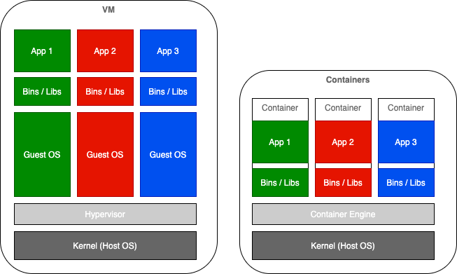

# Docker introduction

In this section we're going to talk about Containerized Applications in general and introduce Docker

* [Docker introduction](#docker-introduction)
  * [From Monolithic to microservices](#from-monolithic-to-microservices)
      * [Monolithic applications](#monolithic-applications)
      * [Microservices](#microservices)
      * [Containerized Microservices](#containerized-microservices)
  * [Native Running vs Containerized Applications](#native-running-vs-containerized-applications)
  * [Containerization vs Virtualization](#containerization-vs-virtualization)
  * [Docker Features](#docker-features)
  * [Docker architecture](#docker-architecture)
    * [Docker daemon](#docker-daemon)
      * [namespaces](#namespaces)
      * [cgroups( control groups )](#cgroups-control-groups-)
      * [UnionFS( Union file systems )](#unionfs-union-file-systems-)
    * [Docker client](#docker-client)
    * [Docker objects](#docker-objects)
      * [IMAGES](#images)
      * [CONTAINERS](#containers)
    * [Docker registries](#docker-registries)
  * [Docker Container orchestration](#docker-container-orchestration)
      * [Docker-compose](#docker-compose)
      * [Docker-swarm](#docker-swarm)
      * [Kubernetes](#kubernetes)
      * [Limitations](#limitations)

## From Monolithic to microservices

#### Monolithic applications

Up to recently, the traditional architecture and software patterns of entreprise applications was, what we call today, "monolithic".
Although back in the days, it used to be a performant approach, as the time went by, their software became a huge and complex boulder, resulting in lots of issues :

-	sedimented layers of features and redundant logic translated into thousands of lines of code
- every new feature added more complexity and code was building up continuously
- application tightly coupled with its complex and expensive hardware:
  - hardcoded connections and operations
  -	Running as a single process and on a single server which has to satisfy its compute, memory, storage, and networking requirements
-	maintenance windows have to be planned as disruptions in service are expected to impact clients
-	hard for developers to work in parallel since each components is tightly coupled with the rest of the applications

#### Microservices

This is a bit of an egg-chicken problem to identify whether
- the monolith software architecture caused the rise of microservices which drove the success of the cloud
- or the appetite for the cloud forced companies to adopt microservices

But anyway, to overcome the weaknesses of the monolith design pattern, a new paradigm arose in 2000's: Microservices.
Its success over the last decade went skyrocketing.

Basically, the idea is to break down the monolith into smaller independent blocks, "services" :

- 	**Single purpose** : each service should focus on one single purpose and do it well.
- 	**Loose coupling** : services know little about each other. A change to one service should not require changing the others. Communication between services should happen only through public service interfaces.
- 	**High cohesion** : each service encapsulates all related behaviors and data together. If we need to build a new feature, all the changes should be localized to just one single service.

A major benefit of microservices is the **decoupling of development and deployment**.
In a true microservices architecture, a team can make changes (within reason) to the service they own without having to communicate those changes to other upstream or downstream teams responsible for other services.

  #### Containerized Microservices

**Virtualisation** and **containerisation** played a major role in this revolution.

Containerized Microservices are **lightweight** applications written in **various** modern **programming languages**, with specific dependencies, libraries and environmental requirements.

To ensure that an application has everything it needs to run successfully it is packaged together with its dependencies.
Containers encapsulate microservices and their dependencies but do not run them directly.
Containers run container images
Container image: bundles the application along with its runtime and dependencies, and a container is deployed from the container image offering an **isolated executable environment** for the application.

In addition to all these advantages, containerized MS offer **Decoupling**
- **with other services**
- **with hardware/system**:
  - as long as a container runtime is installed, you can run your container image on any host os
  - containerized MS developped on local machine can be deployed on dev/prod servers without any modification

## Native Running vs Containerized Applications

As it was explained above, back in the days, the architectural pattern used to be **Monolithic**. Application components used to run on the same host with shared dependencies (packages, libraries, binaries ...).
`N` number of applications used to share the libraries set up on this host on the same OS. As a result, applications are tightly coupled:
- impossible to scale or to limit resources for specific applications
- if one crashes it affects all applications or components running on the same host
- potential dependency conflicts: if your authentication service runs on python 2 while your recommendation engine needs ML feature based on python 3
- service disruptions when updates/upgrades

With containerized applications, first step consists of packaging up
- application code
- along with its runtime dependencies (libraries, configuration assets ..)
into a single a single asset called container image that you can move between your different environments.

Containerization offers isolation and loose coupling: Only thing ontainers share is
- the host OS kernel
- Container Engine (runtime abstraction possible to run the container across different versions of Linux kernel)

## Containerization vs Virtualization

The container comprises just the application and its dependencies. It runs as an isolated process in userspace on the host operating system, sharing the kernel with other containers. Thus, it enjoys the resource isolation and allocation benefits of VMs but is much more portable and efficient.

Containers are lightweight because they don’t need the extra load of a hypervisor, but run directly within the host machine’s kernel. This means you can run more containers on a given hardware combination than if you were using virtual machines.

    A container is a standard unit of software that packages up code and all its dependencies so the application runs quickly and reliably from one computing environment to another.

## Docker Features

Docker provides the ability to package and run an application in a loosely ***isolated*** environment called a container.
Containers are ***lightweight*** because they don’t need the extra load of a hypervisor, but run directly within the host machine’s kernel.
Docker container can be run on any server provided that Docker-daemon enabled, regardless of the underlying operating system (***Portability***).

Thanks to those features, docker becomes

* Development tool: develop your application and its supporting components using containers.
* Testing tool: The container becomes the unit for distributing and testing your application.
* Deployment tool: no needs to modify application developed on local machine when deployed on QA/prod
* Infrastructure/production environment: easy to dynamically manage workloads, scale up/down and to run many containers simultaneously on a given host.

## Docker architecture

Docker uses a client-server architecture. The Docker client talks to the Docker daemon (server), which does the heavy lifting of
- building
- running
- and distributing

your Docker containers.

### Docker daemon

The Docker daemon (`dockerd`) is a thin layer between the containers and the Linux kernel.
The docker server/daemon runs `containers` within `as processes`, acting as a virtual bridge to the host operating system. Although containers are `isolated` processes, they all `share the Kernel of the linux host` between them. Because all of the containers share the services of a single operating system kernel, they use fewer resources than virtual machines.

The Docker daemon is the persistent **runtime environment** that **manages** docker objects such as:

* docker containers
* docker images
* networks
* volumes

As long as docker daemon is setup on a host, **any docker container** can run on **any server** regardless the operating system.
The docker daemon delivers the promise of ***“develop once, run anywhere.”***

Docker uses the `resource isolation` features of the Linux kernel (such as `cgroups` and kernel `namespaces`) and a `union-capable file system` (such as `OverlayFS`) to allow containers to run within a single Linux instance, avoiding the overhead of starting and maintaining virtual machines.

Docker Engine combines the `namespaces`, `cgroups`, and `UnionFS` into a wrapper called a `container format`. The default container format is `libcontainer`.
#### namespaces

Docker uses `namespaces` to provide `isolated` `workspace` called `containers`. 
When a container is run, docker creates a set of namespaces for it, providing a layer of isolation. 
Each aspect of a container runs in a separate namespace and its access is limited to that namespace.

#### cgroups( control groups )

`croups` are used to `limit and isolate the resource usage`( CPU, memory, Disk I/O, network etc ) of a `collection of processes`. 
cgroups allow Docker engine to share the available hardware resources to containers and optionally `enforce limit and constraints`.

#### UnionFS( Union file systems )

File systems that operate by `creating layers`, making them very `lightweight` and fast.

Docker Engine uses some Linux kernel features 

### Docker client
The Docker client (`docker`) is the primary way that many Docker users interact with Docker. When you use commands such as `docker run`, the client sends these commands to `dockerd`, which carries them out. The docker command uses the Docker API.

### Docker objects
When you use Docker, you are creating and using images, containers, networks, volumes, plugins, and other objects. This section is a brief overview of some of those objects.

#### IMAGES

A Docker Image, in a logical way, is **a container’s template**. Using an OOP paradigm as an example, we can think of an image as a **“container class”**. We **instantiate containers from images** just as we instantiate objects from classes.

A Docker Image contains **all the instructions and binaries** necessary to build and run whatever containerized app you want. You can find **docker images for any technology, language, or framework**. Do you want a PHP app? No problem! What about an nginx server? You got it! And a node.js app? Boom! Easy. You also have images available for the most popular database engines (MySQL, Postgres, Mongo, and so on). In conclusion, it’s very likely you will find the right image for every element of your project’s stack.

An image is a read-only template with instructions for creating a Docker container, indicating what the container should be in runtime, including the application code inside the container and runtime configuration settings.
Docker images contain **read-only layers**, which means that once an image is created it is never modified.

Often, **an image is based on another image, with some additional customization**. For example, you may build an image which is based on the ubuntu image, but installs the Apache web server and your application, as well as the configuration details needed to make your application run.

To build your own image, you create a Dockerfile with a simple syntax for defining the steps needed to create the image and run it. **Each instruction** in a Dockerfile creates a **layer in the image**. When you change the Dockerfile and rebuild the image, only those layers which have changed are rebuilt. This is part of what makes images so lightweight, small, and fast, when compared to other virtualization technologies.

#### CONTAINERS

A container is a *runnable* instance of an image. You can create, start, stop, move, or delete a container using the Docker API or CLI. You can connect a container to one or more networks, attach storage to it, or even create a new image based on its current state.

A container is defined by its image as well as any configuration options you provide to it when you create or start it. When a container is removed, any changes to its state that are not stored in persistent storage disappear.

### Docker registries

A Docker registry stores Docker images. **Docker Hub** is a public registry that anyone can use, and Docker is configured to look for images on Docker Hub by default. You can even run your own private registry. Most clients for security reason have their own docker registry with a security scan of images enabled.

When you use the `docker pull` or `docker run` commands, the required images are pulled from your configured registry. When you use the `docker push` command, your image is pushed to your configured registry.

## Docker Container orchestration

#### Docker-compose

#### Docker-swarm

#### Kubernetes

#### Limitations
