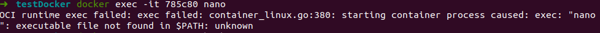

# Docker basics by example

In this section we're going to talk about Containerized Applications in general and introduce Docker

- [Docker basics by example](#docker-basics-by-example)
  - [Docker pull](#docker-pull)
  - [Create and access container](#Create-and-access-container)
  - [Custom image by example](#Custom-image-by-example)
  - [Dockerfile](#Dockerfile)
    - [Dockerfile Commands](#Dockerfile-Commands)
      - [FROM](#from)
      - [RUN](#run)
      - [COPY](#copy)
      - [ADD](#add)
      - [ARG](#arg)
      - [CMD](#cmd)
      - [ENTRYPOINT](#entrypoint)
  - [Volumes](#Volumes)
  - [Manage and clear ressource](#manage-and-clear-ressource)
    - [images](#images)
    - [containers](#containers)
    - [volumes](#volumes)
  - [Hands-on docker commands](#hands-on-docker-commands)
    - [Docker hub](#docker-hub)
    - [Build custom base node.js image](#build-custom-base-nodejs-image)


## Docker pull

Let's imagine in our project, we need a ubuntu xenial image. We can go to the official docker registry `https://hub.docker.com` and search for the available ubuntu images `https://hub.docker.com/_/ubuntu`

Then you can pull the image:
> docker pull ubuntu

By default, it will download the default and latest version of ubuntu present in the registry. In our case, we want the xenial distribution:

> docker pull ubuntu:xenial

You can check now that you have the image locally.

## Create and access container

Generally we don't do a `docker pull` and we directly make run our application

> docker run -id ubuntu:xenial

> docker ps


We just created our first container and we can access it directly as if you were doing a ssh to a VM.

> docker exec -it <container_id> <command>

- container_id:  part of the hash created, you can specify all or part of it. In the example, we will take 785c80.
- commands: Any command accepted by your image OS (bash to ssh with bash on it, but it could me mongo for a mongodb image, it can be ls, cat, mkdir, ...)

=> Try to create a file `/tmp/test` directly in command line and a file `/tmp/test2` by entering the container with `bash`.


Those files have been created inside your container but does not exist in your file system (You can check in your /tmp folder if you don't believe me).

1. If you do not have the ubuntu image locally, Docker pulls it from your configured registry, as though you had run docker pull ubuntu manually
2. Docker creates a new container, as though you had run a docker container create command manually.
3. Docker allocates a read-write filesystem to the container, as its final **container layer** - which is the only **writable layer**. This allows a running container to create or modify files and directories in its local filesystem.
4. Docker creates a network interface to connect the container to the default network, since you did not specify any networking options. This includes assigning an IP address to the container. By default, containers can connect to external networks using the host machine’s network connection.
5. Docker starts the container and executes /bin/bash. Because the container is running interactively and attached to your terminal (due to the -i and -t flags), you can provide input using your keyboard while the output is logged to your terminal.
6. When you type exit to terminate the /bin/bash command, the container stops but is not removed. You can start it again or remove it.

## Custom image

As you seen in the previous section `nano` is not installed by default on ubuntu:xenial and we needed to do a `touch` for creating a file.

> docker exec -it 785c80 nano



We can install `nano` by enter the container using `bash` and run the following command:
`apt-get update` then `apt-get install nano`

Yet, imagine your container is a python app running on linux for which you need to install a lot of libraries. You don't want to re-install them manually every time.

In the illustrations folder of that section, you will find a customNano file. open it and look at its content;

Finally :

> docker build -t custom_nano -f /home/gassogba/Documents/training/git/3-Docker/2-Basics/Illustrations/customNano .


The image is now available in our local repository with the name `custom_nano`.

Let's run it and verify that's `nano` is correctly installed:

> docker run -id custom_nano


Our container now recognize the `nano` command.

## Docker Hub

We just succeeded to create our private image. Yet, it is only accessible from our local repository. You might want to share it with your colleagues.

Let's first create our docker registry.

Go to `hub.docker.com`and create an account. (For the remaining of the section you might see my username `assogbg`, replace by your's in that case).


## Docker containers immutability

One of the most interesting properties of Docker containers is their immutability and the **resulting statelessness** of containers.

As we described in the previous section, a Docker image, once created, does not change.
A running container derived from the image has a **writable layer** that can **temporarily store runtime changes**.
***If the container is committed prior to deletion*** with docker commit, the changes in the writable layer will be saved into a new image that is distinct from the previous one.
Why is immutability good? Immutable images and containers lead to an immutable infrastructure, and an **immutable infrastructure** has many interesting benefits that are not achievable with traditional systems. These benefits include the following:

- Version control: By requiring explicit commits that generate new images, Docker forces you to do version control. You can keep track of successive versions of an image; rolling back to a previous image (therefore to a previous system component) is entirely possible, as previous images are kept and never modified.
- Cleaner updates and more manageable state changes. With immutable infrastructure, you no longer have to upgrade your server infrastructure, which means no need to change configuration files, no software updates, no operating system upgrades, and so on. When changes are needed, you simply make new containers and push them out to replace the old ones. This is a much more discrete and manageable method for state change.

## Hands-on docker commands

first of all let's configure nour remote registry and authenticate to access it from docker client:

> docker login


Personnally it points to my bpersonal docker hub.

### Build custom base node.js image

We defined a new container image in (**[Dockerfile](docker-images/node-app/svc-section/node-utils/Dockerfile)**) node-utils that consists of nodejs base image enrich with some utilities such as telnet, netcat, ping, nslookup...

Here is the content of the Dockerfile, including pulling node base image + installing 9 packages:


```yaml
FROM node:latest
RUN apt-get update && apt-get install -y netcat && \
    apt-get install -y nano && \
    apt-get install -y telnet && \
    apt-get install -y iputils-ping && \
    apt-get install -y curl && \
    apt-get install -y busybox && \
    apt-get install -y lsof && \
    apt-get install -y net-tools && \
    apt-get install -y nmap
CMD [ "node"]
```

We now want to build a new customer image:

```yaml
docker build --tag <yourDockerHubUsername>/node-utils:v1 - < <pathToDirectory>/git/3-Docker/2-Basics/Illustrations/nodeUtils_Dockerfile
docker push <yourDockerHubUsername>/node-utils:v1
```
We notice that we end with 10 (1 + 9) layers:

```yaml
Step 1/3 : FROM node:latest
latest: Pulling from library/node
0400ac8f7460: Pull complete
fa8559aa5ebb: Pull complete
da32bfbbc3ba: Pull complete
e1dc6725529d: Pull complete
572866ab72a6: Pull complete
63ee7d0b743d: Pull complete
186392ceaa5e: Pull complete
d5c847b5cd3f: Pull complete
98b00e0a6a07: Pull complete
```

then, uploads it on docker hub

```yaml
docker push <yourDockerHubUsername/node-utils:v1
```

Go to your Docker Hub, and see that your image is now loaded there.

Delete all the apt-get install except the nano one and create a second version of your image node-utils:v2, push it to your docker hub.

Those images are accessible by everyone if your account is set to public. Try to pull the image of one of your colleagues or if you're on your own simply try to pull my image:

    assogbg:node-utils:v2
