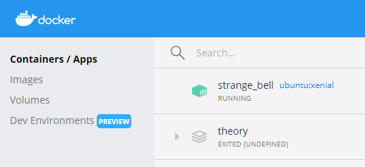
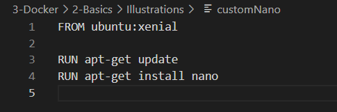
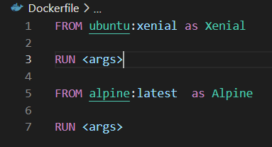

# Docker basics by example

In this section we're going to talk about Containerized Applications in general and introduce Docker

- [Docker basics by example](#docker-basics-by-example)

  - [Hands-on docker commands](#hands-on-docker-commands)
    - [Build custom base node.js image](#build-custom-base-nodejs-image)
    - [Build images for our 2 dummy Micro services - illustrations](#build-images-for-our-2-dummy-micro-services---illustrations)


## Docker pull

Let's imagine in our project, we need a ubuntu xenial image. We can go to the official docker registry `https://hub.docker.com` and search for the available ubuntu images `https://hub.docker.com/_/ubuntu`

Then you could pull the image by using the command `docker pull ubuntu`, by default, it will download the default and latest version of ubuntu present in the registry. In our case, we want the xenial distribution so type in your terminal/CMD:

> docker pull ubuntu:xenial


You can check now that you have the image locally.


## Create and access container

Generally we don't do a `docker pull` and we directly make run our application

> docker run -id ubuntu:xenial

> docker ps




We just created our first container and we can access it directly as if you were doing a ssh to a VM.

> docker exec -it <container_id> <command>

- container_id:  part of the hash created, you can specify all or part of it. In the example, we will take 785c80.
- commands: Any command accepted by your image OS (bash to ssh with bash on it, but it could me mongo for a mongodb image, it can be ls, cat, mkdir, ...)

=> Try to create a file `/tmp/test` directly in command line and a file `/tmp/test2` by entering the container with `bash`.


Those files have been created inside your container but does not exist in your file system (You can check in your /tmp folder if you don't believe me).

1. If you do not have the ubuntu image locally, Docker pulls it from your configured registry, as though you had run docker pull ubuntu manually
2. Docker creates a new container, as though you had run a docker container create command manually.
3. Docker allocates a read-write filesystem to the container, as its final **container layer** - which is the only **writable layer**. This allows a running container to create or modify files and directories in its local filesystem.
4. Docker creates a network interface to connect the container to the default network, since you did not specify any networking options. This includes assigning an IP address to the container. By default, containers can connect to external networks using the host machine’s network connection.
5. Docker starts the container and executes /bin/bash. Because the container is running interactively and attached to your terminal (due to the -i and -t flags), you can provide input using your keyboard while the output is logged to your terminal.
6. When you type exit to terminate the /bin/bash command, the container stops but is not removed. You can start it again or remove it.

## Custom image

As you seen in the previous section `nano` is not installed by default on ubuntu:xenial and we needed to do a `touch` for creating a file.

> docker exec -it 785c80 nano


We can install `nano` by enter the container using `bash` and run the following command:
`apt-get update` then `apt-get install nano`

Yet, imagine your container is a python app running on linux for which you need to install a lot of libraries. You don't want to re-install them manually every time.

In the illustrations folder of that section, you will find a customNano file. open it and look at its content;

Finally :

> docker build -t custom_nano -f /home/gassogba/Documents/training/git/3-Docker/2-Basics/Illustrations/customNano .

**Note**: Obliouvsly you have to type the path to the file in your computer after `-f`


The image is now available in our local repository with the name `custom_nano`.

Let's run it and verify that's `nano` is correctly installed:

> docker run -id custom_nano


Our container now recognize the `nano` command.

## Dockerfile

Docker can build images automatically by reading the instructions from a Dockerfile. A Dockerfile is a text document that contains all the commands a user could call on the command line to assemble an image. Using `docker build` you can create an automated build that executes several command-line instructions in succession. That is exactly what the `custom_nano` file you just used does. Usually we name the file "Dockerfile" by default.



A `Dockerfile` is a set of commands followed by their arguments with sometimes a few comments. The instructions in a Dockerfile are run in order. A Dockerfile must begin with a `FROM` instruction. This may be after parser directives, comments, and globally scoped `ARGs`(arguments command). The `FROM` instruction specifies the Parent Image from which you are building. FROM may only be preceded by one or more `ARG` instructions, which declare arguments that are used in FROM lines in the Dockerfile.

In the custom_nano file at line 1 we have the `FROM` command followed with the parent image ubuntu:xenial which is the argument.
at line 3 and 4 we have the `RUN` CMD followed by the arguments which will launch the OS update and then the installation of `nano`.

## Docker Commands


##### FROM #####

As we've said before the command `FROM` is the first command of a dockerfile(aside from a few exceptions). It initialise a new build stage and sets the base image. The image can be a local one or you can pull it from the [Public Repositories](https://hub.docker.com/).

Note that you can have more than one `FROM` per Dockerfile to create images or to use one build stage as a dependency for another. You can also set an alias for each in order to refer to them with some commands like another `FROM` or a `COPY` .



You can also set an `ARG` before to use it's value:

>ARG VERSION=latest\
>FROM alpine:$VERSION


##### RUN #####

The `RUN` instruction will execute any commands in a new layer on top of the current image and commit the results. The resulting committed image will be used for the next step in the Dockerfile and it allow us to recreate an image from any point of the history as in git. 
If you don't want to create a new layer for each of the `RUN` you can us the `\` character to use continue you instruction to a new line.


The `RUN` command, as most of the others commands, has more than one form. The first form is the **Shell** form, it's the one we've already used, it runs the command in a shell, which by default is `/bin/sh -c` on Linux or `cmd /S /C` on Windows:
>RUN <command>

The second form is the **Exec**:
>RUN ["executable", "param1", "param2"]\
>RUN ["/bin/bash", "-c", "echo hello"]

Note that in the **Exec** form you can simply pass a variable to any executable.This won't work:
>RUN [ "echo", "$HOME" ]

You have to use a shell.
>RUN [ "sh", "-c", "echo $HOME" ]

Also if you're using a path, you'll have to escape the `\` character:
>RUN ["c:\\windows\\system32\\tasklist.exe"]


##### COPY #####

The `COPY` command allows you to copy a file or folder from your local filesystem to your container or the other way around. Note that if you've more than one `FROM` command and if you give alias to them, you can use one of those images as a source too.
If you copy a file from your local filesystem, the path will start where your `Dockerfile` is.


As you can see in the example above, the test.txt file is in the same folder as my `Dockerfile` the copy command takes the source followed by the path in the xenial container( `/tmp/`).
Note that you can copy more than one file if you use Go's [filepath.Match](https://pkg.go.dev/path/filepath#Match) rules:
>COPY test?.txt\
>COPY test*

The first copy above will copy any "test" text file followed by any single character. The second one will copy any file whose name start with "test".


##### ADD #####

The `ADD` command is close to the `COPY` command but it has a broader scope. As an good practice, if you only require to copy a file or directery, use the `COPY` command.
The `ADD` command can not only use file or directories on your local system but it can also use URLs as a source. `ADD` also has the fonction of extracting **localy** recognized compressed files (.tar,.gzip,.bzip2 or xz). When it does detect one such file, it'll unpack it as a folder at the destination. Note that if you use a URL to a compressed file, it'll only copy it and not decompress it.


##### ARG #####

The `ARG` instruction defines a variable that users can pass at build-time to the builder with the docker build command using the `--build-arg <varname>=<value>` flag. The `ARG` command is only available at the build-time, meaning that as soon as your image is formed, you can't acces it when you run your container. 


If a user specifies a build argument that was not defined in the `Dockerfile`, the build outputs a warning. You can also setup a default value in the `Dockerfile`.


As you can see above, we've used a default message "Hello World" to the `ARG MSG`. Now we'll do the same but we'll pass another message as an argument when we build the image:
>docker build -t xenial --build-arg MSG="Hello Friend" -f ./Dockerfile .


We can see that the message displayed is not the default "Hello World" but what we have passed in the build command. The default value as been overrrided.

Note that the `ARG` command can be overrided by the `ENV` command.


##### ENV #####

The `ENV` instruction is close to the the `ARG` instruction but it can be accessed after the build-time. It can also override any variable defined as an `ARG`.
It's sometime useful to use both instruction together:

>docker build -t xenial --build-arg MSG="Hello Friend" -f ./Dockerfile . 


In this case, we pass a value as argument in the build command as an `ARG` and then we give that value to the `ENV` as we cannot define an `ENV` in the build command. This way you can define dynamics `ENV` variables available to your containers

In total there are 3 ways to define an `ENV` variable:
1.One by one as we did above or when we run the container with the tag `-e` and the difinition in double quote docker `run -e "env_var_name=another_value"` or by using a `docker-compose.yml` file.
2.Pass the value from the host which is the same methode as above but without giving a value to the variable. Docker will then fetch the value in the host environlent.
3.By using an environment file or env_file.


##### CMD #####


##### ENTRYPOINT #####


## Docker Hub

We just succeeded to create our private image. Yet, it is only accessible from our local repository. You might want to share it with your colleagues.

Let's first create our docker registry.

Go to `hub.docker.com`and create an account. (For the remaining of the section you might see my username `assogbg`, replace by your's in that case).


## Docker containers immutability

One of the most interesting properties of Docker containers is their immutability and the **resulting statelessness** of containers.

As we described in the previous section, a Docker image, once created, does not change.
A running container derived from the image has a **writable layer** that can **temporarily store runtime changes**.
***If the container is committed prior to deletion*** with docker commit, the changes in the writable layer will be saved into a new image that is distinct from the previous one.
Why is immutability good? Immutable images and containers lead to an immutable infrastructure, and an **immutable infrastructure** has many interesting benefits that are not achievable with traditional systems. These benefits include the following:

- Version control: By requiring explicit commits that generate new images, Docker forces you to do version control. You can keep track of successive versions of an image; rolling back to a previous image (therefore to a previous system component) is entirely possible, as previous images are kept and never modified.
- Cleaner updates and more manageable state changes. With immutable infrastructure, you no longer have to upgrade your server infrastructure, which means no need to change configuration files, no software updates, no operating system upgrades, and so on. When changes are needed, you simply make new containers and push them out to replace the old ones. This is a much more discrete and manageable method for state change.

## Hands-on docker commands

first of all let's configure nour remote registry and authenticate to access it from docker client:

> docker login


Personnally it points to my bpersonal docker hub.

### Build custom base node.js image

We defined a new container image in (**[Dockerfile](docker-images/node-app/svc-section/node-utils/Dockerfile)**) node-utils that consists of nodejs base image enrich with some utilities such as telnet, netcat, ping, nslookup...

Here is the content of the Dockerfile, including pulling node base image + installing 9 packages:


```yaml
FROM node:latest
RUN apt-get update && apt-get install -y netcat && \
    apt-get install -y nano && \
    apt-get install -y telnet && \
    apt-get install -y iputils-ping && \
    apt-get install -y curl && \
    apt-get install -y busybox && \
    apt-get install -y lsof && \
    apt-get install -y net-tools && \
    apt-get install -y nmap
CMD [ "node"]
```

We now want to build a new customer image:

```yaml
docker build --tag pgolard/node-utils:v1 - < docker-images/node-utils/Dockerfile
docker push pgolard/node-utils:v1
```
We notice that we end with 10 (1 + 9) layers:

```yaml
Step 1/3 : FROM node:latest
latest: Pulling from library/node
0400ac8f7460: Pull complete
fa8559aa5ebb: Pull complete
da32bfbbc3ba: Pull complete
e1dc6725529d: Pull complete
572866ab72a6: Pull complete
63ee7d0b743d: Pull complete
186392ceaa5e: Pull complete
d5c847b5cd3f: Pull complete
98b00e0a6a07: Pull complete
```

then and uploads it on docker hub

```yaml
docker push pgolard/node-utils:v1
```


### Build images for our 2 dummy Micro services - illustrations

(**[msHello](docker-images/node-app/svc-section/node-app/msHello)**)
(**[msBye](docker-images/node-app/svc-section/node-app/msBye)**)

Those 2 micro services consists of dockerizzd simple node.js applications.
We first build and upload them to our docker hub.
We repeay tyhe operartion 3 times; for every new build, we make a small modif. in source code and we increment the tag.
```yaml
./docker-images/build.sh 1
./docker-images/build.sh 2
./docker-images/build.sh 3
```

try to run one of our micro service:
> docker run -it -p 7777:7777 --name ms-hello pgolard/ms-hello:v3
> curl 0.0.0.0:7777 - This is the hello world from ms hello - V3%
