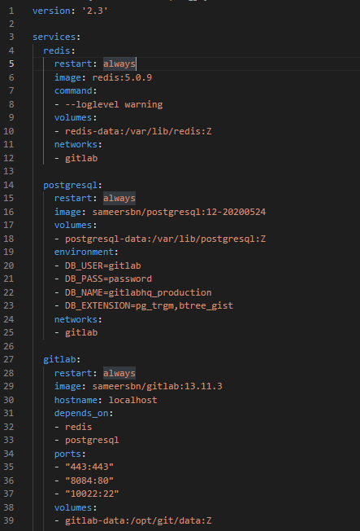
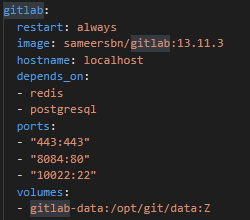

# Docker-Compose

## Section Contents

In this chapter we go through the different software needed in the course of this tutorial.
First section indicates the pre-requisite namely the list of tools required to run the exercises and illustrations of the course.
Then we will go through the set up of Gitlab. Gitlab is code collaboration & version controlling tool, as well as a DevOps platform. At first we describe how to set up Gitlab Server using Docker. Then we go further with the installation of Gitlab Runner, a component used to run CICD jobs.

* [Docker-Compose](#docker-Compose)
    * [Section Contents](#section-contents)
    * [Introduction](#introduction)
    * [Services](#services)
        * [Image and Build](#image-and-build)
        * [Networks](#networks)
        * [Volumes](#volumes)
        * [Dependencies](#dependencies)
        * [Environment Variables](#environment-variables)
    * [Commands](#commands)

## Introduction

Docker Compose is a tool for defining and running multi-container Docker applications. With Docker Compose, you use a YAML file(.yml) to configure your application’s services. Then, with a single command, you create and start all the services from your configuration.

Basically you have three step process:
1. Define your app’s environment with a Dockerfile so it can be reproduced anywhere(optional).

2. Define the services that make up your app in the docker-compose.yml file so they can be run together in an isolated environment.

3. Run docker compose up and the Docker compose command starts and runs your entire app

In the 0-Gitlab server chapter, in the theory folder, there is a file called docker-compose_gs.yml that allow us to run Gitlab localy. If you open the file, you'll see that in it we define 3 services which are Redis, PostgreSQL and Gitlab and each one has its own configuration.



In short, Docker Compose works by applying many rules declared within a single docker-compose.yml configuration file.
Almost every rule replaces a specific Docker command so that in the end we just need to run:
>docker-compose up

We can get dozens of configurations applied by Compose. This will save us the hassle of scripting them.
In the file, we need to specify the version of the Compose file format, at least one service, and optionally volumes and networks:

## Services

### Image and Build

Services refer to containers' configuration.
For example, let's take a dockerized web application consisting of a front end, a back end, and a database: We'll' split those components into three images and define them as three different services in the configuration:
```
services:
  frontend:
    image: my-vue-app
    ...
  backend:
    build: https://github.com/my-company/my-project.git
    ...
  db:
    build: /path/to/dockerfile/
    ...
```

You can name each service as you want(frontend, my-app, ...) and as an source you can either pull an image("ubuntu:latest"), use an URL or use a dockerfile in which you define the image.
You can see above that the keyword if you want to pull an image is `image` but if you want to use something else it's `build`.
Additionally, we can specify an image name in conjunction with the build attribute, which will name the image once created, making it available to be used by other services.
```
services: 
  my-custom-app:
    build: https://github.com/my-company/my-project.git
    image: my-project-image
    ...
```

### Networks

Docker containers communicate between themselves in networks you create on Docker Compose. A service can communicate with another service on the same network by simply referencing it by container name and port (for example network-example-service:80), provided that we've made the port accessible through the expose keyword:
```
services: 
  network-example-service:
    image: karthequian/helloworld:latest
    expose:
      - "80"
```

To reach a container from the host, the ports must be exposed through the ports keyword, which also allows us to choose if exposing the port differently in the host as we did for the Gitlab image in section `0-Gitlab server`:


To reach the gitlab page we then connect to `http://localhost:8084`, 8084 being the port made available on the second line under port in the image above

Finally you can define additional virtual networks to segregate our containers:
```
services:
    redis:
    ...
    networks:
    - gitlab

  postgresql:
    ...
    networks:
    - gitlab

  gitlab:
    ...
    ports:
    - "443:443"
    - "8084:80"
    - "10022:22"
    ...
    networks:
    - gitlab

networks:
  gitlab:
...
```

In the example above, you can see how we setup the network for the gitlab server. Notice that the last keyword `networks` is not declared in the gitlab service (which already has a `networks` keyword) but it declared after the `services` as it is a network made available to all services. You could potentially declare more than one network and spérate your containers by networks. Of course you can onmy reach the port of an image on the same network

### Volumes

Volume are similar to networks in the sense that you can define "global" volume after your services which make them available to all services. You can also setup other volumes in each service lie you would do in a dockerfile. Let's take our gitlab server example again:
```
services:
    redis:
    ...
    volumes:
    - redis-data:/var/lib/redis:Z
    ...

  postgresql:
    ...
    volumes:
    - postgresql-data:/var/lib/postgresql:Z
    ...

  gitlab:
    ...
    ports:
    - "443:443"
    - "8084:80"
    - "10022:22"
    ...
    volumes:
    - gitlab-data:/opt/git/data:Z
    ...

volumes:
  redis-data:
  postgresql-data:
  gitlab-data:
```

You can see tha t we have setup 3 global volume at the end of the file wich are `redis-data`, `postgresql-data` and `gitlab-data` and then we have mapped each service to their relative volume.
Of course you could also connect more than one service to the same volume or connect the more than one volume to the same service. Finally don't forget that you can connect a folder on your host machine to a volume.
```
services:
  volumes-example-service:
    image: alpine:latest
    volumes: 
      - my-named-global-volume:/my-volumes/named-global-volume
      - /tmp:/my-volumes/host-volume
      - /home:/my-volumes/readonly-host-volume:ro
    ...
  another-volumes-example-service:
    image: alpine:latest
    volumes:
      - my-named-global-volume:/another-path/the-same-named-global-volume
    ...
volumes:
  my-named-global-volume: 
```

Notice in the exemple above that on the third volume of the first service has `:ro` added after the path of the destination. It set the access right of the container to a read only preventing the container from erasing data on the host machine folder.


### Dependencies

We sometimes need to create a dependency chain between our services, so that some services get loaded before (and unloaded after) other ones. We can achieve this result through the `depends_on` keyword:
```
    gitlab:
    ...
    depends_on:
    - redis
    - postgresql
    ports:
    - "443:443"
    - "8084:80"
    - "10022:22"
    volumes:
    - gitlab-data:/opt/git/data:Z
```

In the gitlab server case, the gitlab server depend on the `redis` and `postgresql` service meaning that both service will be loaded first. Be aware that when we say "load", we mean start and not finish to load.


### Environment Variables

For each of your services, you can define environment variables, if you've followed the `2-Basics` section of the training you should be familliar with what they do.
If you look at the docker-compose of the Gitlab server, you'll see a lot of variables defined in the gitlab service. We won't explain what each do as we want to focus more on how you declare them.

We can define static environment variables, and also define dynamic variables with the `${}` notation:
```
services:
  database: 
    image: "postgres:${POSTGRES_VERSION}"
    environment:
      DB: mydb
      USER: "${USER}"
```

There are different methods to provide those values to Compose. For example, one is setting them in a .env file in the same directory, structured like a .properties file, key=value as we've seen in the previous section of the training

Otherwise, we can set them in the OS before calling the command:
```
export POSTGRES_VERSION=alpine
export USER=foo
docker-compose up
```

Finally, you might do it using a simple one-liner in the shell:
```
POSTGRES_VERSION=alpine USER=foo docker-compose up
```

You can mix the approaches, but let's keep in mind that Compose uses the following priority order, overwriting the less important with the higher ones:

1. Compose file
2. Shell environment variables
3. Environment file
4. Dockerfile
5. Variable not defined


## Commands

Finally here a a few commands to use docker compose

To create and start the containers, the networks, and the volumes defined in the configuration use:
>docker-compose up

After the first time, however, you can simply use start to start the services:
>docker-compose start

In case your file has a different name than the default one (docker-compose.yml), you can use the -f and ––file flags to specify an alternate file name:
>docker-compose -f custom-compose-file.yml start

Compose can also run in the background as a daemon when launched with the -d option:
>docker-compose up -d

To safely stop the active services, we can use stop, which will preserve containers, volumes, and networks, along with every modification made to them:
>docker-compose stop

To reset the status of our project, instead, we simply run down, which will destroy everything with only the exception of external volumes:
>docker-compose down