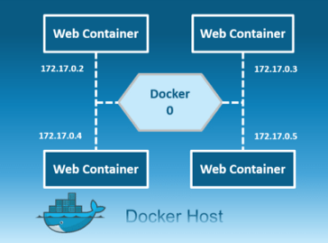
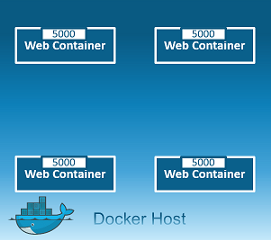
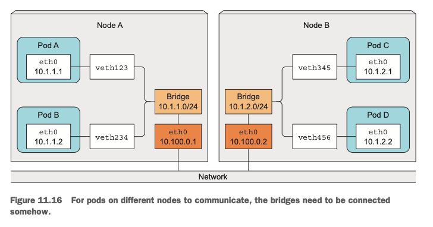
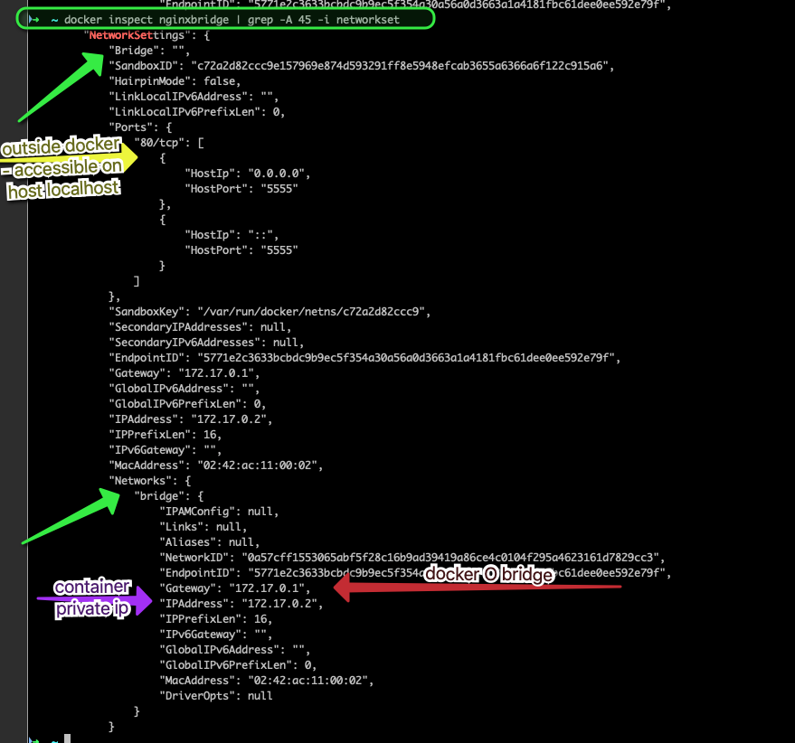
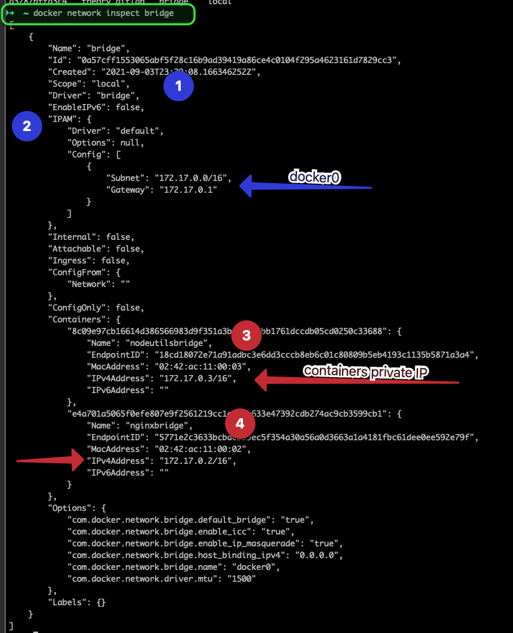
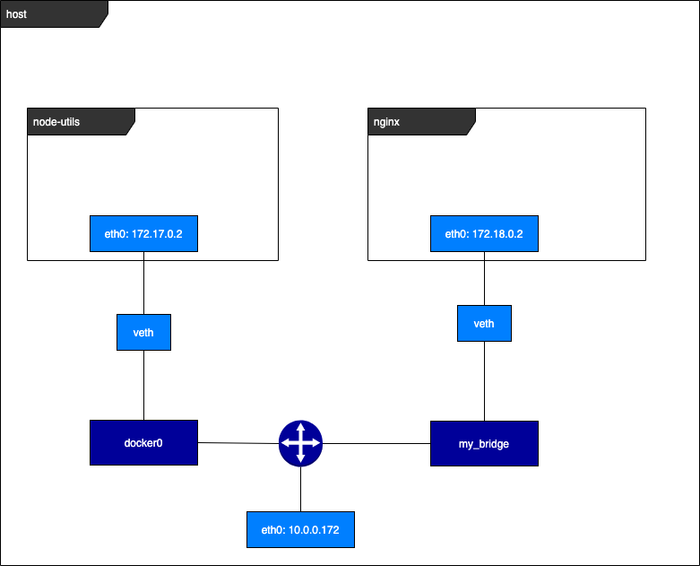
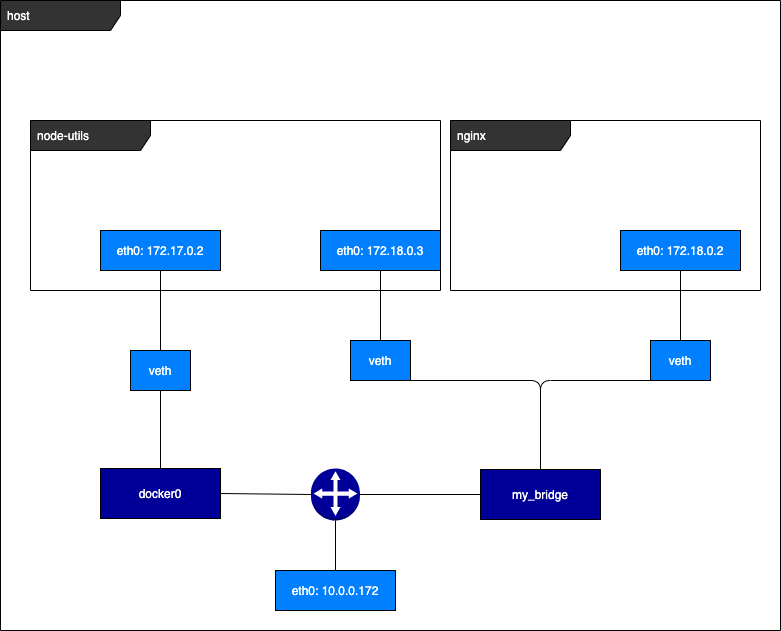
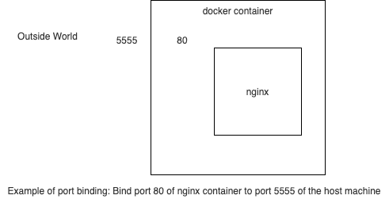

In this section we're going to talk about the main features ofg Docker Networking.

  - [1. Introduction](#1.-introduction)
  - [2. Quick Overview of netwok modes and drivers](#2.-quick-overview-of-netwok-modes-and-drivers)
      - [2.1. Running on One Single Node](#2.1.-running-on-one-single-node)
      - [2.2. Running on Multiple Hosts](#2.2.-running-on-multiple-hosts)
  - [3. Concept Of Bridge Network](#3.-concept-of-bridge-network)
      - [3.1. Definition](#3.1.-definition)

## 1. Introduction

A Docker container needs a `host` to run on. This can either be a physical machine (e.g., a bare-metal server in your on-premise datacenter) or a VM either on-prem or in the cloud. The host has the `Docker daemon` and `client` running, as depicted in next Figure, which enables you to interact with a `Docker registry` on the one hand (to pull/push Docker images), and on the other hand, allows you to `start`, `stop`, and `inspect` `containers`.


The relationship between a host and containers is `1:N`.
A `Docker network` is a **medium** through which a `Docker container` can ***talk*** ***to*** its `host`, `other containers` on the host, or `any other machines` ***on or outside the host’s network***. To configure networks, we use the `docker network` command that provides us subcommands such as 
* `ls`
* `create`
* `attach` 

to configure networks and containers’ relationship to them.

## 2. Network drivers

In order to illustrate the concepts, we use docker images 
- nginx
- pgolard/node-utils: simple image based on node and containing packages like ping, curl, netcat, telnet


#### 2.0.1. Running on One Single Node


##### 2.0.1.1. Bridge



Private default internal network created by docker on the host. So, **all containers** get an **internal IP address** and these containers can access each other, using this internal IP. The Bridge networks are usually used when your applications run in standalone containers that need to communicate.

There are 2 different types of Bridge: default and user defined. 

##### 2.0.1.2. Host



This **driver** `removes` the `network isolation` between the `docker host` and the docker `containers` to **use the host’s networking directly**. So with this, you will not be able to run multiple web containers on the same host, on the same port as the port is now common to all containers in the host network.
Because the container shares the networking namespace of the host, it is directly exposed to the public network; consequently, you need to carry out the coordination via port mapping.


##### 2.0.1.3. None

This mode puts the container inside of its own network stack but doesnt configure it. Effectively, this `turns off networking` and is useful for two cases:

* either for containers that ***dont need a network*** (such as `batch jobs` writing to a `disk volume`) 
* or if you want to set up your custom networking.

https://medium.com/edureka/docker-networking-1a7d65e89013
https://towardsdatascience.com/docker-networking-919461b7f498
https://itnext.io/a-beginners-guide-to-networking-in-docker-ca5b822fb935

#### 2.0.2. Running on Multiple Hosts

https://medium.com/edureka/docker-networking-1a7d65e89013

##### 2.0.2.1. Overlay

Creates an internal private network that spans across all the nodes participating in the swarm cluster. The overlay network driver creates a distributed network among multiple Docker daemon hosts. 

So, Overlay networks facilitate communication between a swarm service and a standalone container, or between two standalone containers on different Docker Daemons.




##### 2.0.2.2. McVLAN


Allows you to assign a MAC address to a container, making it appear as a physical device on your network. Then, the Docker daemon routes traffic to containers by their MAC addresses. Macvlan driver is the best choice when you are expected to be directly connected to the physical network, rather than routed through the Docker host’s network stack.


## 3. Bridge Network

#### 3.0.1. Definition


A `bridge network` consists of a software bridge that `allows containers connected` to it to `communicate`, while providing `isolation` from `containers not connected` to it. 
It can be thought as a virtual switch into which containers plug in to communicate among themselves and with the outside world.

A Docker server starts by default a default bridge, named "bridge", and all containers, unless configured otherwise, connect by default to it. 
This configuration is appropriate when `multiple container`s need to `communicate` on the `same Docker host`. 
The `Docker bridge driver` automatically installs `rules` on the `host` machine so that *** containers on different bridge networks cannot communicate directly*** with each other.
#### 3.0.2. Default Bridge
https://www.oreilly.com/content/what-is-docker-networking/

Let's have a look at default bridge. We deploy the two applications introduced earlier, without specifying the network:

```bash
docker run --name nginxbridge --publish 5555:80 nginx
docker run --name nodeutilsbridge pgolard/node-utils:v1 /bin/sh -c "sleep 50000;"

docker ps
    CONTAINER ID   IMAGE                   COMMAND                  CREATED          STATUS          PORTS                                   NAMES
    8c09e97cb166   pgolard/node-utils:v1   "docker-entrypoint.s…"   9 seconds ago    Up 7 seconds                                            nodeutilsbridge
    e4a701a5065f   nginx                   "/docker-entrypoint.…"   36 seconds ago   Up 35 seconds   0.0.0.0:5555->80/tcp, :::5555->80/tcp   nginxbridge
```

if we inspect the containers we see they have been added to a default bridge network called bridge:

> docker inspect nginxbridge 


From the host, outside docker containers, we can query nginx on docker engine's localhost using port mapping:
> curl http://localhost:5555

Let's now have a look at the networks on the docker host by running `docker network ls` which shows that ***bridge*** network has been created.

> docker network ls
    > ```bash
    > NETWORK ID     NAME            DRIVER    SCOPE
    > 0a57cff15530   bridge          bridge    local
    > 92defebe886c   host            host      local
    > bd49de99b983   none            null      local
    > d3787bffa3c4   theory_gitlab   bridge    local
    > ```
If we inspect ***bridge*** network, we see that both containers have been automatically added to this default network.



They both have a `private ip address` that is used to enable containers to communicate together. If we exec the ***node-utils*** containers and run a curl to the ***nginx*** container, we build the request this way, using private ip adress and container port:

> docker exec -it nodeutilsbridge -- curl 172.17.0.2:80 


#### 3.0.3. User Defined Bridge

User-defined bridge networks are superior to the default bridge network:

- User-defined bridges provide automatic DNS resolution between containers
- User-defined bridges provide better isolation:
  - All containers without a `--network`  specified, are attached to the default bridge network. This can be a risk, as unrelated stacks/services/containers are then able to communicate.
  - Using a user-defined network provides a scoped network in which only containers attached to that network are able to communicate.


Illustration:

Let's use the same docker images 
- nginx
- node-utils

First we create a user-defined bridge network called `my_bridge`:
> docker network create -d bridge my_bridge

```yaml
 ~ docker network ls
NETWORK ID     NAME            DRIVER    SCOPE
0a57cff15530   bridge          bridge    local
92defebe886c   host            host      local
677cb86ccfbf   my_bridge       bridge    local
bd49de99b983   none            null      local
d3787bffa3c4   theory_gitlab   bridge    local
```

Then deploy nginx and node-utils containers, with nginx explicitly attached to my_bridge
> docker run --net=my_bridge --name nginx_my_bridge --publish 5555:80 nginx
> docker run --name nodeutils_default_bridge pgolard/node-utils:v1 /bin/sh -c "sleep 50000;"

The initial situation is desribed in the diagram below where our 2 containers are included in different bridges and thereby cannot communicate together since they are on different host network namespaces:



To enable them to communicate, let's add the node-utils container to the user defined bridge

> docker network connect my_bridge nodeutils_default_bridge

This then leads to the situation described in the second diagram.



Basically docker containers can be attached to several network bridges.

User defined Bridges offer some interesting functionnalities like the automatic DNS resolution between containers, and resolves the names of the containers to their IP address:
> docker exec -it nodeutils_default_bridge bash
> root@0cc2a938790f:/# curl nginx_my_bridge

## Port Binding 

Docker containers ***can connect to the outside world without any configuration***. That’s great because we don’t have to change anything we have programmed before.
But the ***outside world cannot connect to a Docker container by default***.
Ah, I see. So it’s not the other way around. How should you connect to your Docker container then? Well, there are multiple options to do so. Let’s explore them.

#### Docker expose

`EXPOSE` is a way of `documenting` and is related to `Dockerfiles` ( documenting )

In Docker networking, there are two different mechanisms that directly involve network ports: exposing and publishing ports. This applies to the default bridge network and user-defined `bridge` networks.

You expose ports using the `EXPOSE` keyword in the `Dockerfile` or the `--expose` flag to `docker run`. Exposing ports is a way of documenting which ports are used, but ***does not actually map or open any ports***. Exposing ports is optional.

#### Publish

While `EXPOSE` is a way of `documenting`
`--publish` (or -p) is a way of `mapping` a `host port` to a running `container port`

EXPOSE is related to Dockerfiles ( documenting )
--publish is related to `docker run` ... ( execution / run-time )

You publish ports using the --publish or --publish-all flag to docker run. This tells Docker which `ports to open` on the `container’s network interface`. When a `port` is `published`, it is `mapped` to an `available high-order port` (higher than 30000) on the `host machine`, ***unless you specify the port to map to on the host machine at runtime***. You cannot specify the port to map to on the host machine when you build the image (in the Dockerfile), because there is no way to guarantee that the port will be available on the host machine where you run the image.


***By default***, when you create a container, it ***does not publish*** any of its ports to the outside world. To make a port available to services outside of Docker, or to Docker containers which are not connected to the container's network, use the --publish or -p flag. This creates a `firewall` `rule` which `maps` a `container` `port` to a `port` on the `Docker` `host`.

#### Publish all ports 

> docker container run -P -d nginx

The `-P` command `opens every port` the `container` `exposes`. Docker identifies every port the Dockerfile exposes and the ones that are exposed with the Docker container build --expose parameter. Every exposed port is bound directly on a “random” port of the host machine.

Finding the mapped high port

> docker container port <containerId>

This will give the host port (high port) mapped to the container ports published.
For instance:

```bash
➜  ~ docker ps
CONTAINER ID   IMAGE     COMMAND                  CREATED          STATUS          PORTS                                     NAMES
a436869257e5   nginx     "/docker-entrypoint.…"   14 seconds ago   Up 12 seconds   0.0.0.0:55001->80/tcp, :::55001->80/tcp   serene_hopper
```

Then run the command to see which host port is mapped to the container Port:

```bash
➜  ~ docker container port a436869257e5
80/tcp -> 0.0.0.0:55001
80/tcp -> :::55001
```

Therefore, if you want to access the nginx container from outside, namely curl the nginx container from the host terminal (not inside the docker user defined bridge), you need to specify the host port:

```bash
➜  ~ curl 0.0.0.0:55001
<!DOCTYPE html>
<html>
<head>
<title>Welcome to nginx!</title>
<style>
    body {
        width: 35em;
        margin: 0 auto;
        font-family: Tahoma, Verdana, Arial, sans-serif;
    }
</style>
</head>
<body>
<h1>Welcome to nginx!</h1>
<p>If you see this page, the nginx web server is successfully installed and
working. Further configuration is required.</p>

<p>For online documentation and support please refer to
<a href="http://nginx.org/">nginx.org</a>.<br/>
Commercial support is available at
<a href="http://nginx.com/">nginx.com</a>.</p>

<p><em>Thank you for using nginx.</em></p>
</body>
</html>
```

#### Bind specific port

You can also `publish` `container` `port` and `map` it to `host` `machine` with docker run:

> docker run --name nginx_my_bridge --publish 5555:80 nginx



Important thing to keep in mind:

If you access the container from outside you need to use the port mapped to the host machine.
Nevertheless, if you want to access the container from the docker bridge or user defined bridge network, you need to specify the conainer port.

Let's create a user defined bridge network called my_bridge, and deploy 2 containers:

```bash
docker network create -d bridge my_bridge
docker run --name nodeutils_default_bridge pgolard/node-utils:v1 /bin/sh -c "sleep 50000;"
docker network connect my_bridge nodeutils_default_bridge
docker run --net=my_bridge --name nginx_my_bridge --publish 5555:80 nginx
```

Then connect to the user defined bridge network (by connecting to one container) and run a curl command to query the nginx container using port 80:


```bash
~ docker exec -it nodeutils_default_bridge bash
root@fb0690600f0b:/# curl nginx_my_bridge:80
<!DOCTYPE html>
<html>
<head>
<title>Welcome to nginx!</title>
<style>
    body {
        width: 35em;
        margin: 0 auto;
        font-family: Tahoma, Verdana, Arial, sans-serif;
    }
</style>
</head>
<body>
<h1>Welcome to nginx!</h1>
<p>If you see this page, the nginx web server is successfully installed and
working. Further configuration is required.</p>

<p>For online documentation and support please refer to
<a href="http://nginx.org/">nginx.org</a>.<br/>
Commercial support is available at
<a href="http://nginx.com/">nginx.com</a>.</p>

<p><em>Thank you for using nginx.</em></p>
</body>
</html>
root@fb0690600f0b:/#
```

