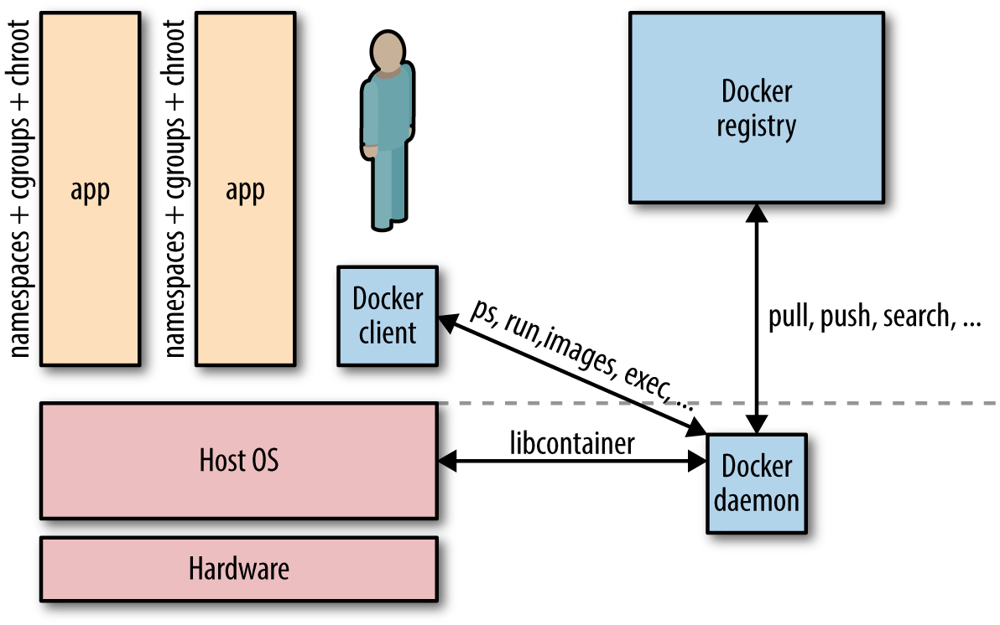

In this section we're going to talk about the main features ofg Docker Networking.

  - [1. Introduction](#1.-introduction)
  - [2. Quick Overview of netwok modes and drivers](#2.-quick-overview-of-netwok-modes-and-drivers)
      - [2.1. Running on One Single Node](#2.1.-running-on-one-single-node)
      - [2.2. Running on Multiple Hosts](#2.2.-running-on-multiple-hosts)
  - [3. Concept Of Bridge Network](#3.-concept-of-bridge-network)
      - [3.1. Definition](#3.1.-definition)

## 1. Introduction

A Docker container needs a `host` to run on. This can either be a physical machine (e.g., a bare-metal server in your on-premise datacenter) or a VM either on-prem or in the cloud. The host has the `Docker daemon` and `client` running, as depicted in next Figure, which enables you to interact with a `Docker registry` on the one hand (to pull/push Docker images), and on the other hand, allows you to `start`, `stop`, and `inspect` `containers`.

The relationship between a host and containers is `1:N`.
A `Docker network` is a **medium** through which a `Docker container` can ***talk*** ***to*** its `host`, `other containers` on the host, or `any other machines` ***on or outside the host’s network***. To configure networks, we use the `docker network` command that provides us subcommands such as 
* `ls`
* `create`
* `attach` 

to configure networks and containers’ relationship to them.

## 2. Quick Overview of network modes and drivers

#### 2.1. Running on One Single Node

##### Bridge and User Defined Bridge

##### Host
##### None

https://medium.com/edureka/docker-networking-1a7d65e89013
https://towardsdatascience.com/docker-networking-919461b7f498
https://itnext.io/a-beginners-guide-to-networking-in-docker-ca5b822fb935

#### 2.2. Running on Multiple Hosts

https://medium.com/edureka/docker-networking-1a7d65e89013

##### Overlay

Creates an internal private network that spans across all the nodes participating in the swarm cluster. So, Overlay networks facilitate communication between a swarm service and a standalone container, or between two standalone containers on different Docker Daemons.

##### McVLAN

Allows you to assign a MAC address to a container, making it appear as a physical device on your network. Then, the Docker daemon routes traffic to containers by their MAC addresses. Macvlan driver is the best choice when you are expected to be directly connected to the physical network, rather than routed through the Docker host’s network stack.

## 3. Concept Of Bridge Network

#### 3.1. Definition

#### Default Bridge
https://www.oreilly.com/content/what-is-docker-networking/
#### User Defined Bridge
https://kb.novaordis.com/index.php/Docker_Networking_Concepts
https://www.tutorialworks.com/container-networking/

#### Attaching a container to myltiple network
https://docs.docker.com/engine/tutorials/networkingcontainers/
https://docs.docker.com/engine/tutorials/networkingcontainers/

TODO:
- embedded dns: https://towardsdatascience.com/docker-networking-919461b7f498
- port mapping: https://www.learnitguide.net/2018/09/understanding-docker-port-mapping.html
- another port mapping: https://tecadmin.net/tutorial/docker/docker-manage-ports/
- another port mapping again: https://betterprogramming.pub/how-does-docker-port-binding-work-b089f23ca4c8
- illustration about benefits of user defined bridge VS default bridge with ms-hello & ms-hello bye in "docker run" default, vs dovker run user def vs docker-compose
- illustrations with port mapping