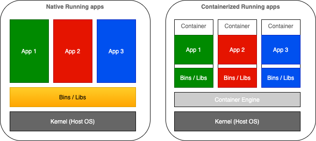
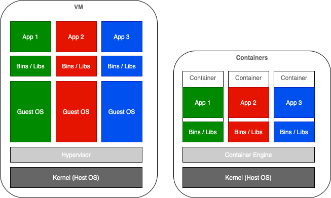
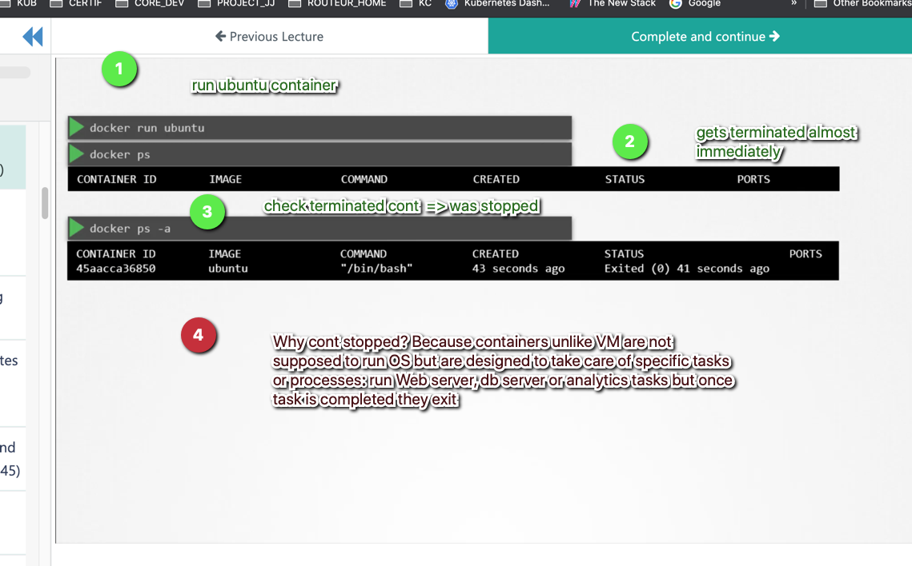
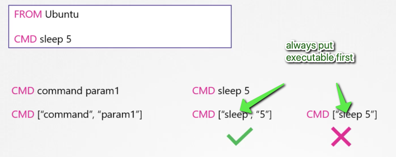
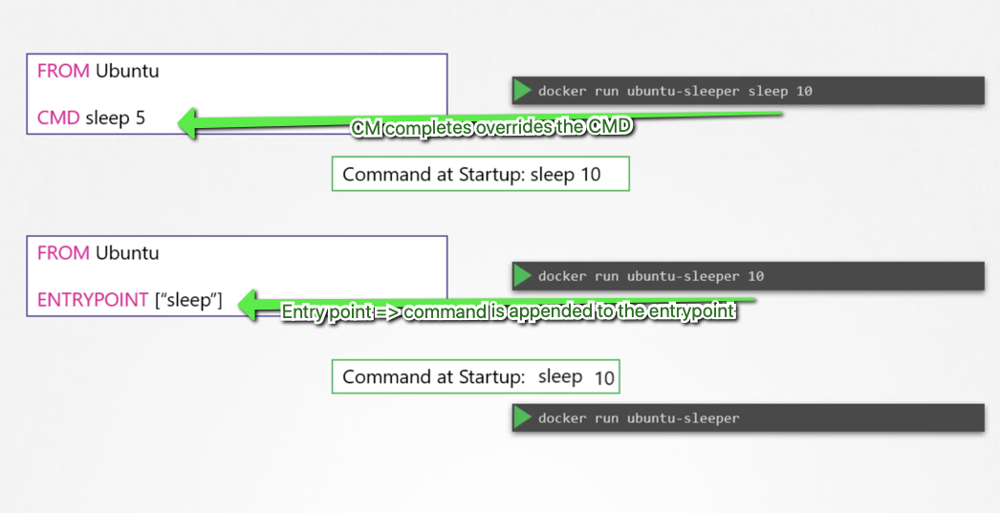
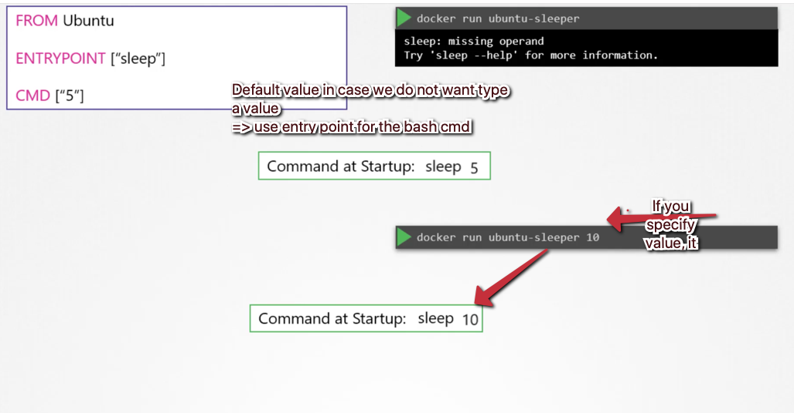
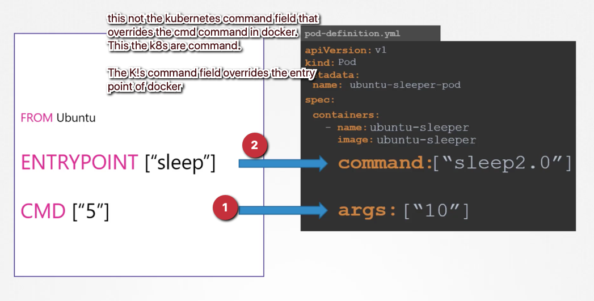

***Docker basics***

In this section we're going to talk about Containerized Applications in general and Docker in particular.


* [1. Native Running vs Containerized Applications](#1-native-running-vs-containerized-applications)
* [2. Containerization vs Virtualization](#2-containerization-vs-virtualization)
* [3. Docker Features](#3-docker-features)
* [4. Docker architecture](#4-docker-architecture)
  * [4.1. Docker daemon](#41-docker-daemon)
  * [4.2. Docker client](#42-docker-client)
  * [4.3. Docker registries](#43-docker-registries)
  * [4.4. Docker objects](#44-docker-objects)
    * [4.4.1. IMAGES](#441-images)
    * [4.4.2. CONTAINERS](#442-containers)
* [5. Docker container lifecycle and commands](#5-docker-container-lifecycle-and-commands)
  * [5.1. Lifecycle bound to its core task](#51-lifecycle-bound-to-its-core-task)
  * [5.2. Docker commands vs entrypoint](#52-docker-commands-vs-entrypoint)
* [6. Docker containers immutability](#6-docker-containers-immutability)
* [7. Docker Container Running User](#7-docker-container-running-user)
* [8. Docker Container orchestration](#8-docker-container-orchestration)
  * [8.1. Docker-compose](#81-docker-compose)
  * [8.2. Docker-swarm](#82-docker-swarm)
  * [8.3. Limitations](#83-limitations)
* [9. Hands-on docker commands](#9-hands-on-docker-commands)
  * [9.1. Build custom base node.js image](#91-build-custom-base-nodejs-image)
  * [9.2. Build images for our 2 dummy Micro services - illustrations](#92-build-images-for-our-2-dummy-micro-services---illustrations)


## 1. Native Running vs Containerized Applications

As described in the introduction, the success of Kubernetes results from a change of paradigm in application development and deployment.



Back in the days, the architectural pattern used to be Monolithic. Application components used to run on the same host with shared dependencies (packages, libraries, binaries ...).
`N` number of applications used to share the libraries set up on this host on the same OS. As a result, applications are tightly coupled:
- impossible to scale or to limit resources for specific applications
- if one crashes it affects all applications or components running on the same host
- potential dependency conflicts: if your authentication service runs on python 2 while your recommendation engine needs ML feature based on python 3
- service disruptions when updates/upgrades


With containerized applications, first step consists of packaging up 
- application code 
- along with its runtime dependencies (libraries, configuration assets ..)
into a single a single asset called container image that you can move between your different environments.

Containerization offers isolation and loose coupling: Only thing ontainers share is 
- the host OS kernel
- Container Engine (runtime abstraction possible to run the container across different versions of Linux kernel)

## 2. Containerization vs Virtualization

The container comprises just the application and its dependencies. It runs as an isolated process in userspace on the host operating system, sharing the kernel with other containers. Thus, it enjoys the resource isolation and allocation benefits of VMs but is much more portable and efficient.

Containers are lightweight because they don’t need the extra load of a hypervisor, but run directly within the host machine’s kernel. This means you can run more containers on a given hardware combination than if you were using virtual machines.




## 3. Docker Features


Docker provides the ability to package and run an application in a loosely ***isolated*** environment called a container. 
Containers are ***lightweight*** because they don’t need the extra load of a hypervisor, but run directly within the host machine’s kernel. 
Docker container can be run on any server provided that Docker-daemon enabled, regardless of the underlying operating system (***Portability***).

Thanks to those features, docker becomes

* Development tool: develop your application and its supporting components using containers.
* Testing tool: The container becomes the unit for distributing and testing your application.
* Deployment tool: no needs to modify application developed on local machine when deployed on QA/prod
* Infrastructure/production environment: easy to dynamically manage workloads, scale up/down and to run many containers simultaneously on a given host.

## 4. Docker architecture

Docker uses a client-server architecture. The Docker client talks to the Docker daemon (server), which does the heavy lifting of 
- building
- running
- and distributing 

your Docker containers. 


### 4.1. Docker daemon

The Docker daemon (`dockerd`) is a thin layer between the containers and the Linux kernel.
The Docker daemon is the persistent **runtime environment** that **manages** docker objects such as:
* dpocker containers
* docker images
* networks
* volumes

As long as docker daemon is setup on a host, **any docker container** can run on **any server** regardless the operating system.
The docker daemon delivers the promise of ***“develop once, run anywhere.”***

### 4.2. Docker client
The Docker client (`docker`) is the primary way that many Docker users interact with Docker. When you use commands such as `docker run`, the client sends these commands to `dockerd`, which carries them out. The docker command uses the Docker API.

### 4.3. Docker registries

A Docker registry stores Docker images. Docker Hub is a public registry that anyone can use, and Docker is configured to look for images on Docker Hub by default. You can even run your own private registry.

When you use the docker pull or docker run commands, the required images are pulled from your configured registry. When you use the docker push command, your image is pushed to your configured registry.

### 4.4. Docker objects
When you use Docker, you are creating and using images, containers, networks, volumes, plugins, and other objects. This section is a brief overview of some of those objects.

#### 4.4.1. IMAGES

An image is a read-only template with instructions for creating a Docker container, indicating what the container should be in runtime, including the application code inside the container and runtime configuration settings.
Docker images contain **read-only layers**, which means that once an image is created it is never modified.

Often, an image is based on another image, with some additional customization. For example, you may build an image which is based on the ubuntu image, but installs the Apache web server and your application, as well as the configuration details needed to make your application run.


To build your own image, you create a Dockerfile with a simple syntax for defining the steps needed to create the image and run it. **Each instruction** in a Dockerfile creates a **layer in the image**. When you change the Dockerfile and rebuild the image, only those layers which have changed are rebuilt. This is part of what makes images so lightweight, small, and fast, when compared to other virtualization technologies.

#### 4.4.2. CONTAINERS


A container is a *runnable* instance of an image. You can create, start, stop, move, or delete a container using the Docker API or CLI. You can connect a container to one or more networks, attach storage to it, or even create a new image based on its current state.

A container is defined by its image as well as any configuration options you provide to it when you create or start it. When a container is removed, any changes to its state that are not stored in persistent storage disappear.

The following command runs an ubuntu container, attaches interactively to your local command-line session, and runs /bin/bash.

```bash
 docker run -i -t ubuntu /bin/bash
```

When you run this command, the following happens (assuming you are using the default registry configuration):

1. If you do not have the ubuntu image locally, Docker pulls it from your configured registry, as though you had run docker pull ubuntu manually
2. Docker creates a new container, as though you had run a docker container create command manually.
3. Docker allocates a read-write filesystem to the container, as its final **container layer** - which is the only **writable layer**. This allows a running container to create or modify files and directories in its local filesystem.
4. Docker creates a network interface to connect the container to the default network, since you did not specify any networking options. This includes assigning an IP address to the container. By default, containers can connect to external networks using the host machine’s network connection.
5. Docker starts the container and executes /bin/bash. Because the container is running interactively and attached to your terminal (due to the -i and -t flags), you can provide input using your keyboard while the output is logged to your terminal.
6. When you type exit to terminate the /bin/bash command, the container stops but is not removed. You can start it again or remove it.

## 5. Docker container lifecycle and commands


### 5.1. Lifecycle bound to its core task

I we run an  ubuntu container with `bash` as `CMD`; It ends up `exited` since the ***role of a docker container***, instance of docker image, is **not to run as an OS** but it's meant to ***fulfill specific tasks or process***. For instance:

- webserver
- db server
- api end point
- job



Container stays up & running while its core mission is still going. Nevertheless, once the ***main tasks has been fulfilled*** the ***container*** got ***terminated***.


### 5.2. Docker commands vs entrypoint

But who decides what tasks the container is going to run and how?
Within the Docerfile, based on CMD and etrypoint.

First you can use docker run [IMAGE] [CMD] and overrides the command `CMD` written in the Dockerfile.

> docker run ubunt sleep 5

If you want to do this more permamnently, you can create your own custom docker image based ubuntu and specify your own commands:




Within the Dockerfile you specify commands argrs that constitute the program you container is going to run at runtime.
Using the [CMD] statement in dockerfile, you can now omit the last part of the docker run command and by default it will sleep for 5 seconds.

> docker run ubunt

If we now decide to go from 5 to 10 seconds, with the current set up the whole instructions need to be passed as container args, and this command will completely override whats is noted in Dockerfile:

> docker run ubunt sleep 10

If we wanna have more flexibility, we can use [ENTRYPOINT] instead of [CMD] within Dockerfile. Main difference an [ENTRYPOINT] statement accepts to be appended by additionnal commands



If we want to keep same flexibility but have a default value for nb of sleeping seconds, we can combine:



If you use CMD:command gets completely overriden




## 6. Docker containers immutability

One of the most interesting properties of Docker containers is their immutability and the **resulting statelessness** of containers.

As we described in the previous section, a Docker image, once created, does not change. 
A running container derived from the image has a **writable layer** that can **temporarily store runtime changes**.
***If the container is committed prior to deletion*** with docker commit, the changes in the writable layer will be saved into a new image that is distinct from the previous one.
Why is immutability good? Immutable images and containers lead to an immutable infrastructure, and an **immutable infrastructure** has many interesting benefits that are not achievable with traditional systems. These benefits include the following:

- Version control: By requiring explicit commits that generate new images, Docker forces you to do version control. You can keep track of successive versions of an image; rolling back to a previous image (therefore to a previous system component) is entirely possible, as previous images are kept and never modified.
- Cleaner updates and more manageable state changes. With immutable infrastructure, you no longer have to upgrade your server infrastructure, which means no need to change configuration files, no software updates, no operating system upgrades, and so on. When changes are needed, you simply make new containers and push them out to replace the old ones. This is a much more discrete and manageable method for state change.

## 7. Docker Container Running User

Even though Containerization provides isolation, this is still not a best practice to let container run as root.
It leaves root access and potential damages to the container itself as well as some resources shared with the host, such as volumes.

The best way to handle that is to specifiy a user that is going to run container's processes.

Here's an example of how to build a docker container image where another user is going to run processes. This is the content of the Dockerfile:

```yaml
FROM debian:stretch
RUN groupadd -g 999 appuser && \
    useradd -r -u 999 -g appuser appuser
USER appuser
```

## 8. Docker Container orchestration
TODO
### 8.1. Docker-compose

### 8.2. Docker-swarm

### 8.3. Limitations

## 9. Hands-on docker commands

first of all let's configure nour remote registry and authenticate to access it from docker client:

> docker login


Personnally it points to my bpersonal docker hub.

### 9.1. Build custom base node.js image

We defined a new container image in (**[Dockerfile](docker-images/node-app/svc-section/node-utils/Dockerfile)**) node-utils that consists of nodejs base image enrich with some utilities such as telnet, netcat, ping, nslookup...

Here is the content of the Dockerfile, including pulling node base image + installing 9 packages:


```yaml
FROM node:latest
RUN apt-get update && apt-get install -y netcat && \
    apt-get install -y nano && \
    apt-get install -y telnet && \
    apt-get install -y iputils-ping && \
    apt-get install -y curl && \
    apt-get install -y busybox && \
    apt-get install -y lsof && \
    apt-get install -y net-tools && \
    apt-get install -y nmap
CMD [ "node"]
```

We now want to build a new customer image:

```yaml
docker build --tag pgolard/node-utils:v1 - < docker-images/node-utils/Dockerfile
docker push pgolard/node-utils:v1
```
We notice that we end with 10 (1 + 9) layers:

```yaml
Step 1/3 : FROM node:latest
latest: Pulling from library/node
0400ac8f7460: Pull complete
fa8559aa5ebb: Pull complete
da32bfbbc3ba: Pull complete
e1dc6725529d: Pull complete
572866ab72a6: Pull complete
63ee7d0b743d: Pull complete
186392ceaa5e: Pull complete
d5c847b5cd3f: Pull complete
98b00e0a6a07: Pull complete
```

then and uploads it on docker hub

```yaml
docker push pgolard/node-utils:v1
```


### 9.2. Build images for our 2 dummy Micro services - illustrations

(**[msHello](docker-images/node-app/svc-section/node-app/msHello)**)
(**[msBye](docker-images/node-app/svc-section/node-app/msBye)**)

Those 2 micro services consists of dockerizzd simple node.js applications.
We first build and upload them to our docker hub.
We repeay tyhe operartion 3 times; for every new build, we make a small modif. in source code and we increment the tag.
```yaml
./docker-images/build.sh 1
./docker-images/build.sh 2
./docker-images/build.sh 3
```

try to run one of our micro service:
> docker run -it -p 7777:7777 --name ms-hello pgolard/ms-hello:v3
> curl 0.0.0.0:7777 - This is the hello world from ms hello - V3%


Implemented by a number of Linux APIs:

cgroups: Restrict resources a process can consume
CPU, memory, disk IO, ...

namespaces: Change a process’s view of the system
Network interfaces, PIDs, users, mounts, ...

capabilities: Limits what a user can do
mount, kill, chown, ...

chroots: Determines what parts of the filesystem a user can see
